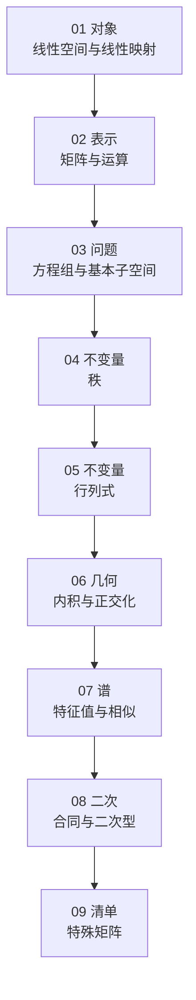

# 线性代数知识主线

本篇是 `00_总览` 的知识地图。它按**结构顺序**（也就是仓库目录的顺序）说明：每引入一个新对象，它解决了什么问题、又留下什么。

需要说明的是，历史上 Cramer 法则先于矩阵语言出现，所以"问题驱动"的叙述习惯把行列式排在矩阵之前；但行列式只对方阵有定义，且与秩同属"不变量"层，因此目录把它排在 [秩](../04_秩/README.md) 之后（理由见 §4）。

全篇固定 $A\in\mathbb F^{m\times n}$，$b\in\mathbb F^m$，$x\in\mathbb F^n$，记 $r=\operatorname{rank}(A)$。

## 1. 全篇路线图

| 阶段 | 引入对象 | 能够回答 | 未能回答 |
| --- | --- | --- | --- |
| 01 | 线性空间、线性映射、基与维数 | "线性"意味着什么；坐标是否唯一 | 抽象映射如何具体计算 |
| 02 | 矩阵、初等变换、分块 | 如何表示并化简一个映射 | 一个具体方程组何时有解 |
| 03 | 列空间、零空间、解集 | $Ax=b$ 是否有解、有多少解 | 存在性有无更省事的判据 |
| 04 | 秩 | 用 $\operatorname{rank}$ 统一上述维数 | 方阵"可逆"的标量判据 |
| 05 | 行列式 | $A$ 可逆 $\iff\lvert A\rvert\ne0$；体积缩放因子 | 一般方阵能否化为对角形 |
| 06 | 内积、正交化 | 垂直、投影与最小二乘 | 是否存在让映射"变简单"的基 |
| 07 | 特征值、相似、谱定理 | $A=P\Lambda P^{-1}$ 的条件与构造 | 不可对角化方阵的一般标准形 |
| 08 | 合同、二次型、惯性指数 | $x^{\mathsf T}Ax$ 在换元下的规范型 | 各类具体矩阵的专项结论 |
| 09 | 对称、正交、秩 1 矩阵 | 常见结构的专属性质与判定 | — |

依赖关系可以画成一条链：

## 2. 统一的核心角度：线性映射

线性代数中看似分散的对象，都可以挂在"线性映射及其矩阵表示"这一根主干上：

| 对象 | 在映射视角下的身份 |
| --- | --- |
| 线性空间 | 映射的定义域与目标空间，也是全部活动展开的舞台 |
| 矩阵 | 映射在某组基下的坐标表示 |
| 线性方程组 $Ax=b$ | 已知像求原像，即映射的逆问题 |
| 行列式 | 映射的尺度缩放因子与可逆性判据 |
| 向量组 | 描述像空间与核空间如何被张成 |
| 特征值与特征向量 | 让映射在某方向上只伸缩、不旋转的基 |

一个便于记忆的比喻是"机器—语言—程序"：

- **线性映射 $T$**：机器，规定如何加工输入。
- **基**：描述输入与输出所用的语言。
- **矩阵**：这台机器在该语言下的说明书（数表）。
- **行列式**：机器的全局缩放刻度与可逆性标记。
- **$Ax=b$**：已知输出 $b$，倒推输入 $x$。
- **核与像**：机器会"压扁"的方向，以及它能产生的全部结果。

## 3. 逐步推进

### 3.1 空间与向量组：舞台

- 线性空间规定可以做加法和数乘的集合；线性映射是保持这两种运算的变换。
- 向量组、线性相关、基与维数把"冗余"与"必要"量化：一组基就是一个坐标系。
- 抽象化的收益：解集、张成空间、核与像都是线性空间，$\mathbb F^X$、$C[a,b]$ 等函数空间同样适用。

**局限。** 目前只有"存在一组基"这类定性结论；对具体的 $\mathbb F^n$ 与具体映射，还缺一套可计算的表示。

### 3.2 矩阵与运算：把映射写成数表

- 选定基后，线性映射唯一对应一个矩阵；矩阵乘法对应映射复合，矩阵的列就是基向量的像。
- 初等矩阵把消元写成乘法：可逆 $\iff$ 初等矩阵之积；分块与 Schur 补是常用的降阶工具。

**局限。** 有了语言，但"何时有解、解有多少"仍要逐例消元。

### 3.3 方程组与基本子空间：原像问题

- $b\in\operatorname{Col}(A)$ 决定**存在性**，$\dim\ker(A)$ 决定**自由度**。
- 解集结构 $S_b=x_p+\ker(A)$：一个特解加上整个零空间。
- 四个基本子空间给出输入、输出空间的正交分解，以及秩–零化度定理。

同一个问题在行列式、秩、向量组、内积等各套语言下的并排对照，见 [线性方程组解的问题](./线性方程组解的问题.md)。

**局限。** 判定仍依赖具体的 $A$；需要一个只反映结构、不依赖运算细节的数值。

### 3.4 秩：唯一的结构数值

- $\operatorname{rank}(A)=\dim\operatorname{Col}(A)=\dim\operatorname{Row}(A)$，四个基本子空间的维数全部由 $r,m,n$ 决定。
- 秩是等价关系下的完全不变量：同型矩阵等价 $\iff$ 秩相等。
- 常见不等式（加法、乘积、拼接、伴随）汇总在 [秩的常见不等式](../04_秩/秩的常见不等式.md)。

**局限。** 秩只说"有几个独立方向"，不给出"体积"与"可逆"的标量刻画。

### 3.5 行列式：方阵的标量不变量

- 对 $n$ 阶方阵，$\lvert A\rvert\ne0\iff A$ 可逆 $\iff\operatorname{rank}(A)=n$，配合 $\lvert AB\rvert=\lvert A\rvert\lvert B\rvert$ 支撑 Cramer 法则与逆矩阵公式。
- 几何上它是有向体积的缩放因子；[公理化推导](../05_行列式/行列式的公理化推导.md) 把全部性质归约为三条公理。

**局限。** 只对方阵有定义，且对不可逆情形只给出 $0$，无法区分"压成了几条方向"。

### 3.6 内积与正交化：补上几何结构

- 双线性形式是一般框架；再加上对称与正定即得内积，从而有长度、角度、正交与投影。
- Gram–Schmidt 把任意基正交化；三维情形可用叉积代替。
- 四个基本子空间的正交关系 $\ker(A)=\operatorname{Row}(A)^\perp$ 在此得到解释。

**局限。** 正交化只简化"基"，并不简化映射本身的矩阵。

### 3.7 特征值与谱：换基把映射变简单

- 特征值与特征向量寻找 $Av=\lambda v$ 的方向，特征子空间为 $E_\lambda=\ker(A-\lambda I)$。
- 可对角化 $\iff$ 有 $n$ 个线性无关的特征向量；相似变换 $B=P^{-1}AP$ 保持特征多项式、迹、行列式与秩。
- 实对称矩阵一定可以正交相似对角化（谱定理），这是 [二次型与合同](../08_二次型与合同/README.md) 的入口。

**局限。** 一般方阵不一定可对角化；完备的相似标准形需要引入 Jordan 形。

### 3.8 二次型与合同：换元下的规范型

- $q(x)=x^{\mathsf T}Ax$ 在换元 $x=Py$ 下作合同变换 $P^{\mathsf T}AP$，实对称矩阵可合同对角化。
- Sylvester 惯性定理：正、负惯性指数在合同下不变，是二次型的完全不变量。

**局限。** 结论只对实对称（或 Hermite）矩阵成立，且不涉及"结构类型"。

### 3.9 特殊矩阵：把结论打包

- 对称、正交、秩 1 三类矩阵各有专属结论（谱定理、保内积、外积表示）。
- 它们的性质大多是前面各层结论的特化，因此这一章更像速查目录。

**局限。** 清单不可能穷尽；遇到新结构应回到对应的层（秩、谱、合同）去找工具。

## 4. 与目录的对应

| 章 | 本篇位置 | 一句话 |
| --- | --- | --- |
| [01 线性空间与线性映射](../01_线性空间与线性映射/README.md) | §3.1 | 建立对象 |
| [02 矩阵与运算](../02_矩阵与运算/README.md) | §3.2 | 给出表示与运算 |
| [03 线性方程组与基本子空间](../03_线性方程组与基本子空间/README.md) | §3.3 | 提出问题 |
| [04 秩](../04_秩/README.md) | §3.4 | 提取不变量 |
| [05 行列式](../05_行列式/README.md) | §3.5 | 方阵的标量不变量 |
| [06 内积与正交化](../06_内积与正交化/README.md) | §3.6 | 补上几何 |
| [07 特征值与谱](../07_特征值与谱/README.md) | §3.7 | 换基与谱分解 |
| [08 二次型与合同](../08_二次型与合同/README.md) | §3.8 | 二次型的规范型 |
| [09 特殊矩阵](../09_特殊矩阵/README.md) | §3.9 | 类型清单 |

**关于行列式的位置。** 若按历史顺序（方程组 → 行列式 → 矩阵 → 向量组 → 空间）讲，行列式会排在矩阵之前，因为 Cramer 法则是最早的唯一性判据。但结构上它与秩同属"不变量"，且只对方阵有定义，所以目录采用"秩先于行列式"的顺序。两种顺序只是叙述起点不同，内容并无冲突。

## 5. 一句话版主线

> **方程组**提出"解的存在性与唯一性"；**矩阵**给出统一表示与运算的语言；**行列式**给出方阵是否唯一的标量判据；**秩**给出不依赖运算细节的结构指标；**内积**补上几何；**谱**寻找让映射最简单的基；**合同**给出二次型的规范型；**特殊矩阵**把常用结论打包成清单。

具体章节顺序见 [代数学索引](../README.md)；正文该用哪套记号见 [符号体系](./符号体系.md)。

[返回本节索引](./README.md)
