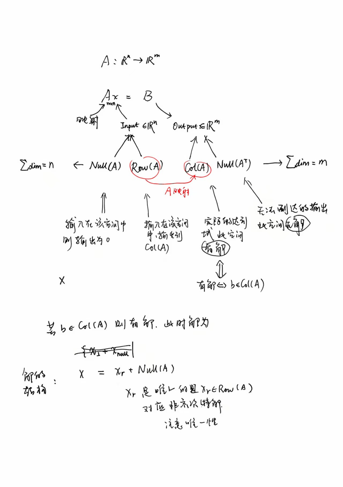

# 线性映射与矩阵方程的几何结构解析

$$
\begin{aligned}
 A: \mathbb R^n & \longrightarrow \mathbb R^m \\
 \text{domain}, &\text{codomain} \\
 \mathbb R^n = \ker(A) \oplus \ker(A)^\perp,& \quad \mathbb R^m = \operatorname{Col}(A) \oplus \operatorname{Col}(A)^\perp
\end{aligned}
$$

其中

$$
\dim(\ker(A)^\perp)=\dim(\operatorname{Col}(A))=\operatorname{rank}(A),\quad
\operatorname{rank}(A)+\dim\ker(A)=n.
$$

线性代数的基本行列空间定理（Fundamental Theorem of Linear Algebra）进一步扩展了这些划分，引入四个基本子空间：列空间 $\operatorname{Col}(A)$、零空间 $\ker(A)$、行空间 $\operatorname{Row}(A)$（等价于 $\ker(A)^\perp$ 或 $\operatorname{Col}(A^{\mathsf T})$）、左零空间 $\ker(A^{\mathsf T})$（等价于 $\operatorname{Col}(A)^\perp$）。这些子空间在欧几里德空间中是正交补，确保分解的唯一性和正交性。

## 1. 两个空间与矩阵映射

线性方程组

$$
A x = b
$$

本质是一个线性变换

$$
A:\ \mathbb R^n \longrightarrow \mathbb R^m
$$

**输入空间**（或称定义域，domain）是 $\mathbb R^n$，所有 $n$ 维向量的集合。线性变换从这里“输入”向量。
**输出空间**（或称目标空间，codomain）是 $\mathbb R^m$，所有 $m$ 维向量的集合。线性变换在这里“输出”结果。

矩阵 $A$ 是 $m \times n$ 的，表示从输入空间到输出空间的映射。其秩 $r = \operatorname{rank}(A)$ 决定了映射的有效维度。

## 2. 输入空间的结构划分

输入空间 $\mathbb R^n$ 被分解为两个正交子空间：零空间和其正交补。这些对应于基本子空间中的 $\ker(A)$ 和 $\operatorname{Row}(A)$。

### 2.1 零空间

$$
\ker(A) = \{x \in \mathbb R^n \mid A x = 0\}
$$

- 属于这里的所有输入向量映射到输出空间的 **零向量**（信息丢失方向）。
- 维数： $\dim\ker(A) = n - r$。
- 几何意义：表示线性变换的核（kernel），其中向量被“压缩”到零。

### 2.2 零空间的正交补

$$
\ker(A)^\perp = \operatorname{Row}(A) = \operatorname{Col}(A^{\mathsf T})
$$

- 与零空间方向垂直。
- 在这个子空间中的输入，**不会被映射成零**（除非本身是 0），并且经 $A$ 映射会精确张成输出空间中的 **列空间 $\operatorname{Col}(A)$**。
- 这个映射 $A: \ker(A)^\perp \to \operatorname{Col}(A)$ 是一个线性同构（isomorphism）：单射（因为 $\ker(A|_{\ker(A)^\perp}) = \{\mathbf{0}\}$）且满射（维度均为 $r$）。
- 维数： $r$。
- 几何意义：这是输入空间中“有效”或“信息保留”的部分，产生非零输出。

### 2.3 输入空间正交分解

$$
\mathbb R^n = \ker(A) \ \oplus\ \ker(A)^\perp
$$

每个输入向量都可以唯一写成：

$$
x = x_{\perp} + x_{\text{null}}
$$

其中 $x_{\perp}\in \ker(A)^\perp$ ， $x_{\text{null}}\in\ker(A)$。
正交性：在标准内积下，$\mathbf{u} \cdot \mathbf{v} = 0$ 对于任意 $\mathbf{u} \in \ker(A)^\perp$ 和 $\mathbf{v} \in \ker(A)$。

## 3. 输出空间的结构划分

输出空间 $\mathbb R^m$ 类似地被分解为列空间和其正交补，对应于 $\operatorname{Col}(A)$ 和 $\ker(A^{\mathsf T})$。

### 3.1 列空间

$$
\operatorname{Col}(A) = \{Ax \mid x\in\mathbb R^n\}
$$

- 又称**值域**（range/image），是线性变换的像。
- 是所有方程右端 $b$ 可能出现的集合（有解的 $b$）。
- 维数： $r$。
- 由 $A$ 的列向量线性组合生成。

### 3.2 列空间的正交补

$$
\operatorname{Col}(A)^\perp = \ker(A^{\mathsf T}) = \{y \in \mathbb R^m \mid A^{\mathsf T} y = 0\}
$$

- 包含所有与 $\operatorname{Col}(A)$ 垂直的向量 $b$。
- 如果 $b$ 有这部分分量，那么 $Ax = b$ 无解（除非这一部分全为零）。
- 维数： $m - r$。
- 几何意义：表示“不可达”方向，导致方程无解。

### 3.3 输出空间正交分解

$$
\mathbb R^m = \operatorname{Col}(A) \ \oplus\ \operatorname{Col}(A)^\perp
$$

每个输出向量 $\mathbf{b}$ 可以唯一写成 $\mathbf{b} = \mathbf{b}_c + \mathbf{b}_n$，其中 $\mathbf{b}_c \in \operatorname{Col}(A)$，$\mathbf{b}_n \in \operatorname{Col}(A)^\perp$。
正交性：在标准内积下，$\operatorname{Col}(A) \perp \operatorname{Col}(A)^\perp$。

## 4. 维数关系总结（Rank–Nullity 定理的对称体现）

设 $r = \operatorname{rank}(A)$ ，则有：

| 所在空间 | 子空间 | 维数 | 关系式 |
| --- | --- | --- | --- |
| 输入空间 $\mathbb R^n$ | $\ker(A)$ | $n - r$ | $n = (n-r) + r$ |
| | $\ker(A)^\perp = \operatorname{Row}(A)$ | $r$ | |
| 输出空间 $\mathbb R^m$ | $\operatorname{Col}(A)$ | $r$ | $m = r + (m-r)$ |
| | $\ker(A^{\mathsf T}) = \operatorname{Col}(A)^\perp$ | $m - r$ | |

**秩–零化度公式**：

$$
\boxed{
\begin{aligned}
&\operatorname{rank}(A) + \dim\ker(A) = n \\
&\operatorname{rank}(A) + \dim\ker(A^{\mathsf T}) = m
\end{aligned}
}
$$

这些公式体现了行列空间的维度等价：$\operatorname{rank}(A) = \operatorname{rank}(A^{\mathsf T})$。

使用奇异值分解（SVD） $A = U \Sigma V^{\mathsf T}$ 可以明确这些基：

- $\operatorname{Row}(A)$ 由 $V$ 的前 $r$ 列生成。
- $\ker(A)$ 由 $V$ 的后 $n-r$ 列生成。
- $\operatorname{Col}(A)$ 由 $U$ 的前 $r$ 列生成。
- $\ker(A^{\mathsf T})$ 由 $U$ 的后 $m-r$ 列生成。
  这些基是正交的，奇异值 $\Sigma$ 的非零部分确保了 $\operatorname{Row}(A)$ 到 $\operatorname{Col}(A)$ 的同构映射。

## 5. 解集的整体几何结构

对于任意 $b\in\mathbb R^m$ ：

- **若** $b \in \operatorname{Col}(A)$ ，则方程有解：
  所有解形成一个仿射子空间：

  $$
  \{x_{\perp} + x_{\text{null}} \mid x_{\perp} \text{是使 } Ax=b \text{ 的某个解},\ x_{\text{null}}\in\ker(A)\}
  $$

  即 **所有解 = 任一解 + 零空间 $\ker(A)$**。
  其中 $x_{\perp} \in \ker(A)^\perp$ 是唯一的（由于同构）。

- **若** $b \notin \operatorname{Col}(A)$ ，则原方程无解：
  可转而求最小二乘解，即最小化 $\lVert Ax-b\rVert^2$。所有最小二乘解相差一个 $\ker(A)$ 中的向量；其中唯一的最小范数解位于 $\ker(A)^\perp=\operatorname{Row}(A)$ 中。

## 6. 关键对称性

- 输入空间的 $\ker(A)$ 映射成 0（信息丢失方向）。
- 输入空间的 $\ker(A)^\perp$ 映射到输出空间的 $\operatorname{Col}(A)$ （信息保留方向，一一对应）。
- 输出空间的 $\operatorname{Col}(A)^\perp$ 是 **无解原因所在** 的方向。
- 对称性：转置矩阵 $A^{\mathsf T}$ 交换了输入/输出角色，但保持了维度关系。

## 7. 总结（结构层面）

- **输入空间的分解**：
  $$
  \mathbb R^n = \ker(A) \oplus \ker(A)^\perp
  $$
- $\ker(A)$ → 映射为 0。
- $\ker(A)^\perp = \operatorname{Row}(A)$ → 一一对应到 $\operatorname{Col}(A)$。

- **输出空间的分解**：
  $$
  \mathbb R^m = \operatorname{Col}(A) \oplus \operatorname{Col}(A)^\perp
  $$
- $\operatorname{Col}(A)$ = 实际可到达的 $b$。
- $\operatorname{Col}(A)^\perp = \ker(A^{\mathsf T})$ = 无法到达的方向（会造成无解）。

- **整个解集的结构**：
  先在输出空间检查 $b$ 是否在 $\operatorname{Col}(A)$，
  若在，则输入空间的所有解是“某个 $\ker(A)^\perp$（即 $\operatorname{Row}(A)$）中的向量”加上整个 $\ker(A)$ 子空间。

## 8. 实例运用

我们用矩阵

$$
A =
\begin{bmatrix}
1 & 2 & 1 \\
2 & 4 & 2
\end{bmatrix}
$$

来具体演示上述空间分解与几何结构。

### 8.1 基本数据

- $A$ 是 $2\times 3$ 矩阵，$m=2, n=3$。
- 第二行是第一行的 $2$ 倍，所以 $\operatorname{rank}(A) = 1$。

由 Rank–Nullity 定理：

- $\dim\ker(A) = n - r = 3 - 1 = 2$。
- $\dim\ker(A^{\mathsf T}) = m - r = 2 - 1 = 1$。

### 8.2 四个基本子空间

1. **行空间**

   - 取非零行： $[1,\,2,\,1]$。
   - $\operatorname{Row}(A) = \operatorname{span}\{(1,2,1)\} \subset \mathbb R^3$。
   - 维数 $= r = 1$。

2. **零空间**
   解 $Ax = 0$：

   $$
   \begin{cases}
   x_1 + 2x_2 + x_3 = 0 \\
   2x_1 + 4x_2 + 2x_3 = 0
   \end{cases}
   \quad\Rightarrow\quad
   x_1 = -2x_2 - x_3
   $$

   依自由变量 $s,t$ 参数化：

   $$
   x = s(-2,\,1,\,0) + t(-1,\,0,\,1)
   $$

   所以：

   $$
   \ker(A) = \operatorname{span}\{(-2,1,0), (-1,0,1)\}, \quad \dim = 2。
   $$

   $\ker(A) \perp \operatorname{Row}(A)$。

3. **列空间**

   - $A$ 的列向量： $c_1 = (1,2)^{\mathsf T}$, $c_2=(2,4)^{\mathsf T}$, $c_3=(1,2)^{\mathsf T}$。
     可以看出 $c_2=2c_1$, $c_3=c_1$，所以列空间是一维的：
     $$
     \operatorname{Col}(A) = \operatorname{span}\{(1,2)\},\quad \dim = 1。
     $$

4. **左零空间**（$\ker(A^{\mathsf T})$）
   解 $A^{\mathsf T} y = 0$：

$$
\begin{bmatrix}
1 & 2 \\
2 & 4 \\
1 & 2
\end{bmatrix}
\begin{bmatrix}
y_1 \\ y_2
\end{bmatrix}=
\begin{bmatrix}
y_1 + 2y_2 \\
2y_1 + 4y_2 \\
y_1 + 2y_2
\end{bmatrix}
= 0
$$

   得 $y_1 + 2y_2 = 0$，解为 $y = (-2,1)t$：

$$
\ker(A^{\mathsf T}) = \operatorname{span}\{(-2,1)\}, \quad \dim = 1。
$$

它与 $\operatorname{Col}(A)$ 正交于 $\mathbb R^2$。

### 8.3 空间分解总结

- **输入空间**

  $$
  \mathbb R^3 = \ker(A) \oplus \operatorname{Row}(A)
  $$

  $$
  \ker(A) = \operatorname{span}\{(-2,1,0), (-1,0,1)\},\quad \operatorname{Row}(A) = \operatorname{span}\{(1,2,1)\}
  $$

- **输出空间**
  $$
  \mathbb R^2 = \operatorname{Col}(A) \oplus \ker(A^{\mathsf T})
  $$
  $$
  \operatorname{Col}(A) = \operatorname{span}\{(1,2)\},\quad \ker(A^{\mathsf T}) = \operatorname{span}\{(-2,1)\}
  $$

维数匹配：

- $\dim \operatorname{Row}(A) = \dim \operatorname{Col}(A) = r = 1$
- $\dim \ker(A) = 2$, $\dim \ker(A^{\mathsf T}) = 1$

### 8.4 解的几何意义

- 对于 $b$ 在 $\operatorname{Col}(A)$ 中，例如 $b=(3,6)$，方程 $Ax = b$ 有解。
  一般解：

  $$
  x = x_{\perp} + s(-2,1,0) + t(-1,0,1)
  $$

  其中 $x_{\perp} \in \operatorname{Row}(A)$ 是唯一的，$s,t \in \mathbb R$ 给出零空间部分。

- 对于 $b$ 不在 $\operatorname{Col}(A)$，如 $b=(1,0)$，无解。
  最小二乘解为将 $b$ 投影到 $\operatorname{Col}(A)$ 上，再反推出 $x_{\perp}$。
