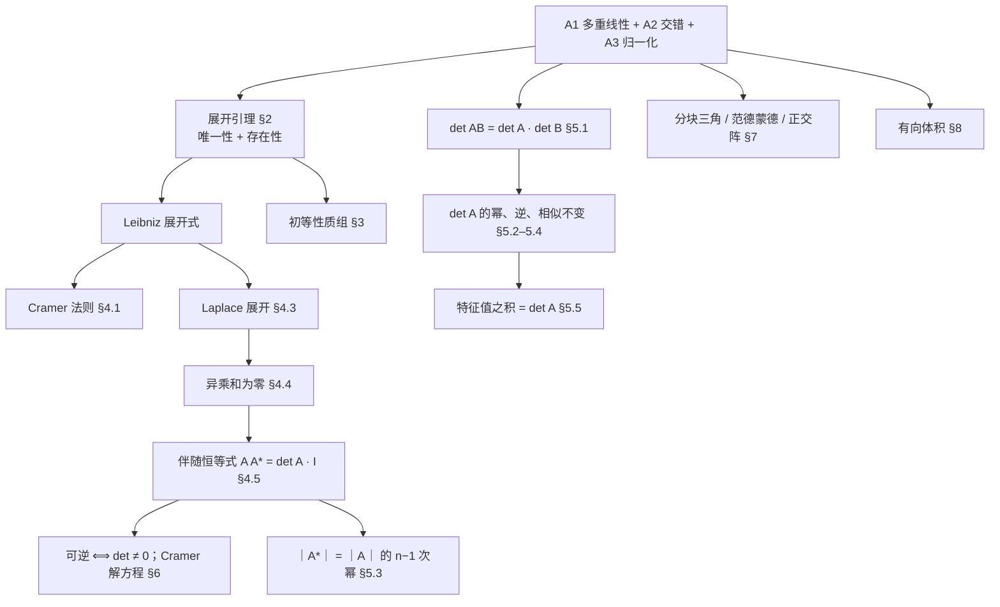
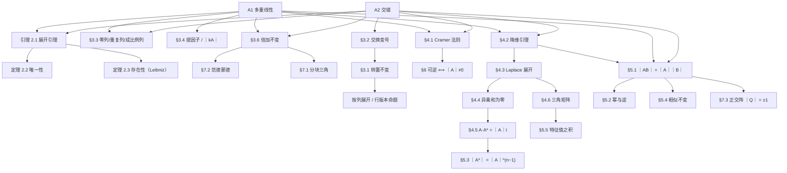

# 行列式的公理化推导

本文**从三条本质性质推出全部性质**，是 [`行列式.md`](./行列式.md) 的**推导层**姊妹篇。那里按"定义 → 性质"罗列结论；这里只做一件事：**把全部结论从三条公理推出来**，说明它们不是彼此平行的记忆条目，而是同一台机器的一根主轴。

## 1. 三条公理 {#axioms}

设 $\mathbb F$ 为任一域，$V=\mathbb F^n$。把 $n$ 阶方阵 $A$ 按列分块写成 $A=(v_1,\dots,v_n)$。

> **定义 1.1（行列式）** $\det:V\times\cdots\times V\to\mathbb F$（$n$ 个变元）是满足下列三条的函数：

| 公理 | 名称 | 内容 | 直观 |
| --- | --- | --- | --- |
| A1 | 多重线性 | 对每个变元分别线性：$\det(\dots,av+bw,\dots)=a\det(\dots,v,\dots)+b\det(\dots,w,\dots)$ | 某一方向拉长 $a$ 倍，体积就 $a$ 倍 |
| A2 | 交错 | 两个变元相同则取值为 $0$：$\det(\dots,v,\dots,v,\dots)=0$ | 两条边重合，体积塌成 $0$ |
| A3 | 归一化 | $\det(e_1,\dots,e_n)=\det I=1$ | 单位立方体体积为 $1$ |

**关于 A2 的两种写法。** 当 $\operatorname{char}\mathbb F\neq2$ 时，A2 等价于"交换两个变元变号"（证明见 §3.2）；$\operatorname{char}\mathbb F=2$ 时两者不等价，此时以"重复变元给出 $0$"为准。

**路线图。**

**记号。** $A^{\mathsf T}$ 为转置；$M_{ij}$ 为删去第 $i$ 行第 $j$ 列所得的 $n-1$ 阶子矩阵（**余子式**）；$A_{ij}=(-1)^{i+j}M_{ij}$ 为**代数余子式**；$A^*$ 为**伴随矩阵** $(A^*)_{ij}=A_{ji}$；记号 $\det(\dots,v,\dots,u,\dots)$ 表示把 $v,u$ 按写在对应位置的列插入。

## 2. 存在性、唯一性与 Leibniz 展开式 {#leibniz}

### 2.1 展开引理

> **引理 2.1** 设 $D$ 具有 A1、A2（不必有 A3）。则
> $$D(v_1,\dots,v_n)=\sum_{\sigma\in S_n}\operatorname{sgn}(\sigma)\prod_{j=1}^{n}a_{\sigma(j)\,j}\cdot D(e_1,\dots,e_n),\qquad A=(v_1,\dots,v_n).$$

**证明** 把 $v_j=\sum\limits_{i=1}^{n}a_{ij}e_i$ 代入，用 A1 逐列拆开 $n$ 重线性和：

$$D(v_1,\dots,v_n)=\sum_{i_1,\dots,i_n=1}^{n}\Bigl(\prod_{j=1}^{n}a_{i_jj}\Bigr)D(e_{i_1},\dots,e_{i_n}).$$

若某个 $(i_1,\dots,i_n)$ 中有两个指标相同，则相应 $D(e_{i_1},\dots,e_{i_n})$ 的对应两个变元都是同一个 $e_i$，由 A2 为 $0$。故只剩 $i_1,\dots,i_n$ 两两不同、即 $(i_1,\dots,i_n)=(\sigma(1),\dots,\sigma(n))$ 的 $n!$ 项。再由 A2 的换位形式（§3.2 已证：交换两个变元变号）得 $D(e_{\sigma(1)},\dots,e_{\sigma(n)})=\operatorname{sgn}(\sigma)D(e_1,\dots,e_n)$。$\blacksquare$

### 2.2 唯一性

> **定理 2.2（唯一性）** 满足 A1–A3 的函数至多一个。

**证明** 由 A3，$D(e_1,\dots,e_n)=1$，故引理 2.1 把 $D$ 完全钉死为右边那个和。$\blacksquare$

### 2.3 存在性：Leibniz 公式

> **定理 2.3（存在性）** 规定
> $$\det A=\sum_{\sigma\in S_n}\operatorname{sgn}(\sigma)\prod_{i=1}^{n}a_{i\,\sigma(i)},$$
> 则 $\det$ 满足 A1–A3。

**证明** 逐条核对。

- **A1**：每一项 $\operatorname{sgn}(\sigma)\prod_i a_{i\sigma(i)}$ 中恰含第 $j$ 列的一个元素 $a_{j\sigma(j)}$（行 $j$ 列的列指标为 $\sigma(j)$）。固定其余列，该项是关于第 $j$ 列的线性函数；有限个线性函数之和仍线性。$n$ 列各自线性即 A1。
- **A2**：设第 $p$ 列与第 $q$ 列相同（$p\neq q$），即 $a_{ip}=a_{iq}$ 对一切 $i$ 成立。取换位 $\tau=(p\,q)$，则 $\sigma\mapsto\sigma\tau$ 是 $S_n$ 上的无固定点对合，且 $\operatorname{sgn}(\sigma\tau)=-\operatorname{sgn}(\sigma)$。又由列相同，$a_{p,\sigma(q)}=a_{q,\sigma(q)}$、$a_{q,\sigma(p)}=a_{p,\sigma(p)}$，故
  $$\prod_{i=1}^{n}a_{i\,(\sigma\tau)(i)}=\prod_{i=1}^{n}a_{i\,\sigma(i)}.$$
  于是求和中的项两两抵消，$\det=0$。
- **A3**：$A=I$ 时 $a_{i\sigma(i)}$ 除 $\sigma=\operatorname{id}$ 外均为 $0$，唯一非零项为 $\operatorname{sgn}(\operatorname{id})\cdot1=1$。$\blacksquare$

### 2.4 结论：公理 ⇔ 公式

由定理 2.2 与 2.3，**"满足 A1–A3 的函数"与"Leibniz 公式定义的函数"是同一个对象**。因此 `行列式.md` §1.2 的定义式不是前提，而是 A1–A3 的**推论**；而 `行列式.md` §6.2 的"三条性质唯一刻画"正是这里的定理 2.2。

### 2.5 元定理：证明套路

唯一性定理真正的威力在于把"证明恒等式"降级为"验证两组线性条件"：

> **元定理 2.4（论证模板）** 设 $X$ 是一个关于 $n$ 个向量（或某矩阵的 $n$ 列/行）的 $\mathbb F$-值函数，满足：**（i）** $X$ 对每个变元线性（A1）；**（ii）** $X$ 在两个变元相同时为 $0$（A2）；**（iii）** $X$ 在某一个具体输入 $A_0$ 上的值已知。则 $X$ 被完全决定：
> $$X(A)=\frac{X(A_0)}{\det A_0}\cdot\det A,$$
> 特别当 $A_0=I$ 且 $X(I)=1$ 时 $X\equiv\det$。

下文凡出现"**用元定理**"字样的证明，都是指固定其余变量、只把待证式看成某一组变量的交错多重线性函数，再在一个极简情形（通常 $A=I$）验证一次。这是把全部性质串起来的那根主轴。

## 3. 初等性质

### 3.1 转置不变

> **命题 3.1** $\lvert A^{\mathsf T}\rvert=\lvert A\rvert$。

**证明（元定理）** 令 $X(A)=\det(A^{\mathsf T})$。把 $A^{\mathsf T}$ 的**列**看成变元，它们正是 $A$ 的各行，故 $X$ 对 $A$ 的各行交错多重线性。由元定理（对"行版本"的行列式）$X(A)=\det A\cdot X(I)=\det A\cdot1$。$\blacksquare$

**意义** 自此之后，凡对"列"成立的命题自动对"行"成立，无需重复证明。`行列式.md` §2 开头那句"对行成立的对列也成立"，其严格来源就是本条。

### 3.2 交换两个变元变号

> **命题 3.2** 交换第 $p,q$ 列得 $\det(\dots,v_q,\dots,v_p,\dots)=-\det(\dots,v_p,\dots,v_q,\dots)$。

**证明** 取 $u=v_p+v_q$ 代入第 $p,q$ 两列，由 A2 与 A1：
$$0=\det(\dots,u,\dots,u,\dots)=\underbrace{\det(\dots,v_p,\dots,v_p,\dots)}_{A2\Rightarrow0}+\det(\dots,v_p,\dots,v_q,\dots)+\det(\dots,v_q,\dots,v_p,\dots)+\underbrace{\det(\dots,v_q,\dots,v_q,\dots)}_{=0}.$$
移项即得（此式在任意域成立，不需除以 $2$）。$\blacksquare$

**推论** $\operatorname{char}\mathbb F\neq2$ 时 A2 与"交换变号"等价：若交换变号且两列相同，则 $X=-X\Rightarrow2X=0\Rightarrow X=0$。

### 3.3 全零列、重复列、成比例列

> **命题 3.3** 下列情形行列式为 $0$：

| 情形 | 依据 |
| --- | --- |
| 某一列为零向量 | A1：$\det(\dots,0\cdot 0,\dots)=0\cdot\det(\dots,0,\dots)=0$ |
| 两列相同 | A2 |
| 两列成比例 $v_q=kv_p$，$p\neq q$ | 先由 A1 提因子得 $k\det(\dots,v_p,\dots,v_p,\dots)=0$ |
| 某一列是其余列的线性组合 | §4.1 的拆列模板，每项都含重复列 |

### 3.4 提因子与 $\lvert kA\rvert$

> **命题 3.4** 某一列乘 $k$，行列式乘 $k$；特别地 $\lvert kA\rvert=k^{n}\lvert A\rvert$。

**证明** 第一条即 A1 取 $v\mapsto kv$；第二条对 $n$ 列各用一次。注意 $\lvert kA\rvert\neq k\lvert A\rvert$（除非 $n=1$），因为 $k$ 作用在**每一列**上。$\blacksquare$

### 3.5 分列线性

> **命题 3.5** $\det(\dots,av+bw,\dots)=a\det(\dots,v,\dots)+b\det(\dots,w,\dots)$（其余列不变）。

这正是 A1，此处单列出来是因为它是**计算**中最常用的形态：它允许把矩阵拆成"若干简单矩阵之和"。

### 3.6 倍加不变

> **命题 3.6** $v_p\leftarrow v_p+kv_q$（$p\neq q$）不改变行列式。

**证明** 由 A1 拆开：$\det(\dots,v_p+kv_q,\dots,v_q,\dots)=\det(\dots,v_p,\dots,v_q,\dots)+k\det(\dots,v_q,\dots,v_q,\dots)=\det A+0$。$\blacksquare$

### 3.7 初等变换汇总

| 初等变换 | 对 $\det$ 的作用 | 依据 |
| --- | --- | --- |
| 交换两列 | 乘 $-1$ | 命题 3.2 |
| 某列乘 $k\neq0$ | 乘 $k$ | A1 |
| 某列加另一列 $k$ 倍 | 不变 | 命题 3.6 |
| 左乘初等矩阵 $E$ | $\det(EA)=\det E\det A$ | §5.1 |

最后一行说明"初等变换"与"乘初等矩阵"的描述一致；其中 $\det E$ 取 $-1,k,1$ 三种值。

## 4. 展开定理

### 4.1 拆列模板与 Cramer 法则

> **命题 4.1（拆列模板）** 若第 $k$ 个变元 $v_k=\sum_j c_jw_j$，则
> $$\det(\dots,\underset{\substack{\uparrow\\ k\text{ 位}}}{v_k},\dots)=\sum_j c_j\det(\dots,\underset{\substack{\uparrow\\ k\text{ 位}}}{w_j},\dots).$$

**证明** 对第 $k$ 个变元用 A1（分列线性，命题 3.5），有限和可直接提出。$\blacksquare$

> **推论 4.1.1（相关列给出零）** 若 $v_k=\sum\limits_{j\neq k}c_jv_j$，则 $\lvert A\rvert=0$。

**证明** 由命题 4.1，右端第 $j$ 项为 $c_j\det(\dots,v_j\text{ 在第 }k\text{ 位},\dots,v_j\text{ 在第 }j\text{ 位},\dots)$，第 $j$ 与第 $k$ 两列都是 $v_j$，由 A2 为 $0$。$\blacksquare$

> **定理 4.2（Cramer 法则）** 设 $w=\sum_j c_jv_j$，则对每个 $k$
> $$c_k\det(v_1,\dots,v_n)=\det(v_1,\dots,\underset{\substack{\uparrow\\k\text{ 位}}}{w},\dots,v_n).$$

**证明** 把 $w$ 放到第 $k$ 位，由命题 4.1 拆开第 $k$ 位：
$$\det(v_1,\dots,w\text{ 在第 }k\text{ 位},\dots,v_n)=\sum_jc_j\det(v_1,\dots,v_j\text{ 在第 }k\text{ 位},\dots,v_n).$$
当 $j\neq k$ 时，右端第 $j$ 位与第 $k$ 位都是 $v_j$，由 A2 为 $0$；当 $j=k$ 时第 $k$ 位仍是 $v_k$，即 $\det A$。故右端只剩 $c_k\det A$。$\blacksquare$

**推论（解方程）** 若 $\det A\neq0$，则 $Ax=b$ 有唯一解，且 $x_k=\det A_k(b)/\det A$，其中 $A_k(b)$ 是把 $A$ 的第 $k$ 列换成 $b$ 所得矩阵。这同时给出 $A$ 可逆的显式构造（见 §6）。

### 4.2 降维引理

> **引理 4.3** 设 $\alpha_j\in\mathbb F^n$（$j\neq k$）的第 $i$ 个分量为 $0$，记 $\alpha_j'\in\mathbb F^{n-1}$ 为删去第 $i$ 个分量所得。则
> $$\det(\alpha_1,\dots,\alpha_{k-1},\,e_i,\,\alpha_{k+1},\dots,\alpha_n)=(-1)^{k-i}\det M,\qquad M=\bigl(\alpha_j'\bigr)_{j\neq k},$$
> 右端按 $j$ 递增排列列。

**证明** 把 $e_i$ 从第 $k$ 位移到第 $i$ 位，需 $\lvert k-i\rvert$ 次相邻换位，由命题 3.2 得符号 $(-1)^{\lvert k-i\rvert}=(-1)^{k-i}$；将变换后的取值记为 $(-1)^{k-i}G(\alpha_j'\,;j\neq k)$。

- $G$ 对每个 $\alpha_j'$ 线性，且交换两个 $\alpha_j'$ 相当于交换行列式两列、由 A2 变号，故 $G$ 交错多重线性（补零提升是线性的，$e_i$ 的位置固定不变）。
- 当诸 $\alpha_j$ 取 $e_1,\dots,\widehat{e_i},\dots,e_n$（按 $j$ 递增，恰好 $n-1$ 个）时，删去坐标 $i$ 后得到 $e_1,\dots,e_{n-1}$，故 $G(I_{n-1})=1$。

由元定理 2.4（$n-1$ 维版本）$G=\det$，右边正是 $M$ 的 $n-1$ 阶行列式。$\blacksquare$

### 4.3 Laplace 展开（按行按列展开）

> **定理 4.4** 对任意 $i$：
> $$\lvert A\rvert=\sum_{j=1}^{n}a_{ij}A_{ij}=\sum_{j=1}^{n}(-1)^{i+j}a_{ij}M_{ij}.$$
> 按列同理：$\lvert A\rvert=\sum_i a_{ij}A_{ij}$。

**证明** 把第 $j$ 列写成 $v_j=a_{ij}e_i+\tilde v_j$，其中 $\tilde v_j$ 的第 $i$ 分量为 $0$。用 A1 对全部 $n$ 列同时拆开，得 $n^n$ 个"每列取一个加项"的乘积项：

- 一列都不取 $e_i$ 的项：即 $\det(\tilde v_1,\dots,\tilde v_n)$。这些列的第 $i$ 个分量全为 $0$，即全部落在 $n-1$ 维子空间 $\{x_i=0\}$ 内，$n$ 个向量必线性相关，由推论 4.1.1 该项为 $0$；
- 含两个及以上 $e_i$ 的项：相应两个变元都是 $e_i$，由 A2 为 $0$；
- 恰含一个 $e_i$ 的项：即"第 $j$ 列取 $a_{ij}e_i$、其余列取 $\tilde v$"，共 $n$ 组：
  $$\det A=\sum_{j=1}^{n}a_{ij}\det(\tilde v_1,\dots,\tilde v_{j-1},e_i,\tilde v_{j+1},\dots,\tilde v_n).$$

对每个 $j$ 用降维引理 4.3（取 $\alpha_j=\tilde v_j$、$k=j$），并注意 $\tilde v_l'$ 就是 $M_{ij}$ 的第 $l$ 列：

$$\det A=\sum_{j=1}^{n}a_{ij}(-1)^{j-i}M_{ij}=\sum_{j=1}^{n}(-1)^{i+j}a_{ij}M_{ij}$$

（末步用 $(-1)^{-i}=(-1)^{i}$）。按列展开由命题 3.1（转置）得到。$\blacksquare$

**推论（低阶显式公式）** $n=2$：$ad-bc$；$n=3$：对角线法则；一般地，三阶以上的"对角线法则"失效，因为它不再是这 $n!$ 项的正确符号分配。

### 4.4 异乘和为零

> **命题 4.5** 对 $i\neq k$：$\sum\limits_{j=1}^{n}a_{kj}A_{ij}=0$；对 $i=k$ 则为 $\lvert A\rvert$。

**证明** 设 $B$ 是把 $A$ 的第 $i$ 行换成第 $k$ 行所得矩阵，则 $B$ 第 $i,k$ 两行相同，由 A2（经转置命题 3.1）$\lvert B\rvert=0$。按第 $i$ 行对 $B$ 展开：$B$ 的第 $i$ 行元素是 $a_{kj}$，而删去第 $i$ 行后 $B$ 与 $A$ 完全一致，故代数余子式相同，为 $A_{ij}$。于是 $\sum_j a_{kj}A_{ij}=\lvert B\rvert=0$。$i=k$ 时即定理 4.4。$\blacksquare$

### 4.5 伴随恒等式

> **定理 4.6** $AA^*=A^*A=\lvert A\rvert\,I$。

**证明** 由 $(A^*)_{ji}=A_{ij}$，
$$(AA^*)_{ik}=\sum_{j=1}^{n}a_{ij}A_{kj}=\begin{cases}\lvert A\rvert,&i=k\quad(\text{定理 4.4})\\ 0,&i\neq k\quad(\text{命题 4.5})\end{cases}$$
即 $AA^*=\lvert A\rvert I$；转置同式得 $A^*A=\lvert A\rvert I$（注意 $(AA^*)^{\mathsf T}=A^*A$ 对 $A^*$ 的定义也成立）。$\blacksquare$

### 4.6 三角矩阵

> **命题 4.7** 上（下）三角、对角矩阵的 $\lvert A\rvert=\prod\limits_{i=1}^{n}a_{ii}$。

**证明** 归纳。$n=1$ 显然。设 $A$ 为上三角，按第 $1$ 列展开（定理 4.4）：该列只有 $a_{11}\neq0$，故 $\lvert A\rvert=a_{11}M_{11}$；而 $M_{11}$ 是 $n-1$ 阶上三角矩阵，由归纳假设 $M_{11}=\prod_{i\ge2}a_{ii}$。下三角按第 $1$ 行同法（或用转置）。$\blacksquare$

## 5. 与矩阵运算的关系

### 5.1 乘法性质 {#product-rule}

> **定理 5.1** 对同阶方阵 $A,B$：$\lvert AB\rvert=\lvert A\rvert\lvert B\rvert$。

**证明（元定理，一步到位）** 固定 $B$，令 $X(A)=\det(AB)$，并把 $X$ 看成 $A$ 的 $n$ 列 $(v_1,\dots,v_n)$ 的函数。

- **A1**：$AB$ 的第 $j$ 列为 $Av_j$，它关于 $v_j$ 线性，故 $X$ 对每个 $v_j$ 线性。
- **A2**：若 $v_p=v_q$，则 $AB$ 的第 $p,q$ 列都是 $Av_p$，相同，故 $X=0$。
- **取值**：$X(I)=\det B$。

由元定理 2.4，$X(A)=\det A\cdot X(I)=\det A\det B$。$\blacksquare$

**要点** $B$ **不必可逆**。把 $B$ 固定、$A$ 变动的做法使退化情形（$\det B=0$）被自动覆盖，无需"可逆时成立 + 连续性延拓"之类的说辞。

**推论** 左乘/右乘初等矩阵 $E$：$\lvert EA\rvert=\lvert E\rvert\lvert A\rvert$，$\lvert AE\rvert=\lvert A\rvert\lvert E\rvert$（后者由转置）。

### 5.2 幂与逆

> **命题 5.2** $\lvert A^{k}\rvert=\lvert A\rvert^{k}$（$k\in\mathbb Z_{\ge0}$）；若 $A$ 可逆，则 $\lvert A^{-1}\rvert=\lvert A\rvert^{-1}$。

**证明** 前者对定理 5.1 归纳。后者：$1=\lvert I\rvert=\lvert AA^{-1}\rvert=\lvert A\rvert\lvert A^{-1}\rvert$。$\blacksquare$

### 5.3 伴随矩阵的行列式

> **命题 5.3** $\lvert A^*\rvert=\lvert A\rvert^{n-1}$。

**证明** 由定理 4.6，$AA^*=\lvert A\rvert I$。对两边取行列式，用 A1 把标量提出（$\det(cI)=c^n\det I=c^n$）：
$$\lvert A\rvert\cdot\lvert A^*\rvert=\lvert A\rvert^{n}.$$

- 若 $\lvert A\rvert\neq0$，两边除以 $\lvert A\rvert$ 得 $\lvert A^*\rvert=\lvert A\rvert^{n-1}$。
- 若 $\lvert A\rvert=0$，则 $\operatorname{rank}A\le n-1$，分两种情形。**若 $\operatorname{rank}A\le n-2$**：每个 $n-1$ 阶子式都是 $0$（因为非零的 $n-1$ 阶子式蕴含 $\operatorname{rank}A\ge n-1$），故所有代数余子式为 $0$，$A^*=0$，$\lvert A^*\rvert=0$。**若 $\operatorname{rank}A=n-1$**：由定理 4.6 得 $AA^*=\lvert A\rvert I=0$，即 $\operatorname{Col}(A^*)\subseteq\ker A$，而 $\dim\ker A=n-\operatorname{rank}A=1$，故 $\operatorname{rank}A^*\le1<n$，由定理 6.1 得 $\lvert A^*\rvert=0$。

两种情形都有 $\lvert A^*\rvert=0=\lvert A\rvert^{n-1}$（$n\ge2$；$n=1$ 时 $A^*=I$，$\lvert A^*\rvert=1=\lvert A\rvert^{0}$ 直接成立）。$\blacksquare$

> 注：引用定理 6.1 时只用其"$\operatorname{rank}<n\Rightarrow\lvert\cdot\rvert=0$"方向，而该方向在 §6.2 中由推论 4.1.1 独立证明，不构成循环。

（这里不需要"多项式延拓"的论证，第二分支是初等的。）

### 5.4 相似不变

> **命题 5.4** 对可逆 $P$：$\lvert P^{-1}AP\rvert=\lvert A\rvert$。

**证明** 由定理 5.1 与命题 5.2：$\lvert P^{-1}AP\rvert=\lvert P^{-1}\rvert\lvert A\rvert\lvert P\rvert=\lvert A\rvert$。$\blacksquare$

**意义** $\det$ 是相似不变量，因此它是"线性变换 $f:V\to V$ 本身"的属性，而不依赖基的选择。

### 5.5 特征值之积

> **命题 5.5** 若 $A$ 在 $\mathbb F$ 的代数闭包中按代数重数计的特征值为 $\lambda_1,\dots,\lambda_n$，则 $\lvert A\rvert=\prod_i\lambda_i$。

**证明** 特征多项式 $f(\lambda)=\det(\lambda I-A)$（对 $\lambda I-A$ 用 A1，它是 $\lambda$ 的 $n$ 次首一多项式）。在代数闭包中 $f$ 分裂，故 $f(\lambda)=\prod_{i}(\lambda-\lambda_i)$。比较 $\lambda=0$ 处的值：
$$f(0)=\det(-A)=(-1)^{n}\det A,\qquad \prod_i(0-\lambda_i)=(-1)^{n}\prod_i\lambda_i,$$
两边消去 $(-1)^{n}$ 即得。$\blacksquare$

**另一说法** 若 $A$ 可三角化（例如 $\mathbb F=\mathbb C$），则 $\lvert A\rvert$ 等于三角化后主对角元之积，即特征值之积；结合命题 4.7 与命题 5.4 立得。

### 5.6 反例：加法不被保持

$\lvert A+B\rvert\neq\lvert A\rvert+\lvert B\rvert$。取 $A=I_2$、$B=-I_2$，则 $\lvert A+B\rvert=\lvert 0\rvert=0$，而 $\lvert A\rvert+\lvert B\rvert=1+1=2$。这不是"公理没推出来"，而是 A1 只保证**对每一列分别**线性；$(A+B)$ 的每一列同时被两个矩阵改变，故不成立。

## 6. 与秩、可逆性的关系

### 6.1 主等价链

> **定理 6.1** 对 $n$ 阶方阵 $A$，下列命题等价：
> $$\lvert A\rvert=0\iff A\text{ 的列线性相关}\iff A\text{ 的行线性相关}\iff\operatorname{rank}A<n\iff Ax=0\text{ 有非零解}\iff A\text{ 不可逆}.$$
> 其否定形式同样等价：$\lvert A\rvert\neq0\iff$ 列无关 $\iff\operatorname{rank}A=n\iff Ax=0$ 只有零解 $\iff A$ 可逆。

### 6.2 证明

证明按下面的闭环走，其中前两步只用已证的结论：

1. **列相关 $\Rightarrow\lvert A\rvert=0$**：即推论 4.1.1。
2. **$\lvert A\rvert\neq0\Rightarrow$ 可逆**：对每个标准基向量 $e_k$，定理 4.2 的推论给出 $Ax=e_k$ 的解 $x^{(k)}$，且 $x^{(k)}_j=\lvert A_j(e_k)\rvert/\lvert A\rvert$ 有定义。拼成 $B=(x^{(1)},\dots,x^{(n)})$，则 $AB=I$；方阵的单边逆即逆，故 $A$ 可逆。这同时给出公式 $A^{-1}=\dfrac{A^*}{\lvert A\rvert}$（由定理 4.6，$\lvert A\rvert\neq0$ 时 $A\cdot\frac{A^*}{\lvert A\rvert}=I$）。
3. **可逆 $\Rightarrow\lvert A\rvert\neq0$**：$1=\lvert I\rvert=\lvert AA^{-1}\rvert=\lvert A\rvert\lvert A^{-1}\rvert$（定理 5.1），故 $\lvert A\rvert\neq0$ 且 $\lvert A^{-1}\rvert=\lvert A\rvert^{-1}$。
4. **列无关 $\Leftrightarrow$ 可逆**：列无关即 $Ax=0$ 只有零解，也就是映射 $x\mapsto Ax$ 单射；方阵单射必满射必可逆。故 2、3 合起来给出"$\lvert A\rvert=0\Leftrightarrow$ 列相关 $\Leftrightarrow$ 不可逆"。
5. **行版本**：$\operatorname{rank}A=\operatorname{rank}A^{\mathsf T}$，且由命题 3.1 交换 $\lvert A\rvert$ 与 $\lvert A^{\mathsf T}\rvert$，故行相关、行秩的表述同样等价。
6. **$\operatorname{rank}A<n$**：$\operatorname{rank}A$ 等于最大线性无关列数（列秩），故 $\operatorname{rank}A<n\Leftrightarrow$ 列相关。
7. **$Ax=0$ 有非零解**：这就是列相关的定义式表达。

## 7. 特殊行列式

### 7.1 分块三角

> **命题 7.1** 若 $A$ 为 $p$ 阶、$D$ 为 $q$ 阶方阵（$p+q=n$），则
> $$\begin{vmatrix}A&B\\0&D\end{vmatrix}=\lvert A\rvert\,\lvert D\rvert,\qquad \begin{vmatrix}A&0\\C&D\end{vmatrix}=\lvert A\rvert\,\lvert D\rvert.$$

**证明** 记左端为 $M$。三步，全用元定理（把 $M$ 看成 $A$ 的列的函数）：

1. 作为 $A$ 的 $p$ 列的函数交错 $p$ 重线性，故 $=\lvert A\rvert\cdot\det\begin{pmatrix}I_p&B\\0&D\end{pmatrix}$。
2. 对该中间矩阵做列倍加 $v_j\leftarrow v_j-\sum_i b_{ij}v_{p+i}$（$j\le p$，命题 3.6），把 $B$ 化为 $0$，得 $\begin{pmatrix}I_p&0\\0&D\end{pmatrix}$。
3. 再把 $\begin{pmatrix}I_p&0\\0&D\end{pmatrix}$ 看成 $D$ 的 $q$ 列的函数，交错 $q$ 重线性，故 $=\lvert D\rvert\cdot\det I=\lvert D\rvert$。

合起来为 $\lvert A\rvert\lvert D\rvert$。左下角形式由转置命题 3.1 得到。$\blacksquare$

### 7.2 范德蒙德行列式

> **命题 7.2** 设 $V_n=\det\begin{pmatrix}1&1&\cdots&1\\ x_1&x_2&\cdots&x_n\\ \vdots&\vdots&&\vdots\\ x_1^{n-1}&x_2^{n-1}&\cdots&x_n^{n-1}\end{pmatrix}$，则 $V_n=\prod\limits_{1\le i<j\le n}(x_j-x_i)$。

**证明** 用命题 3.6 做列变换：对 $j=n,n-1,\dots,2$ 依次取 $v_j\leftarrow v_j-x_1v_{j-1}$。变换后第 $j$ 列（$j\ge2$）第 $i$ 个元素为 $x_j^{i-1}-x_1x_j^{i-2}=x_j^{i-2}(x_j-x_1)$（$i\ge2$），第一个元素为 $0$。于是第 $1$ 行只剩第一个元素为 $1$，按它（定理 4.4）并逐列提出因子 $x_j-x_1$（命题 3.4）：

$$V_n=\Bigl(\prod_{j=2}^{n}(x_j-x_1)\Bigr)\det\bigl(x_j^{\,i-2}\bigr)_{\substack{i=2,\dots,n\\ j=2,\dots,n}}=\Bigl(\prod_{j=2}^{n}(x_j-x_1)\Bigr)V_{n-1}^{(x_2,\dots,x_n)}.$$

归纳：$V_1=1$，累乘即得结论。$\blacksquare$

**要点** 这条**没有展开 Leibniz 公式**——纯靠"倍加不变 + 提因子 + 展开"三条公理派生出的工具完成，说明公理体系同时是计算工具。

### 7.3 正交矩阵

> **命题 7.3** 若 $Q^{\mathsf T}Q=I$，则 $\lvert Q\rvert=\pm1$。

**证明** $\lvert Q\rvert^{2}=\lvert Q^{\mathsf T}\rvert\lvert Q\rvert=\lvert Q^{\mathsf T}Q\rvert=\lvert I\rvert=1$（用命题 3.1 与定理 5.1）。$\blacksquare$

## 8. 几何意义：这三条就是"有向体积"的公理

把 $\mathbb F$ 取为 $\mathbb R$。$n$ 个向量张成的平行 $n$ 面体的**有向体积** $V(v_1,\dots,v_n)$ 天然满足：

| 公理 | 几何内容 |
| --- | --- |
| A1 | 固定其余边、让第 $j$ 条边 $v_j\mapsto av_j+bw$，体积随该边线性变化（平行体沿一个方向线性缩放） |
| A2 | 两向量重合（退化）时体积为 $0$；等价地交换两面指向相反 |
| A3 | 单位立方体体积为 $1$ |

而 A1+A2+A3 唯一确定一个函数（定理 2.2），故 **$\det$ 只能是有向体积**。反过来，§3.6 的"倍加不变"就是几何上的**剪切不变性**（Euclid 的剪拼）：把平行体剪开重排成"矩形体"不改变体积，而整个过程在代数上正是用倍加变换把 $A$ 化成 $\operatorname{diag}$ 或上三角，再由命题 4.7 读到 $\prod a_{ii}$ 即为体积。符号部分：$\det A>0$ 保定向、$\det A<0$ 反定向。

## 9. 为什么偏偏是这三条：外代数视角

A1–A3 并非任意选集，它们各自对应外代数（Grassmann 代数）构造中的一步。

- 设 $\Lambda^n(V)$ 是 $V$ 的 $n$ 次外幂：由 $v_1\wedge\cdots\wedge v_n$ 张成，商掉 $v\wedge v=0$。由组合计数 $\dim\Lambda^n(V)=\binom{n}{n}=1$，即它是**一维**的。
- 线性映射 $f:V\to V$ 诱导 $\Lambda^n(f):\Lambda^n(V)\to\Lambda^n(V)$。一维空间上的线性映射只能是"乘一个数"，**那个数就是 $\det f$**。
- 对应关系：$\Lambda^n$ 的多线性性 $\to$ A1；商掉 $v\wedge v=0$ $\to$ A2；$\Lambda^n$ 的一维性与基的选择 $\to$ A3 归一化。

于是定理 5.1 不再需要证明：$\Lambda^n$ 是函子，$\Lambda^n(g\circ f)=\Lambda^n(g)\Lambda^n(f)$，一维空间上的"乘数"相应地相乘，这就是 $\det$ 的乘法性。命题 5.4 也只是函子在共轭下的平凡结论。

**更高一层的统一** 可以说 $\det:GL_n\to\mathbb F^{\times}$ 是"保持乘法且与基无关"的**唯一**非平凡同态（nLab 的表述：行列式是 *the (essentially unique) universal alternating multilinear map*）。在非交换环上，相应的对象是 Dieudonné 行列式。

## 10. 依赖关系总图与溯源表

### 10.1 依赖图

### 10.2 溯源表：`行列式.md` 的每条性质来自哪里

| `行列式.md` 的位置 | 性质 | 本文的证明 | 用到的公理 |
| --- | --- | --- | --- |
| §1.2 定义式 | Leibniz 公式 | 定理 2.3 | A1–A3 |
| §2.1 | 转置不变 | 命题 3.1 | 元定理（A1+A2+A3） |
| §2.2 | 交换变号 | 命题 3.2 | A1+A2 |
| §2.3 | 重复/成比例/零列为 $0$ | 命题 3.3 | A1+A2 |
| §2.4 | 提因子、$\lvert kA\rvert=k^{n}\lvert A\rvert$ | 命题 3.4 | A1 |
| §2.5 | 分列线性 | 命题 3.5 | A1 |
| §2.6 | 倍加不变 | 命题 3.6 | A1+A2 |
| §2.7 | 初等变换汇总 | 命题 3.7 表 | A1+A2 |
| §3.1 | 按行列展开 | 定理 4.4 | A1+A2+A3 |
| §3.2 | 异乘和为零 | 命题 4.5 | A2+定理 4.4 |
| §3.3 | 三角/对角 | 命题 4.7 | 定理 4.4 |
| §4.1 | $\lvert AB\rvert=\lvert A\rvert\lvert B\rvert$、$\lvert A^{k}\rvert$ | 定理 5.1、命题 5.2 | 元定理 |
| §4.2 | 可逆性、$\lvert A^{-1}\rvert$ | §6.2、命题 5.2 | Cramer、定理 5.1 |
| §4.3 | $\lvert A^*\rvert=\lvert A\rvert^{n-1}$ | 命题 5.3 | 定理 4.6 |
| §4.4 | 相似不变 | 命题 5.4 | 定理 5.1 |
| §4.5 | 特征值之积 | 命题 5.5 | $\det(\lambda I-A)$、代数基本定理 |
| §4.6 | 与秩、线性相关的关系 | 定理 6.1 | 命题 4.1、Cramer |
| §5.1 | 分块三角 | 命题 7.1 | 元定理+倍加 |
| §5.2 | 范德蒙德 | 命题 7.2 | 倍加+提因子+归纳 |
| §5.3 | $\lvert Q\rvert=\pm1$ | 命题 7.3 | 定理 5.1+转置 |
| §6.1 | 有向体积 | §8 | A1–A3 即体积公理 |
| §6.2 | 三性质唯一刻画 | 定理 2.2 | — |

## 11. 边界：公理推不出什么

诚实地标出这台机器的能力边界：

1. **具体数值公式**：公理给出化简路径（倍加、提因子、归纳），但像范德蒙德的最后一步组合计算、或某些特殊行列式的封闭式，仍要动手算；公理本身不含任何"数值信息"。
2. **与加法有关的命题**：$\lvert A+B\rvert\neq\lvert A\rvert+\lvert B\rvert$（§5.6）。这不是"没推出来"，而是**不存在**——A1 只保证逐列线性。同理 $\lvert A+B\rvert$ 一般没有简单公式（有的话需要 $\operatorname{rank}$ 修正项之类的额外结构）。
3. **$\operatorname{char}\mathbb F=2$**：此时"交换变号"与"重复变元为 $0$"不再等价（$-1=1$），必须以 A2 的"重复为 $0$"形式为准；§3.2 的证明恰好不需要除以 $2$，故仍然可用。
4. **非交换环**：定理 5.1 的证明依赖 $\mathbb F$ 交换（元定理中的"提取标量"）。在非交换环上需要改为 Dieudonné 行列式（取值在 $R/[R,R]$ 中），公理体系要重新表述。
5. **基相关的最优算法**：公理不告诉你"哪种展开最快"。那是算法问题（如选零元素最多的行展开、或先做消元），与本质性质无关。

## 12. 一页速查

| 结论 | 一行证明 |
| --- | --- |
| 唯一性、Leibniz 公式 | 逐列拆开 + 交错消项（引理 2.1） |
| 转置不变 | 把"行行列式"当交错多重线性函数（元定理） |
| 交换变号 | 令两列为 $v_p+v_q$ 后展开并消项 |
| 倍加不变 | 拆开后剩一项含重复列 |
| Cramer | 把 $w=\sum c_jv_j$ 放进第 $k$ 列，其余项因重复列为 $0$ |
| Laplace 展开 | 拆列 $\to$ 只剩单 $e_i$ 项 $\to$ 降维引理定符号 |
| 异乘和为零 | 换成两行相同的矩阵展开 |
| $AA^*=\lvert A\rvert I$ | Laplace + 异乘和为零 |
| $\lvert AB\rvert=\lvert A\rvert\lvert B\rvert$ | 固定 $B$，$A\mapsto\det(AB)$ 满足三条 |
| $\lvert A^*\rvert=\lvert A\rvert^{n-1}$ | 对 $AA^*=\lvert A\rvert I$ 取行列式，分 $\lvert A\rvert=0$ 与否 |
| 可逆 $\iff\lvert A\rvert\neq0$ | Cramer 构造逆 / $\lvert AA^{-1}\rvert=1$ |
| 特征值之积 | 特征多项式比较常数项 |
| 有向体积 | A1–A3 即体积公理 |
