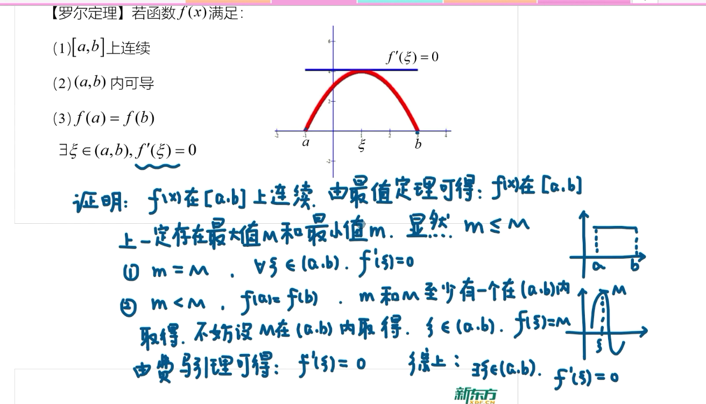
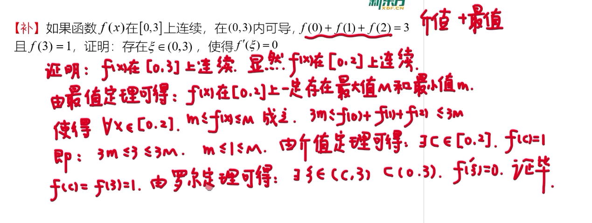
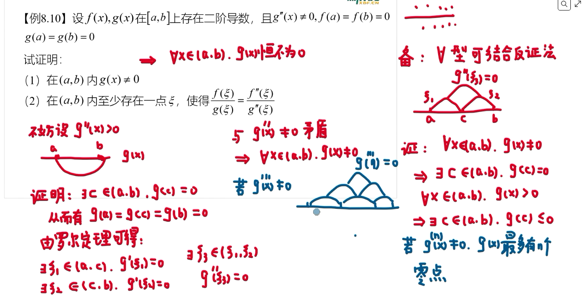
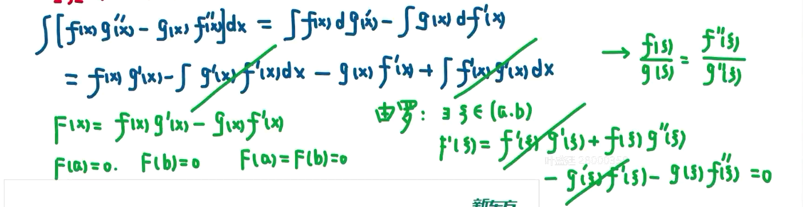
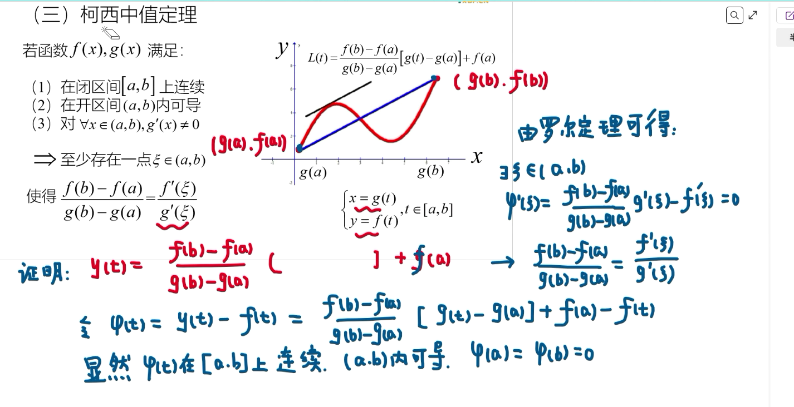
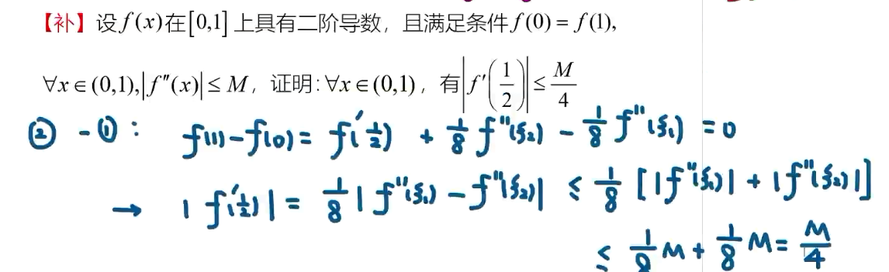

# 中值定理

## 中值定理类型

1. 介值定理
2. 费马引理
3. Rolle 中值定理
4. Lagrange 中值定理

**费马引理**

**Rolle中值定理**

## 题目

### 直接积分问题

设函数 \(f(x)\) 在闭区间 \([0,1]\) 上连续，在开区间 \((0,1)\) 内可导，且
\[
f(0)=0,\qquad f(1)=\frac{1}{2}.
\]
证明：存在 \(\xi\in(0,1)\)，使得
\[
f'(\xi)=\xi.
\]

### 反证法

### 齐次微分方程形势

$$
f^{(n)}(\xi)+P(\xi)f^{(n-1)}(\xi)=0
$$

例如：

$$
\xi f'(\xi)+(2\xi+1)f(\xi)=0
$$

构造辅助函数：

$$
\varphi(x)=f^{(n-1)}(x)e^{\int P(x)\,\mathrm{d}x}
$$

则存在 $\xi\in(a,b)$，使得

$$
f'(\xi)+P(\xi)f(\xi)=0
$$

并取

$$
\varphi(x)=f(x)e^{\int P(x)\,\mathrm{d}x}.
$$

## cauchy 中值定理

## Taylor中值定理

