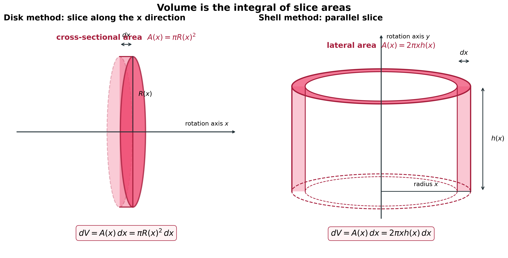

# 旋转体积分：圆盘法与柱壳法

## 1 旋转体与体积微元

[旋转体](https://zh.wikipedia.org/wiki/%E6%97%8B%E8%BD%AC%E4%BD%93)是平面区域绕同一平面内的一条直线旋转所形成的立体。计算其体积的关键不是记住两套孤立公式，而是先确定：**平面微元旋转后变成什么立体微元？**

- 切片**垂直于旋转轴**：旋转后成为圆盘或圆环，使用圆盘法（含垫片法）。
- 切片**平行于旋转轴**：旋转后成为薄圆柱壳，使用柱壳法。

因此，两种方法的本质都是黎曼和：将旋转体分成许多体积近似可算的薄层，再令薄层厚度趋于零。

### 1.1 圆盘法与垫片法

若旋转轴为 $x$ 轴，垂直于旋转轴的截面外半径为 $R(x)$、内半径为 $r(x)$，厚度为 $\mathrm dx$，则

$$
\mathrm dV
=\underbrace{\pi\bigl(R(x)^2-r(x)^2\bigr)}_{\text{截面积}}\,\mathrm dx,
$$

所以

$$
\boxed{V=\pi\int_a^b\bigl(R(x)^2-r(x)^2\bigr)\,\mathrm dx.}
$$

当 $r(x)=0$ 时，圆环退化为实心圆盘：

$$
\boxed{V=\pi\int_a^b R(x)^2\,\mathrm dx.}
$$

### 1.2 柱壳法

若旋转轴为 $y$ 轴，平行于旋转轴的切片到旋转轴的距离为 $\rho(x)$、高度为 $h(x)$、厚度为 $\mathrm dx$，旋转后得到薄圆柱壳。将其沿一条母线展开，可近似看成长方体：

$$
\mathrm dV
=\underbrace{2\pi\rho(x)}_{\text{周长}}
\underbrace{h(x)}_{\text{高度}}
\underbrace{\mathrm dx}_{\text{厚度}},
$$

所以

$$
\boxed{V=2\pi\int_a^b\rho(x)h(x)\,\mathrm dx.}
$$

## 2 例题：同一区域的两种旋转方向

设平面区域

$$
D=\{(x,y)\mid 0\le x\le 1,\ 0\le y\le 1-x^2\}.
$$

分别求区域 $D$ 绕 $x$ 轴和绕 $y$ 轴旋转一周所得旋转体的体积。

### 2.1 绕 $x$ 轴：圆盘法

旋转轴是水平的 $x$ 轴，故沿 $x$ 方向累积垂直于旋转轴的竖直切片。位于 $x$ 处的线段绕 $x$ 轴旋转后成为实心圆盘，其半径和面积分别为

$$
R(x)=1-x^2,
\qquad
A(x)=\pi R(x)^2=\pi(1-x^2)^2.
$$

因此

$$
\begin{aligned}
V
&=\int_0^1 A(x)\,\mathrm dx \\
&=\pi\int_0^1(1-x^2)^2\,\mathrm dx \\
&=\pi\left[x-\frac{2x^3}{3}+\frac{x^5}{5}\right]_0^1 \\
&=\boxed{\frac{8\pi}{15}}.
\end{aligned}
$$

### 2.2 绕 $y$ 轴：柱壳法

取平行于 $y$ 轴的竖直切片。位于 $x$ 处的切片绕 $y$ 轴旋转后成为薄圆柱壳，其几何量为

$$
\rho(x)=x,
\qquad
h(x)=(1-x^2)-0=1-x^2,
\qquad
\text{厚度}=\mathrm dx.
$$

因此

$$
\begin{aligned}
V
&=2\pi\int_0^1\rho(x)h(x)\,\mathrm dx \\
&=2\pi\int_0^1x(1-x^2)\,\mathrm dx \\
&=2\pi\left[\frac{x^2}{2}-\frac{x^4}{4}\right]_0^1 \\
&=\boxed{\frac{\pi}{2}}.
\end{aligned}
$$

这里虽然两种方法都使用 $\mathrm dx$，但生成体积微元的方式不同：绕 $x$ 轴时，竖直切片生成圆盘；绕 $y$ 轴时，竖直切片生成圆柱壳。由于旋转轴不同，两个旋转体的体积一般不相等。

## 3 如何选择方法

| 方法 | 切片相对旋转轴 | 旋转后的微元 | 典型体积微元 |
| --- | --- | --- | --- |
| 圆盘法 | 垂直 | 圆盘或圆环 | $\mathrm dV=\pi(R^2-r^2)\,\mathrm dx$ |
| 柱壳法 | 平行 | 薄圆柱壳 | $\mathrm dV=2\pi\rho h\,\mathrm dx$ |

实际选择时，可以比较两种描述所需的代数工作：

1. 若垂直切片能直接写出内、外半径，优先考虑圆盘法。
2. 若平行切片能直接写出“半径 × 高度”，优先考虑柱壳法。
3. 若某种方法要求分段或求难以表达的反函数，通常改用另一种方法更简洁。
4. 本文统一沿 $x$ 方向取厚度，因此积分元素均为 $\mathrm dx$。

本例中，同一个竖直切片绕 $x$ 轴生成圆盘，绕 $y$ 轴生成圆柱壳，因此可以直观看到两种体积微元的区别。

## 4 Matplotlib 可视化

配套脚本：[旋转体面积切片可视化.py](旋转体面积切片可视化.py)

脚本生成双联面积切片图：

1. 左图：竖直线段绕 $x$ 轴旋转形成薄实心圆盘，直接标出截面积 $A(x)$ 与厚度 $\mathrm dx$。
2. 右图：竖直线段旋转形成的薄圆柱壳，直接标出侧面积 $A(x)$ 与厚度 $\mathrm dx$。

运行脚本后，图片将保存至 `image/旋转体_圆盘法与柱壳法.png`。

## 参考资料

- [旋转体 - 维基百科，自由的百科全书](https://zh.wikipedia.org/wiki/%E6%97%8B%E8%BD%AC%E4%BD%93)
