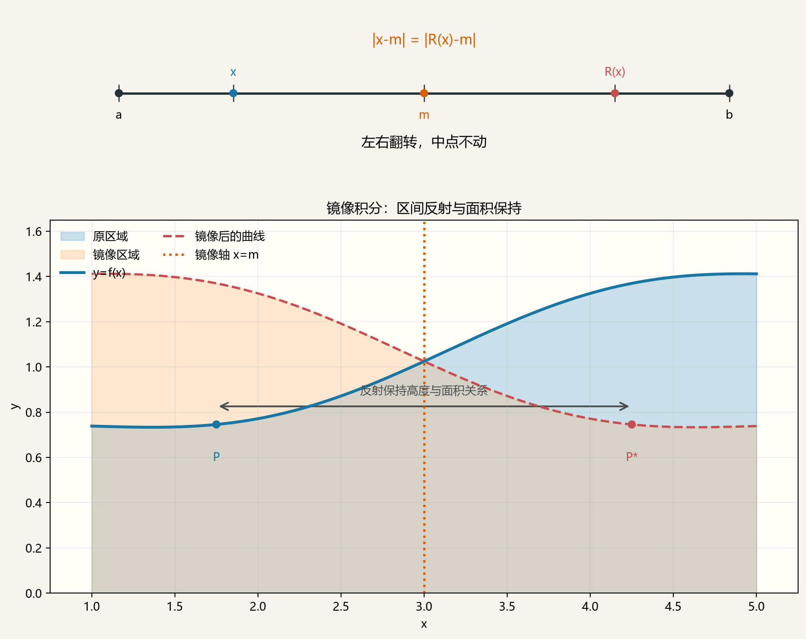

# 镜像积分：从区间对称到通用化简

设函数在区间 \([a,b]\) 上可积，记区间中点为

\[
m=\frac{a+b}{2},
\]

并定义镜像变换

\[
R(x)=a+b-x=2m-x.
\]

则

\[
\boxed{
\begin{aligned}
\int_a^b f(x)\,dx
&=\int_a^b f(R(x))\,dx
\end{aligned}
}.
\]

镜像积分法的重点不在于三角函数、指数函数或对数函数本身，而在于：

> 研究表达式在二阶变换 \(R\) 下如何变化，并提取它关于区间中点的对称部分。

## 1. 镜像变换及其不变性

### 1.1 几何说明

把区间 \[a,b\] 看作一条水平线段。镜像变换

\[
R(x)=a+b-x=2m-x
\]

就是关于竖直直线 `x=m` 的对称：点 `x` 被移到另一侧的点 `R(x)`，并且两点到中点的距离相等，

\[
x-m=-(R(x)-m),
\qquad
|x-m|=|R(x)-m|.
\]

因此，左半区间与右半区间只是左右翻转，长度保持不变。对曲线 `y=f(x)` 下方的面积来说，曲线上的点

\[
P=(x,f(x))
\]

被镜像到

\[
P^*=(R(x),f(x)).
\]

这个几何反射保持高度与面积不变，所以原区域和镜像区域面积相等：

\[
\int_a^b f(x)\,dx
=\int_a^b f(R(x))\,dx.
\]

这里保持不变的是整个区间上的面积（或带符号面积），并不要求每个点的函数值相同。只有当曲线本身关于 `x=m` 对称时，才有 `f(x)=f(R(x))`。下面的示例图把区间端点、对应点和反射轴画在一起，帮助记住“左右翻转，中点不动”。

变换 \(R\) 把区间左右翻转：

\[
a\leftrightarrow b,
\qquad
m\longmapsto m.
\]

若写成

\[
x=m+t,
\]

则

\[
R(x)=m-t.
\]

因此，关于 \([a,b]\) 的镜像问题，本质上就是关于新变量 \(t=x-m\) 的变换

\[
t\longmapsto -t.
\]

同时，镜像两次会回到原点：

\[
R(R(x))=x.
\]

这种满足 \(R^2=\operatorname{id}\) 的变换称为对合。

### 1.2 换元证明

令

\[
u=a+b-x,
\qquad du=-dx.
\]

当 \(x=a\) 时 \(u=b\)，当 \(x=b\) 时 \(u=a\)。所以

\[
\begin{aligned}
\int_a^b f(R(x))\,dx
&=\int_b^a f(u)(-du)\\
&=\int_a^b f(u)\,du\\
&=\int_a^b f(x)\,dx.
\end{aligned}
\]

注意，这只说明两个函数的积分相等，一般并不说明

\[
f(x)=f(R(x)).
\]

## 2. 核心本质：对称化

定义函数关于区间中点的对称部分与反对称部分：

\[
f_+(x)=\frac{f(x)+f(R(x))}{2},
\]

\[
f_-(x)=\frac{f(x)-f(R(x))}{2}.
\]

于是

\[
f=f_++f_-,
\]

而且

\[
f_+(R(x))=f_+(x),
\qquad
f_-(R(x))=-f_-(x).
\]

其中 \(f_+\) 关于中点对称，\(f_-\) 关于中点反对称。由镜像不变性，

\[
\int_a^b f_-(x)\,dx=0,
\]

所以

\[
\boxed{
\begin{aligned}
\int_a^b f(x)\,dx
&=\int_a^b f_+(x)\,dx\\
&=\frac12\int_a^b\left[f(x)+f(R(x))\right]dx
\end{aligned}
}.
\]

这就是所有镜像配对技巧的统一来源：

\[
\boxed{
\text{定积分只“看见”被积函数关于区间中点的对称部分。}
}
\]

**三角互换、指数互换、分式互补和奇次项抵消，都只是对称化在不同表达式中的表现。**

## 3. 镜像后可能产生的化简机制

以下分类依据的是镜像后的代数关系，而不是函数属于三角、指数还是对数类型。

### 3.1 反对称抵消

如果

\[
f(R(x))=-f(x),
\]

那么

\[
\boxed{\int_a^b f(x)\,dx=0}.
\]

例如，令 \(t=x-m\)。任何关于 \(t\) 的奇函数都满足这一条件：

\[
\int_a^b (x-m)^{2k+1}\,dx=0.
\]

又如，在广义积分存在时，

\[
f(x)=\ln\frac{x-a}{b-x}
\]

满足

\[
f(R(x))
=\ln\frac{b-x}{x-a}
=-f(x),
\]

故积分为零。

### 3.2 镜像和化为常数或简单函数

如果

\[
f(x)+f(R(x))=C,
\]

则

\[
\boxed{
\int_a^b f(x)\,dx=\frac{C(b-a)}2
}.
\]

更一般地，即使镜像和不是常数，只要它比原函数更容易积分，仍可使用

\[
\int_a^b f(x)\,dx
=\frac12\int_a^b\left[f(x)+f(R(x))\right]dx.
\]

例如若

\[
f(m+t)=t^5+3t^4+2t+7,
\]

则

\[
f(m+t)+f(m-t)=6t^4+14.
\]

这里镜像和没有变成常数，但奇次项全部消失，积分次数明显降低。

### 3.3 两个基本量在镜像下交换

设

\[
A(R(x))=B(x),
\qquad
B(R(x))=A(x).
\]

那么镜像的作用就是交换 \(A,B\)。因此：

- \(A+B\)、\(AB\)、\(A^2+B^2\) 等对称组合保持不变；
- \(A-B\)、\(A^2-B^2\) 等反对称组合变号；
- 任意 \(F(A,B)\) 的镜像为 \(F(B,A)\)。

常见交换对包括

\[
x-a\leftrightarrow b-x,
\]

\[
\sin x\leftrightarrow\cos x
\quad\left(x\in\left[0,\frac\pi2\right]\right),
\]

以及以 \(t=x-m\) 表示的

\[
e^t\leftrightarrow e^{-t},
\qquad
u\leftrightarrow \frac1u.
\]

因此，真正值得识别的是“交换结构”，三角或指数只是产生交换结构的方式。

### 3.4 互补分式

若 \(A,B\) 在镜像下交换，则

\[
\frac{A}{A+B}
\quad\longleftrightarrow\quad
\frac{B}{A+B},
\]

两者相加为 \(1\)。因此

\[
\boxed{
\int_a^b
\frac{A(x)}{A(x)+A(R(x))}\,dx
=\frac{b-a}{2}
}
\]

只要分母不为零且积分存在。

例如

\[
\int_a^b
\frac{(x-a)^n}{(x-a)^n+(b-x)^n}\,dx
=\frac{b-a}{2}.
\]

逻辑函数也是同一个结构。令 \(t=x-m\)，则

\[
\frac1{1+e^t}+\frac1{1+e^{-t}}=1,
\]

从而

\[
\int_a^b\frac1{1+e^{x-m}}\,dx=\frac{b-a}{2}.
\]

### 3.5 镜像对拆分

若被积函数本身可以写成

\[
f(x)=h(x)+h(R(x)),
\]

则

\[
\boxed{
\int_a^b f(x)\,dx
=2\int_a^b h(x)\,dx
}.
\]

这类题的目标不是让两项抵消，而是识别两项积分其实相等，从而只计算较容易的一项。

相同思想适用于差：

\[
\int_a^b\left[h(x)-h(R(x))\right]dx=0.
\]

### 3.6 乘积的对称化

设

\[
p=p_++p_-,
\qquad
q=q_++q_-,
\]

其中下标 \(+\) 和 \(-\) 分别表示对称部分与反对称部分。展开得

\[
pq=p_+q_++p_+q_-+p_-q_++p_-q_-.
\]

其中

- \(p_+q_+\) 对称；
- \(p_-q_-\) 也对称；
- \(p_+q_-\) 和 \(p_-q_+\) 反对称。

所以

\[
\boxed{
\begin{aligned}
\int_a^b pq\,dx
&=\int_a^b\left(p_+q_++p_-q_-\right)dx
\end{aligned}
}.
\]

这给出一个比“奇次项抵消”更一般的规律：

> 对称因子与反对称因子的乘积是反对称函数，其积分为零；两个反对称因子的乘积反而是对称函数，可能保留下来。

特别地，若 \(p\) 对称、\(q\) 反对称，则

\[
\boxed{\int_a^b p(x)q(x)\,dx=0}.
\]

### 3.7 对称核乘权重

设

\[
g(R(x))=g(x).
\]

对于任意权重 \(w\)，镜像配对给出

\[
\boxed{
\int_a^b w(x)g(x)\,dx
=\frac12\int_a^b
\left[w(x)+w(R(x))\right]g(x)\,dx
}.
\]

因此，复杂度可以从 \(w\) 转移到它的镜像和。

若 \(w(x)=x\)，则

\[
w(x)+w(R(x))=x+(a+b-x)=a+b=2m,
\]

于是得到重要公式

\[
\boxed{
\int_a^b xg(x)\,dx
=m\int_a^b g(x)\,dx
\qquad\bigl(g(R(x))=g(x)\bigr)
}.
\]

更一般地，对仿射权重 \(w(x)=\alpha x+\beta\)，有

\[
\int_a^b (\alpha x+\beta)g(x)\,dx
=(\alpha m+\beta)\int_a^b g(x)\,dx.
\]

其本质是：权重的反对称部分 \(\alpha(x-m)\) 与对称核相乘后积分为零。

### 3.8 对数、乘积与商的闭合

若

\[
f(x)=\ln P(x),
\]

则

\[
f(x)+f(R(x))
=\ln\left(P(x)P(R(x))\right).
\]

因此关键不是“看到对数就配对”，而是检查乘积

\[
P(x)P(R(x))
\]

是否变成常数、平方或其他容易处理的表达式。

同理，若镜像使 \(u\leftrightarrow1/u\)，则可以利用

\[
\ln u\leftrightarrow-\ln u,
\]

\[
u+\frac1u,
\qquad
\frac1{1+u}+\frac1{1+1/u}=1.
\]

这些都属于“镜像关系与代数恒等式闭合”，而不是孤立的函数技巧。

### 3.9 折叠到半区间

把 \([a,b]\) 在中点 \(m\) 处分开，并将右半区间镜像到左半区间，可得

\[
\boxed{
\begin{aligned}
\int_a^b f(x)\,dx
&=\int_a^m\left[f(x)+f(R(x))\right]dx
\end{aligned}
}.
\]

这与全区间上的平均公式不同：它直接把积分区间缩短了一半。

当镜像和没有化成常数，但在半区间上符号固定、根式更简单，或适合继续换元时，半区间折叠往往更有用。

### 3.10 含参数的镜像配对

若

\[
I(\lambda)=\int_a^b f(x,\lambda)\,dx,
\]

且

\[
f(x,\lambda)+f(R(x),\lambda)=G(x,\lambda),
\]

则

\[
I(\lambda)=\frac12\int_a^b G(x,\lambda)\,dx.
\]

如果 \(G\) 比 \(f\) 更适合对参数求导、积分或递推，就应先做镜像配对。需要交换求导与积分次序时，还必须另行检查连续性、可积控制等条件。

## 4. 三个综合例题

### 4.1 先换元制造交换结构

计算

\[
I=\int_0^1\frac{dx}{x+\sqrt{1-x^2}}.
\]

原变量中的镜像 \(x\mapsto1-x\) 不能让 \(x\) 与 \(\sqrt{1-x^2}\) 直接交换。先令

\[
x=\sin t,
\qquad
dx=\cos t\,dt,
\]

则

\[
I=\int_0^{\pi/2}
\frac{\cos t}{\sin t+\cos t}\,dt.
\]

现在区间镜像为

\[
t\longmapsto\frac\pi2-t,
\]

它恰好交换 \(\sin t\) 与 \(\cos t\)。因此

\[
I=\int_0^{\pi/2}
\frac{\sin t}{\sin t+\cos t}\,dt.
\]

两式相加：

\[
2I=\int_0^{\pi/2}1\,dt=\frac\pi2,
\]

故

\[
\boxed{I=\frac\pi4}.
\]

这个例子说明：有时需要先作普通换元，把原式改造成镜像能够交换两个基本量的形式。

### 4.2 对称核乘线性权重

计算

\[
I=\int_0^\pi
\frac{x\sin x}{1+\cos^2x}\,dx.
\]

令

\[
g(x)=\frac{\sin x}{1+\cos^2x}.
\]

在镜像 \(R(x)=\pi-x\) 下，

\[
\sin(\pi-x)=\sin x,
\qquad
\cos^2(\pi-x)=\cos^2x,
\]

所以 \(g(R(x))=g(x)\)。由线性权重公式，

\[
I=\frac\pi2\int_0^\pi
\frac{\sin x}{1+\cos^2x}\,dx.
\]

令 \(u=\cos x\)，则

\[
\int_0^\pi\frac{\sin x}{1+\cos^2x}\,dx
=\int_{-1}^1\frac{du}{1+u^2}
=\frac\pi2.
\]

因此

\[
\boxed{I=\frac{\pi^2}{4}}.
\]

这里镜像没有让整个被积函数变成常数，而是消除了线性权重 \(x\) 的反对称部分。

### 4.3 三角函数中的镜像积分

三角函数在互补角下常产生对称核。例如，若 \(f(\sin x)\) 在 \([0,\pi]\) 上可积，则

\[
g(x)=f(\sin x)
\]

满足

\[
g(\pi-x)=f\bigl(\sin(\pi-x)\bigr)=f(\sin x)=g(x).
\]

因此，含有线性权重 \(x\) 的积分可以直接取区间中点 \(\pi/2\) 作为平均权重：

\[
\begin{aligned}
\int_0^\pi x f(\sin x)\,\mathrm{d}x
&=\frac12\int_0^\pi
\left[x f(\sin x)+(\pi-x)f\bigl(\sin(\pi-x)\bigr)\right]\,\mathrm{d}x\\
&=\frac12\int_0^\pi \pi f(\sin x)\,\mathrm{d}x\\
&=\frac\pi2\int_0^\pi f(\sin x)\,\mathrm{d}x.
\end{aligned}
\]

又因为 \(f(\sin x)\) 关于 \(\pi/2\) 对称，故

\[
\int_0^\pi f(\sin x)\,\mathrm{d}x
=2\int_0^{\pi/2}f(\sin x)\,\mathrm{d}x,
\]

从而

\[
\boxed{
\int_0^\pi x f(\sin x)\,\mathrm{d}x
=\frac\pi2\int_0^\pi f(\sin x)\,\mathrm{d}x
=\pi\int_0^{\pi/2}f(\sin x)\,\mathrm{d}x
}.
\]

这个应用的作用是把难处理的权重 \(x\) 换成常数 \(\pi/2\)，而不必先求出原函数；关键步骤只有互补角恒等式与镜像配对。

### 4.4 对称核乘互补因子

设 \(a\ge 0\)，计算

\[
I=\int_{-a}^a
\frac{\sin^2x}{1+e^{-x}}\,dx.
\]

令

\[
g(x)=\sin^2x,
\qquad
L(x)=\frac1{1+e^{-x}}.
\]

其中

\[
g(-x)=g(x),
\]

而

\[
L(x)+L(-x)
=\frac1{1+e^{-x}}+\frac1{1+e^x}
=1.
\]

所以

\[
2I=\int_{-a}^a\sin^2x\,dx,
\]

即

\[
I=\frac12\int_{-a}^a\sin^2x\,dx
=\int_0^a\sin^2x\,dx.
\]

最终

\[
\boxed{
I=\frac a2-\frac{\sin2a}{4}
}.
\]

这个例子同时使用了两层结构：\(\sin^2x\) 是对称核，logistic 因子在镜像下互补。

## 5. 快速识别与决策流程

面对 \([a,b]\) 上的定积分，可以按以下顺序判断。

### 第一步：写出镜像和中点变量

\[
R(x)=a+b-x,
\qquad
t=x-m.
\]

于是 \(t\mapsto-t\)。

### 第二步：列出基本量的镜像

重点观察：

\[
x-a\leftrightarrow b-x,
\]

以及题目中特有的交换关系，如

\[
\sin x\leftrightarrow\cos x,
\qquad
e^t\leftrightarrow e^{-t}.
\]

### 第三步：检查镜像后的代数关系

依次检查：

1. 是否变成相反数；
2. 两项之和是否为常数或简单函数；
3. 是否有两个基本量互换；
4. 分子是否互补、分母是否保持不变；
5. 是否为对称核乘线性或仿射权重；
6. 积、商或对数能否利用恒等式闭合；
7. 是否适合折叠到半区间。

### 第四步：比较复杂度

镜像法并非看到对称区间就一定使用。真正的判断标准是：

\[
f(x)+f(R(x))
\]

是否比 \(f(x)\) 更容易积分。

如果镜像后只是得到另一个同样复杂、且无法与原式闭合的表达式，就应停止配对，转用普通换元、分部积分、三角代换、参数法等工具。

## 6. 加法、减法与乘法分别保留什么

令 \(x=m+t\)。

### 相加

\[
f(m+t)+f(m-t)
\]

消去关于 \(t\) 的奇部分，保留偶部分。

### 相减

\[
f(m+t)-f(m-t)
\]

消去偶部分，保留奇部分。

但计算原积分时，相加公式能直接给出

\[
2\int_a^b f(x)\,dx,
\]

而相减后的积分恒为零，通常只用于识别反对称部分，不能单独恢复原积分。

### 相乘

- 对称 \(\times\) 对称 = 对称；
- 反对称 \(\times\) 反对称 = 对称；
- 对称 \(\times\) 反对称 = 反对称，积分为零。

这三条可以快速判断复杂乘积中哪些部分真正对积分有贡献。

## 7. 适用条件与易错点

1. **积分必须存在。** 对普通定积分，连续或可积通常足够；对广义积分，应确认端点奇性和收敛方式。
2. **检查定义域。** 分式需要分母不为零，对数需要真数满足相应定义条件。
3. **积分相等不代表逐点相等。** 一般只有

   \[
   \int_a^b f(x)\,dx=\int_a^b f(R(x))\,dx,
   \]

   而不是 \(f(x)=f(R(x))\)。
4. **广义积分不能随意配对。** 若两部分并非分别收敛，未经说明的拆分或抵消可能改变含义；应在截断积分上完成换元并检查极限。
5. **不要被函数名称限制。** 同一个指数函数既可能产生互补，也可能毫无帮助；关键是镜像后的代数关系。
6. **镜像法可以与其他方法串联。** 可以先换元制造交换结构，也可以先镜像降阶，再做普通积分。

## 8. 结构速查表

| 观察到的结构 | 镜像关系 | 化简结果 | 典型载体 |
| --- | --- | --- | --- |
| 中点奇函数 | \(f\circ R=-f\) | 积分为零 | 奇次幂、对数倒数 |
| 镜像和为常数 | \(f+f\circ R=C\) | \(C(b-a)/2\) | 互补概率、logistic |
| 两个量交换 | \(A\circ R=B\) | 比较 \(F(A,B)+F(B,A)\) | 端点距离、\(\sin/\cos\)、指数倒数 |
| 互补分式 | \(A/(A+B)\leftrightarrow B/(A+B)\) | 和为 \(1\) | 幂函数、指数函数 |
| 镜像对 | \(h+h\circ R\) | 两项积分相等 | 分拆后的复合表达式 |
| 对称核乘反对称因子 | \(g\circ R=g,\ q\circ R=-q\) | 积分为零 | 偶核乘 \(x-m\) |
| 对称核乘线性权重 | \(g\circ R=g\) | \(\int xg=m\int g\) | 含 \(x\) 的三角积分 |
| 对数镜像和 | \(\ln P+\ln(P\circ R)\) | 化为乘积的对数 | 端点距离、倒数关系 |
| 半区间折叠 | 右半区间映到左半区间 | 区间减半并合并被积函数 | 根式、分段或符号问题 |
| 含参数结构 | 镜像和变为已知参数核 | 先对称化再求导或递推 | 参数积分 |

## 9. 总结

镜像积分最核心的公式是

\[
\boxed{
\begin{aligned}
\int_a^b f(x)\,dx
&=\frac12\int_a^b
\left[f(x)+f(a+b-x)\right]dx
\end{aligned}
}.
\]

但真正通用的认识是

\[
\boxed{
\text{寻找的不是某一种函数，而是表达式在镜像对合下的对称部分。}
}
\]

所谓“化简”也不只有抵消一种形式，它还可以表现为：

- 反对称部分消失；
- 两个基本量交换后形成互补；
- 镜像和化成常数或低复杂度函数；
- 对称核使线性权重降为中点常数；
- 乘积中的混合对称项消失；
- 对数之和、倒数之和或三角恒等式闭合；
- 全区间折叠为半区间；
- 先经普通换元，再制造可配对的镜像结构。

因此，判断镜像法是否有效的最终标准只有一个：

\[
\boxed{
f(x)+f(a+b-x)\text{ 是否比 }f(x)\text{ 更容易处理。}
}
\]
