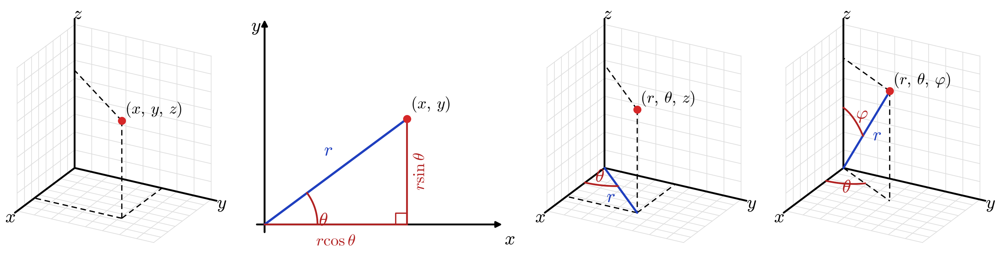
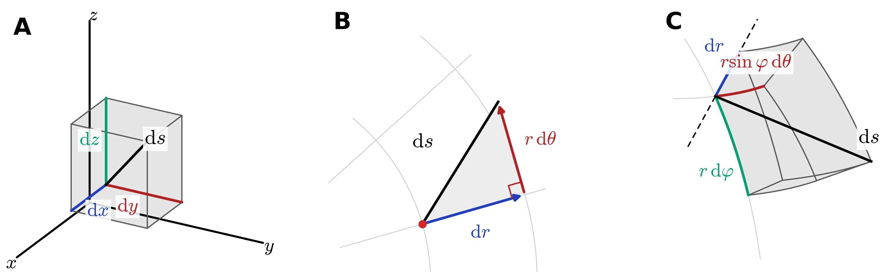
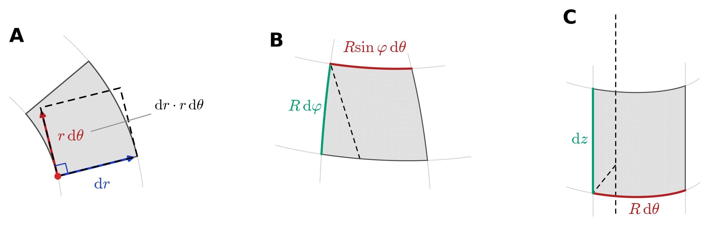
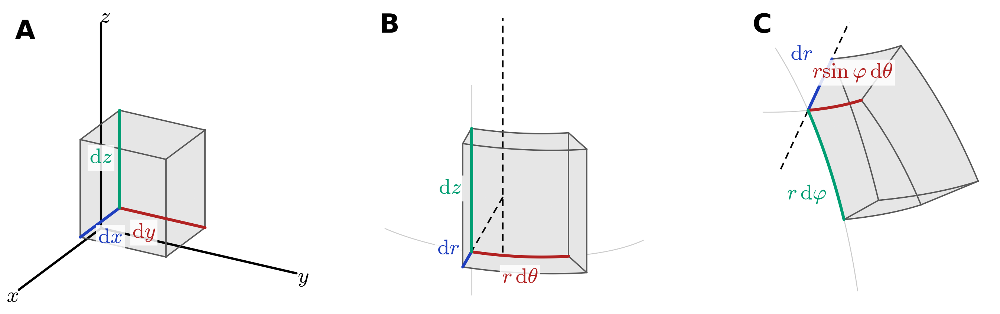

# 弧长、面积与体积元素在常用坐标系下的表示

## 0. 总览与记号约定

### 0.1 常用坐标系示意图

从左至右依次为 **直角坐标** $(x,y,z)$、**极坐标** $(r,\theta)$、**圆柱坐标** $(r,\theta,z)$、**球坐标** $(r,\theta,\varphi)$。四张图用同一套约定、同一投影绘制，可逐列对照。

### 0.2 记号与角度约定

本文统一采用**数学约定**（与多数中文数学教材一致）。

| 坐标系 | 坐标 | 范围 | 角度定义 |
| --- | --- | --- | --- |
| 极坐标 | $(r,\theta)$ | $r\ge 0,\ \theta\in[0,2\pi)$ | $\theta$ 自 $+x$ 轴逆时针 |
| 圆柱坐标 | $(r,\theta,z)$ | $r\ge 0,\ z\in\mathbb{R}$ | $\theta$ 自 $+x$ 轴逆时针 |
| 球坐标 | $(r,\theta,\varphi)$ | $r\ge 0,\ \varphi\in[0,\pi]$ | $\varphi$ 自 $+z$ 轴量起；$\theta$ 为方位角，自 $+x$ 轴逆时针 |

**径向坐标统一记 $r$，方位角统一记 $\theta$**（极、圆柱、球三系一致）；**极角 $\varphi$ 只出现在球坐标**。注意圆柱系与球系的 $r$ 不是同一个量：
$$
r_{\text{柱}}=\sqrt{x^{2}+y^{2}}\ \ (\text{到 } z \text{ 轴的距离}),
\qquad
r_{\text{球}}=\sqrt{x^{2}+y^{2}+z^{2}}\ \ (\text{到原点的距离}).
$$
反三角一律写成 $\operatorname{atan2}(y,x)$，自动判断象限。

### 0.3 两条路线

1. **坐标变换法**（线性代数视角）：写出映射 $\mathbf{F}$，求 Jacobian 矩阵、度量张量与尺度因子 $h_i$，再统一写出 $ds,\ dA,\ dV$。**见 §1.1 与各节的“坐标变换法”列**。
2. **几何法**（直接可视化）：把微元看成一个“正交小盒子”，直接量出棱长再相乘。**见 §1.2 与各节的“几何法”小节**。

## 1. 一般理论框架

### 1.1 坐标变换法（线性映射 + Jacobian）

#### 1.1.1 映射与 Jacobian 矩阵

设曲线坐标 $(u,v,w)$ 通过光滑映射给出直角坐标
$$
\mathbf{r}=\mathbf{F}(u,v,w)=\bigl(x(u,v,w),\;y(u,v,w),\;z(u,v,w)\bigr),
$$
要求 $\mathbf{F}$ 在所用区域内局部一一、$C^1$。固定两个坐标、只让第三个变化，得到三条**坐标曲线**；其切向量构成局部基
$$
\mathbf{e}_u=\frac{\partial\mathbf{r}}{\partial u},\qquad
\mathbf{e}_v=\frac{\partial\mathbf{r}}{\partial v},\qquad
\mathbf{e}_w=\frac{\partial\mathbf{r}}{\partial w}.
$$
把这三个切向量按**列**排成矩阵，即得 Jacobian 矩阵
$$
J=\frac{\partial(x,y,z)}{\partial(u,v,w)}
=\begin{pmatrix}
x_u & x_v & x_w\\
y_u & y_v & y_w\\
z_u & z_v & z_w
\end{pmatrix}
=\bigl(\,\mathbf{e}_u\mid\mathbf{e}_v\mid\mathbf{e}_w\,\bigr).
$$
它正是线性映射 $\mathrm{d}\mathbf{r}=J\,\mathrm{d}(u,v,w)^{\mathsf{T}}$ 的矩阵；$\det J$ 是局部**有向体积伸缩率**，故 $\lvert \det J\rvert$ 给出 $dV$。

#### 1.1.2 度量张量与尺度因子

位移的长度平方由**度量张量**（第一基本形式）给出
$$
G=J^{\mathsf{T}}J,\qquad g_{ij}=\mathbf{e}_i\cdot\mathbf{e}_j,
\qquad
ds^{2}=\mathrm{d}u^{\mathsf{T}}G\,\mathrm{d}u=\sum_{i,j}g_{ij}\,\mathrm{d}u^{i}\mathrm{d}u^{j}.
$$
若坐标曲线两两正交（$g_{ij}=0,\ i\neq j$），称**正交曲线坐标系**。此时记**尺度因子**（Lamé 系数）
$$
h_u=\lvert \mathbf{e}_u\rvert,\qquad h_v=\lvert \mathbf{e}_v\rvert,\qquad h_w=\lvert \mathbf{e}_w\rvert,
$$
则
$$
ds^{2}=h_u^{2}\mathrm{d}u^{2}+h_v^{2}\mathrm{d}v^{2}+h_w^{2}\mathrm{d}w^{2},
\qquad
\lvert \det J\rvert=\sqrt{\det G}=h_u h_v h_w .
$$
几何含义：沿坐标曲线 $u$ 走 $\mathrm{d}u$，真实弧长是 $h_u\,\mathrm{d}u$ —— $h_i$ 就是“坐标增量 → 真实长度”的换算系数。直角、极、圆柱、球坐标都是正交系。

#### 1.1.3 三个元素的统一写法

| 元素 | 一般公式 | 正交系下 |
| --- | --- | --- |
| 线元 $ds$ | $\sqrt{\mathrm{d}u^{\mathsf{T}}G\,\mathrm{d}u}$ | $\sqrt{h_u^2\mathrm{d}u^2+h_v^2\mathrm{d}v^2+h_w^2\mathrm{d}w^2}$ |
| 面元 $dA$ | $\sqrt{\det G_{2\times2}}\;\mathrm{d}u\,\mathrm{d}v=\lvert \mathbf{r}_u\times\mathbf{r}_v\rvert\,\mathrm{d}u\,\mathrm{d}v$ | $h_u h_v\,\mathrm{d}u\,\mathrm{d}v$ |
| 体元 $dV$ | $\lvert \det J\rvert\,\mathrm{d}u\,\mathrm{d}v\,\mathrm{d}w$ | $h_u h_v h_w\,\mathrm{d}u\,\mathrm{d}v\,\mathrm{d}w$ |

其中 $G_{2\times2}$ 指两个方向上的 $2\times2$ 度量子矩阵（详见 §3.2）；$\lvert \det J\rvert=\sqrt{\det G}$ 对非正交系也成立。

#### 1.1.4 各坐标系的变换公式

以下每节**左栏为“直角 → 该系”，右栏为“该系 → 直角”**。

**（1）直角 ↔ 极坐标**

$$
\left\{
\begin{aligned}
r &= \sqrt{x^{2}+y^{2}}, & x &= r\cos\theta,\\
\theta &= \operatorname{atan2}(y,x), & y &= r\sin\theta.
\end{aligned}
\right.
$$

$$
J=\begin{pmatrix}\cos\theta & -r\sin\theta\\ \sin\theta & r\cos\theta\end{pmatrix},
\qquad
\det J=r,\qquad
h_r=1,\quad h_\theta=r .
$$

**（2）直角 ↔ 圆柱坐标**

$$
\left\{
\begin{aligned}
r &= \sqrt{x^{2}+y^{2}}, & x &= r\cos\theta,\\
\theta &= \operatorname{atan2}(y,x), & y &= r\sin\theta,\\
z &= z, & z &= z.
\end{aligned}
\right.
$$

$$
J=\begin{pmatrix}\cos\theta & -r\sin\theta & 0\\ \sin\theta & r\cos\theta & 0\\ 0 & 0 & 1\end{pmatrix},
\qquad
\det J=r,\qquad
h_r=1,\quad h_\theta=r,\quad h_z=1 .
$$

**（3）直角 ↔ 球坐标**（$\varphi$ 自 $+z$ 轴量起）

$$
\left\{
\begin{aligned}
r &= \sqrt{x^{2}+y^{2}+z^{2}}, & x &= r\sin\varphi\cos\theta,\\
\varphi &= \arccos\frac{z}{r}=\operatorname{atan2}\!\bigl(\sqrt{x^{2}+y^{2}},\,z\bigr), & y &= r\sin\varphi\sin\theta,\\
\theta &= \operatorname{atan2}(y,x), & z &= r\cos\varphi.
\end{aligned}
\right.
$$

$$
\det J=r^{2}\sin\varphi,\qquad
h_r=1,\quad h_\varphi=r,\quad h_\theta=r\sin\varphi .
$$

范围与退化：$\varphi\in[0,\pi]$，$\theta\in[0,2\pi)$；由圆柱的 $r=0$（$z$ 轴上）或球的 $r=0$（原点）时方位角 $\theta$ 无定义，约定取 $0$；球的 $r=0$ 时 $\varphi$ 也无定义。$\varphi=0,\pi$（球面两极）处 $\lvert \det J\rvert=r^{2}\sin\varphi=0$，映射退化——这正是体元在两极缩为零的原因。

> **约定提醒**：物理/ISO 文献常把球坐标写成 $(r,\theta,\varphi)$ 而让 $\theta$ 自 $+z$ 轴量起、$\varphi$ 为方位角，即 $x=r\sin\theta\cos\varphi,\ y=r\sin\theta\sin\varphi,\ z=r\cos\theta$。两者只是把 $\theta,\varphi$ 交换名字，度量与体元形式完全相同（$r^{2}\sin\varphi\,\mathrm{d}r\,\mathrm{d}\varphi\,\mathrm{d}\theta$）；对照物理教材时只需把 $\theta\leftrightarrow\varphi$ 换回。**本文统一采用上述数学约定**（即 §0.2 表）。

### 1.2 几何法（正交小盒子）

不写 Jacobian，只做三件事：找出过点 $P$ 的三条坐标曲线在该点的切向；量出沿每条曲线走一个坐标增量所对应的真实弧长；再按形状相乘。

在正交曲线坐标系中，沿第 $i$ 条坐标曲线走 $\mathrm{d}u^{i}$ 的真实弧长正是 $h_i\,\mathrm{d}u^{i}$（$h_i$ 即 §1.1.2 的尺度因子），而三条坐标曲线在 $P$ 处两两垂直，因此这些微小位移张成一个**正交小盒子**，三条棱长为
$$
h_u\,\mathrm{d}u,\qquad h_v\,\mathrm{d}v,\qquad h_w\,\mathrm{d}w .
$$
三种元素就是这个盒子的“体对角线 / 面 / 体”：

| 元素 | 在小盒子里取什么 | 结果 |
| --- | --- | --- |
| 线元 $ds$ | 体对角线（三条棱的勾股） | $\sqrt{h_u^2\mathrm{d}u^2+h_v^2\mathrm{d}v^2+h_w^2\mathrm{d}w^2}$ |
| 面元 $dS$ | 两条棱张成的矩形 | $h_uh_v\,\mathrm{d}u\,\mathrm{d}v$ |
| 体元 $dV$ | 三条棱张成的长方体 | $h_uh_vh_w\,\mathrm{d}u\,\mathrm{d}v\,\mathrm{d}w$ |

有了这张表，四个坐标系的结果都能现推：写出三条棱长、乘起来即可，不需要记任何“修正因子”。

三点必须说清楚：

- **$h_i$ 的作用是“角增量 → 真实弧长”的换算**。角坐标无量纲；若没有 $h_i$，$\mathrm{d}V=\mathrm{d}r\,\mathrm{d}\varphi\,\mathrm{d}\theta$ 的量纲是长度而不是体积，一眼就能看出漏了东西。
- **小盒子的棱是直线（切向量），而坐标曲面是弯曲的**，两者只在一阶主部意义下相等：$\text{真实值}=\text{主部}\times[1+O(\mathrm{d})]$。用它做积分（增量趋于零）不会有系统偏差；用它估计有限大的一块则会有稳定误差，§4.3 给出定量结果。
- **只有正交系才能“棱长相乘”**。坐标曲线一旦不垂直，小盒子变成斜平行体，必须回到 §1.1.2 的 $\sqrt{\det G}$，且此时 $\sqrt{\det G}<h_uh_vh_w$。

以下各节按「**坐标变换法**」与「**几何法**」两栏并列，逐个坐标系给出具体结果。

## 2. 一维：弧长元素 $ds$（线元）

### 2.1 一般公式（坐标变换法）

设曲线 $\Gamma:\ u=u(t),\ v=v(t),\ w=w(t)$（$t$ 为任意参数），则
$$
\mathbf{r}'(t)=J\,(\dot u,\dot v,\dot w)^{\mathsf{T}},
\qquad
ds=\lvert \mathbf{r}'(t)\rvert\,\mathrm{d}t=\sqrt{\dot u^{\mathsf{T}}G\,\dot u}\;\mathrm{d}t .
$$
正交系下化为
$$
ds=\sqrt{h_u^2\dot u^{2}+h_v^2\dot v^{2}+h_w^2\dot w^{2}}\;\mathrm{d}t .
$$
特别地，沿单条坐标曲线运动时只剩一项，例如极坐标中沿 $\theta$ 方向的微元 $ds_\theta=r\,\mathrm{d}\theta$（这正是半径为 $r$ 的圆弧弧长）。

### 2.2 各坐标系结果

| 坐标系 | 坐标变换法结果 | 几何法结果 |
| --- | --- | --- |
| 直角坐标 | $ds=\sqrt{\mathrm{d}x^2+\mathrm{d}y^2+\mathrm{d}z^2}$（平面 $ds=\sqrt{\mathrm{d}x^2+\mathrm{d}y^2}$） | 勾股：$ds$ 是三条棱的体对角线 |
| 极坐标 | $ds=\sqrt{\mathrm{d}r^2+r^2\mathrm{d}\theta^2}$ | 切平面内两条正交棱 $\mathrm{d}r$ 与 $r\,\mathrm{d}\theta$ 的勾股 |
| 圆柱坐标 | $ds=\sqrt{\mathrm{d}r^2+r^2\mathrm{d}\theta^2+\mathrm{d}z^2}$ | 三条两两垂直的棱 $\mathrm{d}r,\ r\,\mathrm{d}\theta,\ \mathrm{d}z$ |
| 球坐标 | $ds=\sqrt{\mathrm{d}r^2+r^2\mathrm{d}\varphi^2+r^2\sin^2\varphi\,\mathrm{d}\theta^2}$ | 三条两两垂直的棱 $\mathrm{d}r,\ r\,\mathrm{d}\varphi,\ r\sin\varphi\,\mathrm{d}\theta$ |

### 2.3 用法示例

**极坐标下的曲线长**：取 $r=r(\theta)$，则
$$
ds=\sqrt{r'(\theta)^{2}+r(\theta)^{2}}\;\mathrm{d}\theta
\ \Longrightarrow\
L=\int_{\theta_1}^{\theta_2}\sqrt{r'^{2}+r^{2}}\;\mathrm{d}\theta .
$$

**参数曲线（直角坐标）**：$\mathbf{r}(t)=\bigl(x(t),y(t),z(t)\bigr)$，$ds=\sqrt{\dot x^2+\dot y^2+\dot z^2}\,\mathrm{d}t$。

### 2.4 几何法：逐系构造

**直角坐标**：过 $P$ 的三条坐标曲线是互相垂直的直线，各自走过 $\mathrm{d}x,\mathrm{d}y,\mathrm{d}z$，故三条棱就是 $\mathrm{d}x,\mathrm{d}y,\mathrm{d}z$，$ds$ 是它们的体对角线。

**极坐标**：过 $P$ 的两条坐标曲线是射线（$r$ 方向）与以原点为心的圆（$\theta$ 方向），二者在 $P$ 处垂直。沿径向走 $\mathrm{d}r$；沿 $\theta$ 方向走 $\mathrm{d}\theta$ 时，$P$ 到原点的距离是 $r$，这段圆弧的弧长为 $r\,\mathrm{d}\theta$。于是
$$
ds^{2}=\mathrm{d}r^{2}+(r\,\mathrm{d}\theta)^{2}.
$$
这里 $h_\theta=r$ 的含义就是"角增量乘半径得弧长"：$\mathrm{d}\theta$ 无量纲，必须乘上该点的切向尺度 $r$ 才成为长度。

**圆柱坐标**：与极坐标相同，再加一条与两者都垂直的轴向棱 $\mathrm{d}z$，三条棱两两正交。

**球坐标**：三条棱分别是

- 径向 $\mathrm{d}r$（$h_r=1$）；
- 极角方向 $r\,\mathrm{d}\varphi$：$\varphi$ 沿**经线**变化，经线是半径 $r$ 的大圆，故弧长为 $r\,\mathrm{d}\varphi$；
- 方位角方向 $r\sin\varphi\,\mathrm{d}\theta$：$\theta$ 沿**纬线**变化，该纬线所在圆的半径是 $P$ 到 $z$ 轴的距离 $r\sin\varphi$，故弧长为 $r\sin\varphi\,\mathrm{d}\theta$。

纬线半径为 $r\sin\varphi$ 的来历：设 $P'$ 是 $P$ 在 $z$ 轴上的投影，则直角三角形 $OPP'$ 中斜边 $OP=r$、$\angle POz=\varphi$，故 $PP'=r\sin\varphi$。当 $\varphi\to0$ 或 $\varphi\to\pi$（两极）时纬线收缩成点，$\theta$ 方向没有弧长——这正是 $\lvert\det J\rvert=r^{2}\sin\varphi$ 在两极退化为 $0$ 的几何原因。

图 A：直角坐标下 $\mathrm{d}s$ 是 $\mathrm{d}x,\mathrm{d}y,\mathrm{d}z$ 小长方体的体对角线。图 B：极坐标下 $\mathrm{d}s$ 是切平面内直角三角形的斜边，两直角边为 $\mathrm{d}r$ 与 $r\,\mathrm{d}\theta$。图 C：球坐标下三条互相垂直的位移 $\mathrm{d}r$、$r\,\mathrm{d}\varphi$、$r\sin\varphi\,\mathrm{d}\theta$ 及其体对角线 $\mathrm{d}s$。三张图共用一套颜色约定：**第一坐标方向蓝、第二坐标（方位角）红、第三坐标（自 $+z$ 量的极角）绿**；每条彩色棱都带自己的标注，因此灰度打印下同样可读。

## 3. 二维：面积元素 $dA$ / $dS$

### 3.1 平面面积元（坐标变换法）

平面上的映射 $(u,v)\mapsto(x,y)$：
$$
dA=\lvert \det J\rvert\,\mathrm{d}u\,\mathrm{d}v,\qquad
J=\begin{pmatrix} x_u & x_v\\ y_u & y_v\end{pmatrix}.
$$

| 坐标系 | 坐标变换法结果 | 几何法结果 |
| --- | --- | --- |
| 直角坐标 | $dA=\mathrm{d}x\,\mathrm{d}y$ | 垂直于坐标轴的小矩形 |
| 极坐标 | $dA=r\,\mathrm{d}r\,\mathrm{d}\theta$ | 环形扇区，两条边长为 $\mathrm{d}r$ 与 $r\,\mathrm{d}\theta$ |

极坐标中的 $r$ 就是 $\det J$：在半径 $r$ 处，$\mathrm{d}\theta$ 对应的弧长为 $r\,\mathrm{d}\theta$，故微元是 $r\,\mathrm{d}\theta\times \mathrm{d}r$ 的小扇形。

### 3.2 曲面面积元（一般参数曲面）

设曲面 $\Sigma:\ \mathbf{r}=\mathbf{r}(u,v)$，两个切向量
$$
\mathbf{r}_u=\frac{\partial \mathbf{r}}{\partial u},\qquad
\mathbf{r}_v=\frac{\partial \mathbf{r}}{\partial v}.
$$
参数小矩形映到曲面上近似为一个**平行四边形**，两边为 $\mathbf{r}_u\mathrm{d}u$、$\mathbf{r}_v\mathrm{d}v$，故
$$
dS=\lvert \mathbf{r}_u\times \mathbf{r}_v\rvert\,\mathrm{d}u\,\mathrm{d}v
=\sqrt{EG-F^{2}}\;\mathrm{d}u\,\mathrm{d}v,
$$

$$
E=\mathbf{r}_u\cdot\mathbf{r}_u,\qquad F=\mathbf{r}_u\cdot\mathbf{r}_v,\qquad G=\mathbf{r}_v\cdot\mathbf{r}_v .
$$
$EG-F^{2}=\det G_{2\times2}$ 正是曲面的 Gram 行列式（由拉格朗日恒等式 $\lvert \mathbf{a}\times\mathbf{b}\rvert^{2}=\lvert \mathbf{a}\rvert^{2}\lvert \mathbf{b}\rvert^{2}-(\mathbf{a}\cdot\mathbf{b})^{2}$）。

**图像曲面** $z=f(x,y)$：取 $(u,v)=(x,y)$，得
$$
dS=\sqrt{1+f_x^{2}+f_y^{2}}\;\mathrm{d}x\,\mathrm{d}y .
$$
同理 $y=g(x,z)$ 时 $dS=\sqrt{1+g_x^{2}+g_z^{2}}\,\mathrm{d}x\,\mathrm{d}z$。

### 3.3 特殊曲面

| 曲面 | 参数 | $E,\,F,\,G$ | $dS$ |
| --- | --- | --- | --- |
| 球面 $r=R$ | $(\theta,\varphi)$ | $E=R^{2}\sin^{2}\varphi,\ F=0,\ G=R^{2}$ | $R^{2}\sin\varphi\,\mathrm{d}\varphi\,\mathrm{d}\theta$ |
| 柱面 $r=R$ | $(\theta,z)$ | $E=R^{2},\ F=0,\ G=1$ | $R\,\mathrm{d}\theta\,\mathrm{d}z$ |
| 平面 $z=\text{const}$ | $(x,y)$ | $E=G=1,\ F=0$ | $\mathrm{d}x\,\mathrm{d}y$ |

球面元里的 $\sin\varphi$ 与体元中的 $r^{2}\sin\varphi$ 同源：极角 $\varphi$ 处的周向（$\theta$ 方向）弧长是 $r\sin\varphi\,\mathrm{d}\theta$。

### 3.4 几何法：三种曲面上的微元

**极坐标小扇形**（平面 $z=\text{const}$）：取半径 $r$ 与 $r+\mathrm{d}r$ 的两条圆弧、方位角 $\theta$ 与 $\theta+\mathrm{d}\theta$ 的两条射线，围成一个**环形扇区**。它的精确面积是
$$
\frac{1}{2}\bigl[(r+\mathrm{d}r)^{2}-r^{2}\bigr]\mathrm{d}\theta
=r\,\mathrm{d}r\,\mathrm{d}\theta+\frac{1}{2}\mathrm{d}r^{2}\mathrm{d}\theta ,
$$
一阶主部正是 $r\,\mathrm{d}r\,\mathrm{d}\theta$，余项比主部高一阶，积分时消失。若把弯曲的边换成切向直线，得到的就是 §1.2 的小矩形。

**球面小梯形**（$r=R$）：两条经线（$\theta$ 与 $\theta+\mathrm{d}\theta$）与两条纬线（$\varphi$ 与 $\varphi+\mathrm{d}\varphi$）围成曲边四边形。四条边交替为 $R\,\mathrm{d}\varphi$（沿经线）与 $R\sin\varphi\,\mathrm{d}\theta$（沿纬线），且两组边互相垂直，故
$$
dS=R\,\mathrm{d}\varphi\cdot R\sin\varphi\,\mathrm{d}\theta
=R^{2}\sin\varphi\,\mathrm{d}\varphi\,\mathrm{d}\theta .
$$
球面元里的 $\sin\varphi$ 与体元中的 $r^{2}\sin\varphi$ 同源：极角 $\varphi$ 处的纬线半径是 $R\sin\varphi$。

**柱面小矩形**（$r=R$）：两条水平圆（$z$ 与 $z+\mathrm{d}z$）与两条母线（$\theta$ 与 $\theta+\mathrm{d}\theta$）围成矩形，边长为 $R\,\mathrm{d}\theta$ 与 $\mathrm{d}z$，故
$$
dS=R\,\mathrm{d}\theta\,\mathrm{d}z .
$$
这里没有额外因子，因为沿母线是直线、沿圆是**等半径**的圆弧（$h_\theta=R$ 在整个柱面上不变）。

图 A：极坐标的环形扇区（实线填色）与它的切向矩形近似（虚线），矩形边长为 $\mathrm{d}r$ 与 $r\,\mathrm{d}\theta$，两者面积只差高阶小量。图 B：球面小块，两条边为 $R\,\mathrm{d}\varphi$ 与 $R\sin\varphi\,\mathrm{d}\theta$。图 C：柱面小块，两条边为 $R\,\mathrm{d}\theta$ 与 $\mathrm{d}z$。颜色约定同图 5（第一坐标蓝、方位角红、第三坐标绿）；浅灰曲线是曲面上相应坐标曲线的延长，黑色虚线是半径或轴线。

## 4. 三维：体积元素 $dV$

### 4.1 一般公式（坐标变换法）

$$
dV=\lvert \det J\rvert\,\mathrm{d}u\,\mathrm{d}v\,\mathrm{d}w
\ \xrightarrow{\ \text{正交系}\ }\
dV=h_u h_v h_w\,\mathrm{d}u\,\mathrm{d}v\,\mathrm{d}w .
$$
$\det J$ 即局部体积伸缩率；正交时三条坐标曲线微元 $h_u\mathrm{d}u,\ h_v\mathrm{d}v,\ h_w\mathrm{d}w$ 恰好是微元小长方体的三边。

### 4.2 各坐标系结果

| 坐标系 | $\lvert \det J\rvert$ | 坐标变换法结果 | 几何法结果 |
| --- | --- | --- | --- |
| 直角坐标 | $1$ | $dV=\mathrm{d}x\,\mathrm{d}y\,\mathrm{d}z$ | 三棱 $\mathrm{d}x,\mathrm{d}y,\mathrm{d}z$ 的长方体 |
| 圆柱坐标 | $r$ | $dV=r\,\mathrm{d}r\,\mathrm{d}\theta\,\mathrm{d}z$ | 扇形柱体，三棱 $\mathrm{d}r,\ r\,\mathrm{d}\theta,\ \mathrm{d}z$ |
| 球坐标 | $r^{2}\sin\varphi$ | $dV=r^{2}\sin\varphi\,\mathrm{d}r\,\mathrm{d}\varphi\,\mathrm{d}\theta$ | 球壳小块，三棱 $\mathrm{d}r,\ r\,\mathrm{d}\varphi,\ r\sin\varphi\,\mathrm{d}\theta$ |

### 4.3 几何法：三种小盒子

**直角坐标**：三棱 $\mathrm{d}x,\mathrm{d}y,\mathrm{d}z$ 的长方体，体积 $\mathrm{d}x\,\mathrm{d}y\,\mathrm{d}z$。

**圆柱坐标的扇形柱体**：底面是 §3.4 的环形扇区，高为 $\mathrm{d}z$。精确体积
$$
V=\frac{1}{2}\bigl[(r+\mathrm{d}r)^{2}-r^{2}\bigr]\mathrm{d}\theta\,\mathrm{d}z
=r\,\mathrm{d}r\,\mathrm{d}\theta\,\mathrm{d}z+\frac{1}{2}\mathrm{d}r^{2}\mathrm{d}\theta\,\mathrm{d}z,
$$
主部即 $\mathrm{d}V=r\,\mathrm{d}r\,\mathrm{d}\theta\,\mathrm{d}z$。

**球坐标的球壳小块**：径向、极角、方位角各切一刀得到的小块，六个面都是曲面。它的精确体积可以直接求出：
$$
V=\frac{\mathrm{d}\theta}{3}\Bigl[\cos\varphi-\cos(\varphi+\mathrm{d}\varphi)\Bigr]
\Bigl[(r+\mathrm{d}r)^{3}-r^{3}\Bigr].
$$
用 $\cos\varphi-\cos(\varphi+\mathrm{d}\varphi)=\sin\varphi\,\mathrm{d}\varphi+O(\mathrm{d}\varphi^{2})$ 与 $(r+\mathrm{d}r)^{3}-r^{3}=3r^{2}\mathrm{d}r+O(\mathrm{d}r^{2})$ 代入，得
$$
V=r^{2}\sin\varphi\,\mathrm{d}r\,\mathrm{d}\varphi\,\mathrm{d}\theta+O(\mathrm{d}^{4}),
$$
即 $\mathrm{d}V=r^{2}\sin\varphi\,\mathrm{d}r\,\mathrm{d}\varphi\,\mathrm{d}\theta$。

把这两个精确式与一阶主部做数值对照（令三段弧长都等于同一个 $h$，即 $\mathrm{d}r=h$、$r\,\mathrm{d}\theta=h$、$r\,\mathrm{d}\varphi=h$、$r\sin\varphi\,\mathrm{d}\theta=h$）：

| 元素 | $h=0.02$ | $h=0.01$ | $h=0.005$ | 误差比 |
| --- | --- | --- | --- | --- |
| 扇形柱体 | $9.90\times10^{-3}$ | $4.98\times10^{-3}$ | $2.49\times10^{-3}$ | $1.99$ |
| 球壳小块 | $2.91\times10^{-2}$ | $1.47\times10^{-2}$ | $7.39\times10^{-3}$ | $1.98$ |

步长减半、相对误差也减半，说明误差是 $O(h)$：元素确实是**一阶主部**。两者在同一个 $h$ 下的系数不同（球壳更大），说明系数还依赖几何——球面在两个方向上都弯曲。（表由 `_make_figures.py` 的 `check_exact()` 复现。）

图 A：直角坐标的长方体。图 B：圆柱坐标的扇形柱体，径向的两面是柱面、角向的两面是半平面。图 C：球坐标的球壳小块，六个面都是曲面。三个小块上标出的三条彩色棱，就是乘法公式里被乘的三段弧长；颜色约定同图 5。

## 5. 统一对照表

**坐标变换法结果**（径向坐标统一记 $r$，方位角统一记 $\theta$，极角 $\varphi$ 仅出现于球坐标；尺度因子按各系坐标顺序列出）：

| 元素 | 直角坐标 | 极坐标 | 圆柱坐标 | 球坐标 |
| --- | --- | --- | --- | --- |
| 尺度因子 $h$ | $(1,\,1,\,1)$ | $(1,\ r)$ | $(1,\ r,\ 1)$ | $(1,\ r,\ r\sin\varphi)$ |
| $\lvert \det J\rvert$ | $1$ | $r$ | $r$ | $r^{2}\sin\varphi$ |
| 线元 $ds$ | $\sqrt{\mathrm{d}x^2+\mathrm{d}y^2+\mathrm{d}z^2}$ | $\sqrt{\mathrm{d}r^2+r^2\mathrm{d}\theta^2}$ | $\sqrt{\mathrm{d}r^2+r^2\mathrm{d}\theta^2+\mathrm{d}z^2}$ | $\sqrt{\mathrm{d}r^2+r^2\mathrm{d}\varphi^2+r^2\sin^2\varphi\,\mathrm{d}\theta^2}$ |
| 平面面元 $dA$ | $\mathrm{d}x\,\mathrm{d}y$ | $r\,\mathrm{d}r\,\mathrm{d}\theta$ | $r\,\mathrm{d}r\,\mathrm{d}\theta$ | — |
| 体元 $dV$ | $\mathrm{d}x\,\mathrm{d}y\,\mathrm{d}z$ | — | $r\,\mathrm{d}r\,\mathrm{d}\theta\,\mathrm{d}z$ | $r^{2}\sin\varphi\,\mathrm{d}r\,\mathrm{d}\varphi\,\mathrm{d}\theta$ |

**几何法结果**（“三条棱相乘”，见 §1.2）：

| 元素 | 直角坐标 | 极坐标 | 圆柱坐标 | 球坐标 |
| --- | --- | --- | --- | --- |
| 三条棱 | $\mathrm{d}x,\ \mathrm{d}y,\ \mathrm{d}z$ | $\mathrm{d}r,\ r\,\mathrm{d}\theta$ | $\mathrm{d}r,\ r\,\mathrm{d}\theta,\ \mathrm{d}z$ | $\mathrm{d}r,\ r\,\mathrm{d}\varphi,\ r\sin\varphi\,\mathrm{d}\theta$ |
| 几何法读法 | $\mathrm{d}x\cdot\mathrm{d}y\cdot\mathrm{d}z$ | $\mathrm{d}r\cdot r\,\mathrm{d}\theta$ | $\mathrm{d}r\cdot r\,\mathrm{d}\theta\cdot\mathrm{d}z$ | $\mathrm{d}r\cdot r\,\mathrm{d}\varphi\cdot r\sin\varphi\,\mathrm{d}\theta$ |

把上表每行的棱长相乘、再除以对应的坐标微分，剩下的恰好是尺度因子 $h_uh_vh_w$；两张表逐格相等，这正是 $\lvert\det J\rvert=h_uh_vh_w$ 的具体体现。结论：**元素公式不必背——写出三条弧长乘起来即可**。

## 6. 两种方法的边界

- **正交性是几何法的前提**。非正交坐标（如斜角坐标）下 $\lvert\det J\rvert<h_uh_vh_w$，“棱长相乘”会系统性高估，此时只能回到 $\sqrt{\det G}$。
- **元素只在一阶意义下精确**。$\text{真实值}=\text{主部}\,[1+O(\mathrm{d})]$；用它做积分（增量趋于零）不会有系统偏差，但用它的乘积去估计有限大的一块则会有稳定误差，见 §4.3 的定量对照。
- **几何法给直觉，坐标变换法给保证**。前者解释“因子为什么长这样”，后者保证“换元时不出错”，两者互为校验。
