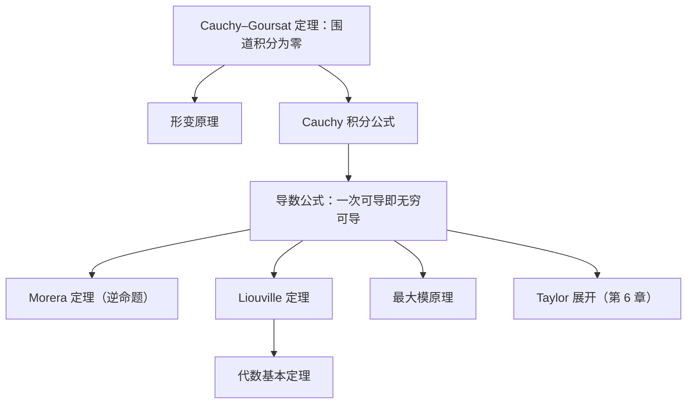

# 柯西定理族

本节是整门课的中心：由 Cauchy 定理出发，一路推出积分公式、导数公式、Morera 定理、Liouville 定理与最大模原理。它们是“全纯性是强约束”这一事实的全部量化表达。

- [柯西定理与积分公式](柯西定理与积分公式.md)：Cauchy–Goursat 定理、形变围道、Cauchy 积分公式、导数公式、Liouville、最大模原理。

> **必须掌握的输出**：会用**形变围道**把复杂围道换成小圆，从而直接用导数公式算出积分。

[返回复分析索引](../README.md)
