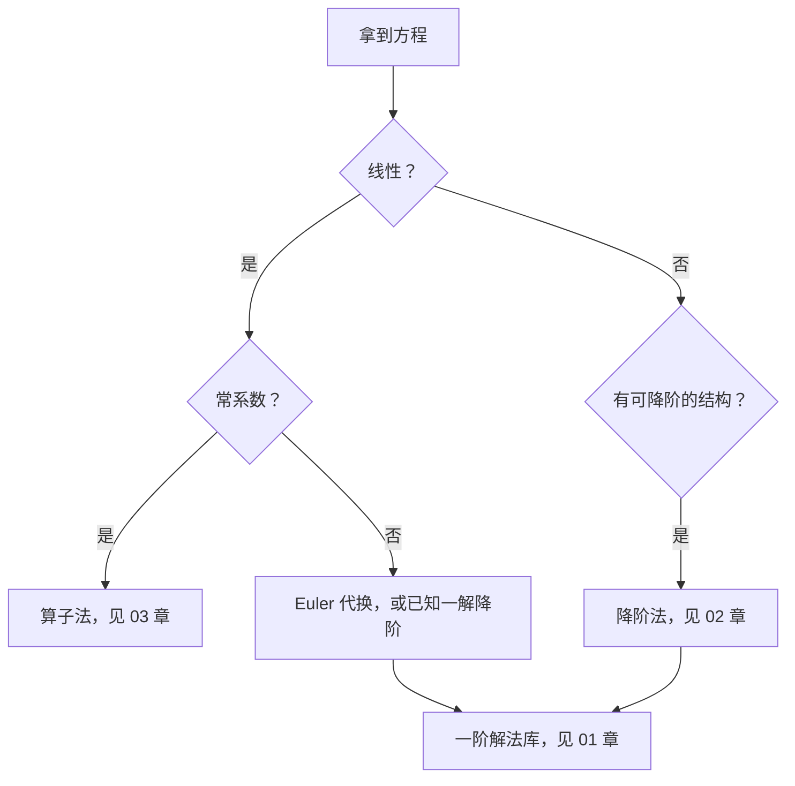

# 常微分方程

本区是 [06_离散分析](../06_离散分析/README.md) 的**连续原像**：同一套推理骨架，把差分换成微分、把几何数列换成指数函数。

## 1. 分类地图

常微分方程的分类是若干条**互相独立**的维度，任何一个方程都是它们的组合：

| 维度 | 取值 |
| --- | --- |
| 阶 | 一阶 / 二阶 / $n$ 阶 |
| 线性性 | 线性 / 非线性 |
| 系数 | 常系数 / 变系数 |
| 自治性 | 自治（不显含 $x$）/ 非自治 |
| 齐次性 | 齐次 / 非齐次 |

**"可降阶"不在这个表里。** 它不是方程的类型，而是求解的**策略**：降阶的起点必是高阶（一阶无从降），终点必是一阶（收尾靠一章的解法库），因此它天然横跨两章。同样，"算子法"也不是一种降阶，而是**线性常系数**这一格上理论完整的闭式解法。

## 2. 三个层次

$$
\text{类型层：}\;\text{一阶}\;\Big|\;\text{高阶}\;\bigl(\text{线性常系数}\;\big|\;\text{线性变系数}\;\big|\;\text{非线性}\bigr)
$$

$$
\text{方法层：}\;\underbrace{\text{一阶解法库}}_{\text{工具}}\;\longleftarrow\;\underbrace{\text{降阶法}}_{\text{桥梁}}\;\longleftarrow\;\text{高阶方程},
\qquad
\underbrace{\text{算子法}}_{\text{线性常系数的直达解法}}
$$

## 3. 本章结构

| 章 | 定位 | 什么时候翻它 |
| --- | --- | --- |
| [01_一阶方程](01_一阶方程/README.md) | 工具箱：可分离、齐次、线性、伯努利 | 降阶后的收尾 |
| [02_高阶方程与降阶法](02_高阶方程与降阶法/README.md) | 策略：靠代换把阶数降下来 | 非线性或变系数 |
| [03_线性常系数与算子法](03_线性常系数与算子法/README.md) | 闭式解法：特征多项式与平移引理 | 常系数线性方程 |
| [04_变系数线性方程](04_变系数线性方程/README.md) | Euler 代换等 | 变系数线性方程 |

阅读顺序是**从一般到特殊**：先有通用的一阶解法库，再有把高阶化为低阶的策略，最后才是最高效的算子法。

## 4. 方法选择

## 5. 与相邻章节的关系

- [06_离散分析](../06_离散分析/README.md)：离散镜像，$D\leftrightarrow E$、$e^{\lambda x}\leftrightarrow r^n$、左半平面 $\leftrightarrow$ 单位圆，逐条对应见[连续与离散算子对照](../06_离散分析/02_差分方程与算子法/连续与离散算子对照.md)。
- [04_复分析](../04_复分析/README.md)：复特征根 $\alpha\pm i\beta$ 与复指数法共用 $\operatorname{Re}/\operatorname{Im}$ 语言。
- [02_多元微积分](../02_多元微积分/README.md)：偏微分方程是另一条路线，不在本区。

[返回分析学索引](../README.md)
