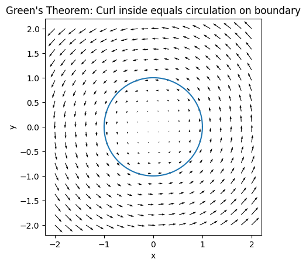
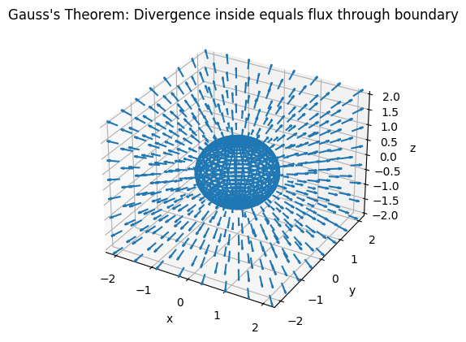

# 广义 Stokes 定理的本质：边界抵消的不可避免性

广义 Stokes 定理并非一系列“巧合”的公式，而是源于一个深刻的代数与几何结构：**当我们对“局部变化”在整体上求和时，内部贡献必然相互抵消，只剩边界项存留**。

广义斯托克斯公式的母公式可以表达为：
$$\int_{\Omega} d\omega = \int_{\partial \Omega} \omega$$
其中：

$\Omega$ 是一个 $k$-维的可定向区域（例如，二维区域或三维区域）。
$\partial \Omega$ 是 $\Omega$ 的边界，维度是 $k-1$（例如，二维区域的边界是一条曲线）。
$\omega$ 是 $(k-1)$ 阶微分形式。
$d$ 表示外微分，它是一种操作，将微分形式提升一个阶数（例如，导数、旋度、散度等）。

## 例 0：账本模型（代数原型）

考虑一列离散点 \(x_0, x_1, \dots, x_n\)，定义相邻点间的差分  
\[
\Delta_i = f(x_{i+1}) - f(x_i)
\]

总和为  
\[
\sum_{i=0}^{n-1} \Delta_i = \sum_{i=0}^{n-1} \bigl[ f(x_{i+1}) - f(x_i) \bigr]
\]

展开后中间项成对抵消（telescope sum），结果仅剩  
\[
f(x_n) - f(x_0)
\]

**核心观察**：  
- 内部项以相反符号成对出现 → 完全抵消  
- 仅端点（边界）未被抵消  

此即所有 Stokes 型定理的代数原型。

## 例 1：微积分基本定理

求  
\[
\int_a^b f'(x) \, dx
\]

其中 \(f'(x)\) 可视为“局部变化率”。  

将区间离散化，Riemann 和近似为  
\[
\sum f'(x_i) \Delta x \approx \sum \bigl[ f(x_{i+1}) - f(x_i) \bigr]
\]

再次出现望远镜求和，最终  
\[
\int_a^b f'(x) \, dx = f(b) - f(a)
\]

**本质**：积分（整体求和）将局部差分坍缩为边界值。

## 例 2：Green 定理 —— 平面旋度与环流

给定平面矢量场 \(\mathbf{v}(x,y)\)，考虑区域 \(D\) 的旋度与边界环流。

将 \(D\) 剖分为小格子，每个小格子贡献微小旋度。  

相邻格子共享边时：  
- 沿共享边的切向流动方向相反 → 完全抵消  

内部所有共享边贡献消去，仅剩外部边界。  

因此  
\[
\iint_D (\nabla \times \mathbf{v}) \cdot \mathbf{k} \, dA = \oint_{\partial D} \mathbf{v} \cdot d\mathbf{r}
\]

**本质**：体密度（旋度）在整体积分时坍缩为边界线积分。

## 例 3：Gauss 散度定理 —— 源与通量

给定三维矢量场 \(\mathbf{F}\)，\(\nabla \cdot \mathbf{F}\) 表示局部源/汇强度。

将体 \(V\) 剖分为小体元，内部面上的通量：  
- 相邻体元共享面时，法向通量符号相反 → 抵消  

仅外部表面通量保留。  

故  
\[
\iiint_V (\nabla \cdot \mathbf{F}) \, dV = \iint_{\partial V} \mathbf{F} \cdot d\mathbf{S}
\]

**本质**：体积源密度在整体积分时坍缩为表面通量。

## 例 4：Kirchhoff 电压定律与 \(d^2 = 0\)

在闭合回路中，电势差（视为梯度）沿回路积分：  
\[
\oint \Delta V = 0
\]

因为回路无净边界，内部涨落相互抵消。  

若电势 \(\phi\) 满足 \(\mathbf{E} = -\nabla \phi\)，则  
\[
\oint d\phi = 0 \quad \Rightarrow \quad d^2 = 0
\]

此为外微分算子平方为零的直接体现。

## 例 5：边界的边界为零（\(\partial^2 = 0\)）

- 线段 \([a,b]\) 的边界：\(\partial [a,b] = \{b\} - \{a\}\)  
- 再取边界：\(\partial(\partial [a,b]) = 0\)

- 闭合多边形（如正方形）：四条有向边首尾相连，每个顶点入度=出度 → 符号相反抵消  

\[
\partial \partial = 0 \quad \Leftrightarrow \quad d^2 = 0
\]

此性质是整个微分几何与同调论的基石。

## 例 6：复分析中的 Cauchy 定理与留数 —— 二维 Stokes 的极致形式
在复平面中，考虑复函数
\[
f(z) = u(x,y) + i v(x,y), \quad z = x + iy
\]
以及复积分形式
\[
f(z),dz
\]
将其写为实变量形式：
\[
f(z),dz = (u,dx - v,dy) + i(v,dx + u,dy)
\]
这是定义在平面上的一个 **1-形式** (\(\omega\))。

### （1）Cauchy 积分定理：无源情形
若 $(f)$ 在区域 $(D)$ 内解析，则 $(u,v)$ 满足 Cauchy–Riemann 方程：
\[
\frac{\partial u}{\partial x} = \frac{\partial v}{\partial y},
\qquad
\frac{\partial u}{\partial y} = -\frac{\partial v}{\partial x}
\]
直接计算可得：
\[
d\omega = 0
\]
因此对任意闭曲线 $(\gamma = \partial D)$：
\[
\oint_\gamma f(z),dz = \int_{\partial D} \omega
= \int_D d\omega
= 0
\]

**几何解释**：
- 将区域 $(D)$ 剖分为无数小面元
- 每个小面元的边界积分相互抵消
- 因为 $(d\omega = 0)$，内部无“源”
- 最外层边界积分也只能为零
这正是 **Green / Stokes 定理在复平面中的“零旋度版本”**。

### （2）留数定理：存在“源”的情形
若 $(f(z))$ 在区域 $(D)$ 内存在孤立奇点 $(z_1,\dots,z_n)$，则
\[
d\omega \neq 0 \quad (\text{在奇点处失效})
\]
此时，内部剖分时：
- 正常区域内部的边界仍然成对抵消
- 但围绕奇点的小圈 **无法继续收缩消失**
最终得到：
\[
\oint_\gamma f(z),dz = 2\pi i \sum_{k=1}^n \operatorname{Res}(f, z_k)
\]

**结构性解释**：
- 奇点 = 内部的“源 / 破洞”
- 留数 = 源强度
- 边界积分 = 所有内部源的总贡献
这与 Gauss 定理中“体内源 → 边界通量”的结构完全一致。

### （3）一个最简单的例子
\[
\oint_{|z|=1} \frac{1}{z},dz = 2\pi i
\]
原因并非“算巧了”，而是：
- $\frac{1}{z},dz$ 在 $(z=0)$ 处不可定义
- 内部剖分无法完全抵消
- 围绕 $(z=0)$ 的那一圈边界必然留下贡献

### （4）本质总结（复分析视角）
复分析中的结论可以概括为：
- 解析函数 ⇒ 对应 1-形式闭合（$(d\omega=0)$）
- 闭区域内无奇点 ⇒ 边界积分为零
- 奇点存在 ⇒ 边界积分只“记住”奇点

### （5）与广义 Stokes 的对应关系
\[
\oint_{\partial D} \omega = \int_D d\omega + \sum (\text{奇点贡献})
\]
其中：
- 内部光滑区域：完全抵消
- 奇点：唯一不可消去的“边界残留”

## 补充总结（统一视角）
> **复分析是二维情形下，广义 Stokes 定理的“刚性极限”：  
> 内部一旦无源，所有自由度都会被边界锁死。**
这也是为什么：
- Cauchy 积分定理
- Cauchy 积分公式
- 留数定理
并非彼此独立，而是同一“边界抵消结构”的不同表现。

## 核心机制总结（四要素）

广义 Stokes 定理的必然性源于以下结构：

1. **可加性**：整体区域可剖分为小块之和  
2. **局部性**：被积量由局部差分/变化定义  
3. **抵消机制**：内部界面以相反取向出现 → 自动抵消  
4. **边界残留**：仅最外层边界未被抵消  

因此，任何“局部变化”的整体积分必然坍缩为边界贡献。

## 总结

> **任何由局部差分（外微分）定义的微分形式，在闭链上积分时，若链无边界则积分为零；若有边界，则等于边界上的积分。**

这解释了为何：

- 微积分基本定理  
- Green 定理  
- Stokes 定理  
- Gauss 定理  

