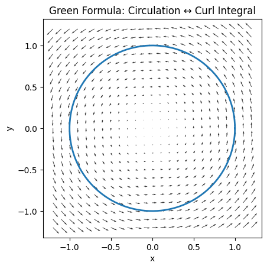
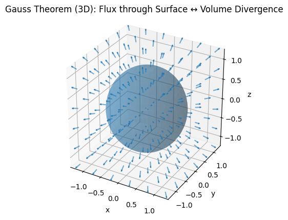

# 关于微积分基本定理的思考-广义Stokes定理 

## 一、核心观点（总览）

广义 Stokes 定理并非一系列彼此独立、偶然成立的公式，而是源于一个**统一且不可避免的结构性事实**：

> **当我们对“局部变化”在整体上求和时，所有内部贡献必然成对抵消，只剩下边界项。**

这一思想贯穿于：

- 微积分基本定理
- Green 定理
- Gauss 散度定理
- Stokes 定理
- 复分析中的 Cauchy 定理与留数定理

它们只是**同一母结构在不同维数、不同对象上的投影**。

## 二、广义 Stokes 定理（母公式）

广义 Stokes 定理可统一表述为：

$$
\int_{\Omega} d\omega = \int_{\partial \Omega} \omega
$$

其中：

- $\Omega$ ：一个 $k$ -维、可定向的区域（链）
- $\partial \Omega$ ： $\Omega$ 的边界，维数为 $k-1$ 
- $\omega$ ：一个 $(k-1)$ -阶微分形式
- $d$ ：外微分算子（描述“局部变化”）

**直观含义**：
> 对一个区域内部的“变化”做整体积分，其结果完全由边界决定。

## 三、代数原型：一切的起点

### 例 0：账本模型（望远镜求和）

考虑离散点 $x_0, x_1, \dots, x_n$ ，定义差分：

$$
\Delta_i = f(x_{i+1}) - f(x_i)
$$

求和得：

$$
\sum_{i=0}^{n-1} \Delta_i = \sum_{i=0}^{n-1} \bigl[f(x_{i+1}) - f(x_i)\bigr]
$$

展开后，中间项**逐项抵消**，仅剩：

$$
f(x_n) - f(x_0)
$$

**结构性观察**：

- 内部项以相反符号出现 → 自动抵消
- 仅“端点”（边界）留下

> 这正是所有 Stokes 型定理的**代数原型**。

## 四、一维情形：微积分基本定理

### 例 1：微积分基本定理

$$
\int_a^b f'(x)\,dx = f(b) - f(a)
$$

解释路径：

- $f'(x)$ ：局部变化率
- 积分：对局部变化做整体求和
- Riemann 和本质上就是差分的累加

最终结果只剩区间端点。

**本质**：
> 一维 Stokes 定理： $\int d f = f\big|_{\partial}$ 

## 五、二维情形（一）：Green 定理

### 例 2：旋度与环流

{width=65%}

给定平面向量场 $\mathbf v(x,y)$ ，区域 $D$ ，边界 $\partial D$ ：

$$
\iint_D (\nabla \times \mathbf v)\cdot \mathbf k\, dA
= \oint_{\partial D} \mathbf v \cdot d\mathbf r
$$

**剖分解释**：

- 将 $D$ 划分为无数小面元
- 相邻面元共享的边，方向相反 → 抵消
- 仅最外层边界未被抵消

**本质**：
> 面内旋度密度在整体积分后，坍缩为边界环流。

## 六、三维情形：Gauss 散度定理

### 例 3：源与通量

$$
\iiint_V (\nabla\cdot \mathbf F)\, dV
= \iint_{\partial V} \mathbf F \cdot d\mathbf S
$$

解释结构：

- $\nabla\cdot \mathbf F$ ：局部源 / 汇强度
- 内部体元共享的面 → 通量符号相反 → 抵消
- 仅外表面保留

**本质**：
> 体内源密度整体积分，等价于边界总通量。

## 七、抽象结构： $d^2 = 0$ 与 $\partial^2 = 0$ 

### 例 4：Kirchhoff 电压定律

若 $\mathbf E = -\nabla \phi$ ，则

$$
\oint d\phi = 0
$$

因为闭路**无边界**。

### 例 5：边界的边界为零

- $\partial[a,b] = \{b\} - \{a\}$ 
- $\partial(\partial[a,b]) = 0$ 

推广到任意维数：

$$
\partial^2 = 0 \quad \Longleftrightarrow \quad d^2 = 0
$$

这是微分几何与同调论的核心公理。

## 八、二维情形（二）：复分析的极致版本

## 例 6：Cauchy 定理与留数定理

设
$$
f(z)=u(x,y)+iv(x,y),\quad dz=dx+i dy
$$
对应 1-形式：
$$
\omega = u\,dx - v\,dy + i(v\,dx + u\,dy)
$$

### （1）无源：Cauchy 积分定理

若 $f$ 在 $D$ 内解析，则满足 C–R 方程：

$$
\frac{\partial u}{\partial x}=\frac{\partial v}{\partial y},
\quad
\frac{\partial u}{\partial y}=-\frac{\partial v}{\partial x}
$$

从而
$$
d\omega = 0
$$

因此：
$$
\oint_{\partial D} f(z)dz = \int_D d\omega = 0
$$

**解释**：

- 内部无源
- 所有内部边界完全抵消
- 外边界也无法留下贡献

### （2）有源：留数定理

若 $D$ 内存在孤立奇点 $z_k$ ，则：

$$
\oint_{\partial D} f(z)dz = 2\pi i\sum_k \operatorname{Res}(f,z_k)
$$

**结构解释**：

- 奇点 = 无法消去的“内部破洞”
- 留数 = 源强度
- 边界积分 = 所有内部源的总和

这与 Gauss 定理完全同构。

### （3）最简单例子

$$
\oint_{|z|=1} \frac{1}{z}dz = 2\pi i
$$

原因不在“技巧”，而在结构：

- $z=0$ 处形式不可定义
- 内部抵消失败
- 必然留下边界贡献

## 九、统一总结（结构视角）

### 四个不可或缺的要素

1. **可加性**：整体可拆为小块之和
2. **局部性**：被积对象描述局部变化
3. **取向抵消**：内部界面符号相反
4. **边界残留**：仅最外层无法抵消

## 十、最终总结

> **任何由外微分定义的局部变化，在整体积分后，必然坍缩为边界贡献。**

这解释了为什么：

- 微积分基本定理
- Green 定理
- Stokes 定理
- Gauss 定理
- Cauchy 定理与留数定理

并非偶然成立，而是同一“边界抵消机制”的必然结果。

> **广义 Stokes 定理不是公式，而是结构。**
