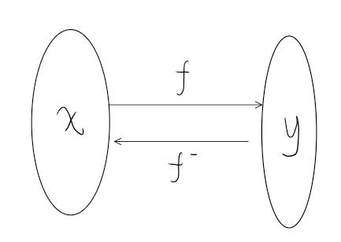

# 

```markdown
- 讨论的问题
  - 四则运算后求导法则
  - 复合函数的求导
  - 反函数求导
```

## 0 引言

**首先关于求导的定义:**

$$y' =  \lim_{x\to0}\frac{f(x+\Delta x)-f(x)}{\Delta x} = \frac{dy}{dx}\in \mathbb{R}$$

倒数的数值满足某种映射后比值的确定性(唯一性)[即导数的存在性]

由于这个性质我们可以认为$dy$和$dx$运算具有独立性
即
在$y = f(x)$的映射条件，且导数存在时

$$dy = f'(x)dx$$

**关于复合函数:**


图中有关系$y = f(x)$ , $z = g(y) = g(f(x))$

## 1 四则运算的求导法则

### 1 加减法

$$d[f_1(x)\pm f_2(x)\pm f_3(x)\cdots] = df_1(x)dx\pm df_2(x)dx\pm df_3(x)dx\cdots = f'_1(x)dx\pm f'_2(x)dx\pm f'_3(x)dx\cdots$$ 

### 2 乘除法

<!-- todo 待完善 -->
## 2 复合函数的求导

设 $z = g(y) = g(f(x))$

求$\frac{dz}{dx}$


$$\frac{dz}{dx} = \frac{dz}{dy}\frac{dy}{dx} = g'(y)f'(x)$$

$$\frac{dz}{dx} = \frac{g'(y)dy}{dx} = g'(y) f'(x)$$


## 3 反函数求导



设 $y = f(x)$ 且有反函数$x = f^{-1}(y)$

求$$\frac{df^{-1}(y)}{dy} = \frac{dx}{dy} = \frac{1}{\frac{dy}{dx}} = \frac{1}{f'(x)} = \frac{1}{f'(f^{-1}(y))}$$
