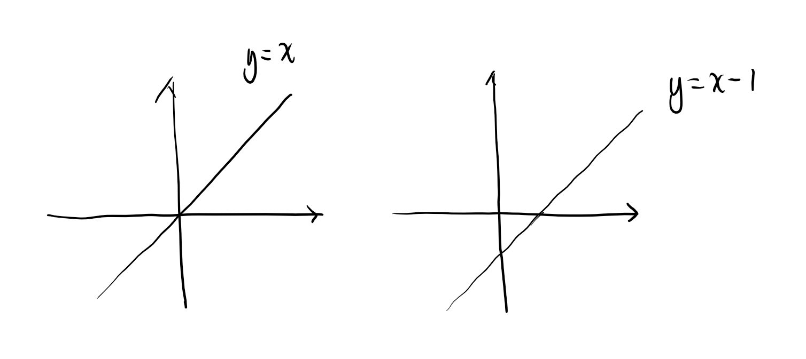
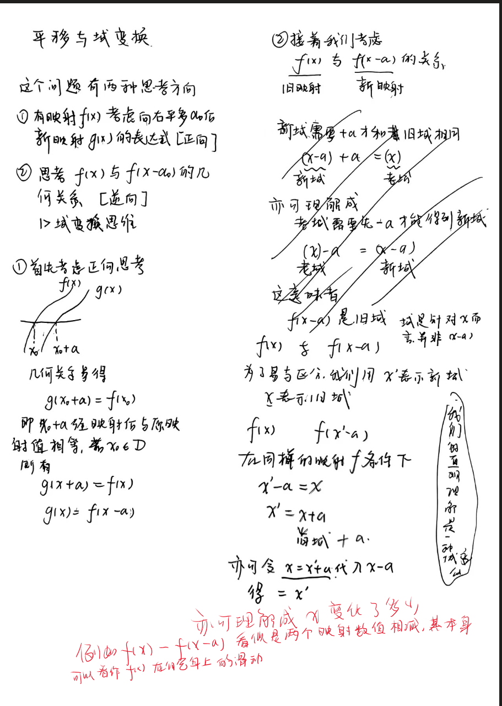
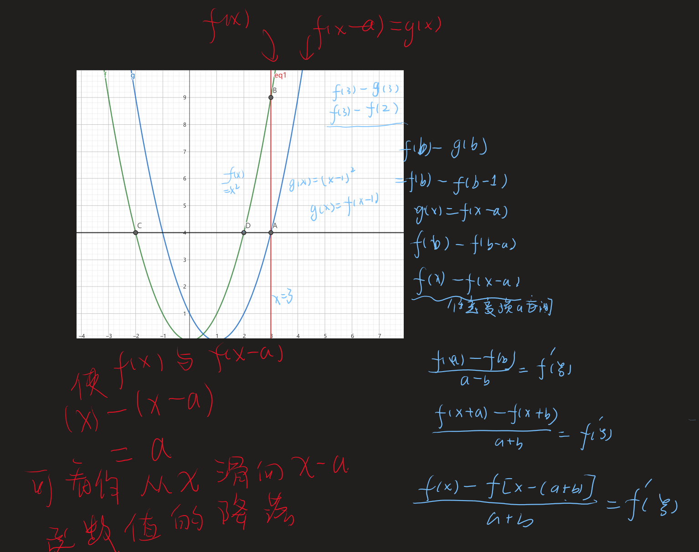
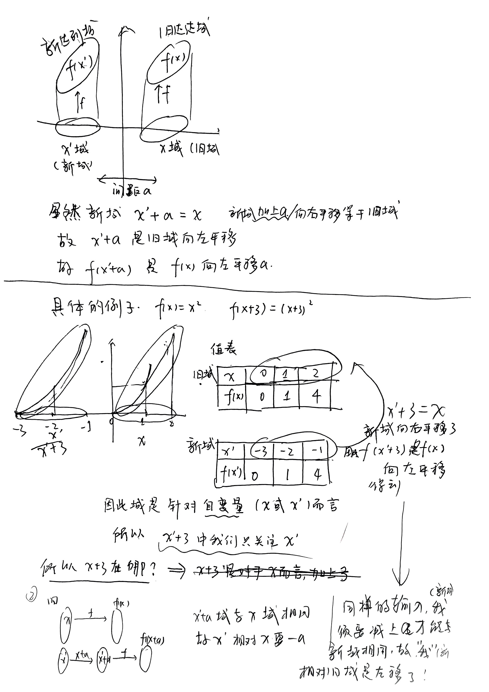

我们先考虑最简单的函数$y=x$，图像呈现给我们的只是$y$和$x$的映射关系。
当我们对图像进行平移的时候可以认为改变了映射关系，因此我们对应一个旧的映射体系和一个新的映射体系。
对于新的坐标我们用$new$老的使用$old$

$$\begin{cases}
    x_{new} = x_{old} + 1\\
    y_{new} = y_{old}
\end{cases}$$
我们将曲线向右移动将会有如此变化，又因为我们知道原坐标的映射：
$$x_{old} = y_{old}$$
因此我们写出通过原映射关系得到了新的映射关系。
$$\begin{cases}
    x_{old} = x_{new} - 1\\
    y_{old} = y_{new}
\end{cases}$$
借助$x_{old} = y_{old}$
我们得到了
$$y_{new} = x_{new} - 1$$

---

下面将对以上部分的问题进行推广，在二维直角坐标系中。我们已知原坐标系内映射关系。
为了方便起见，原本的坐标用$x$，$y$而新的$new$将会用`'`去代替

$$F(x,y)=0$$
并且分别对x，y坐标进行了如下映射，这种变化并不仅限于线性的变化，（平移旋转等）。注意这里的映射暂且认为是可逆的。
$$\begin{cases}
    y'=\varphi(y)\\
    x' = \psi(x)
\end{cases}$$
根据之前的经验由于我们知道原本的映射关系：
$$\begin{cases}
    y = \varphi^{-1}(y')\\
    x = \psi^{-1}(x')
\end{cases}$$
又因为原本的映射关系$F(x,y)=0$
我们很自然的得到了新坐标的映射关系：
$$F(\psi^{-1}(x'),\varphi^{-1}(y'))=0$$

**需要注意的是，有与我们总关心新坐标的`自变量`**：例如x(t),x(-2t+6)我们总之针对t，而非整体。因为新坐标的函数自变量仍然还是t。

---

 

---

下面是一个具体的例子

$$f(x) =\ln(1 + \frac{1}{x + 1}),g(x) = \ln(1 + \frac{1}{x - 1})$$

1. 当我们讨论f(x) 和 g(x)的的关系时候(平移关系),对于任意$x_f \in D_f,x_g\in D_g$若两个映射存在平移关系，则$f(x_f) = g(x_g)$,即$\ln(1 + \frac{1}{x_f + 1}) = \ln(1 + \frac{1}{x_g - 1})$化简得$x_f = x_g - 2$，这是一个恒等关系，意味着$f(x)$和$g(x)$存在平移关系，故而知道$g(x)$相对于$f(x)$向右平移2。
2. 当我们讨论$f(x),f(x-2)$  

---
