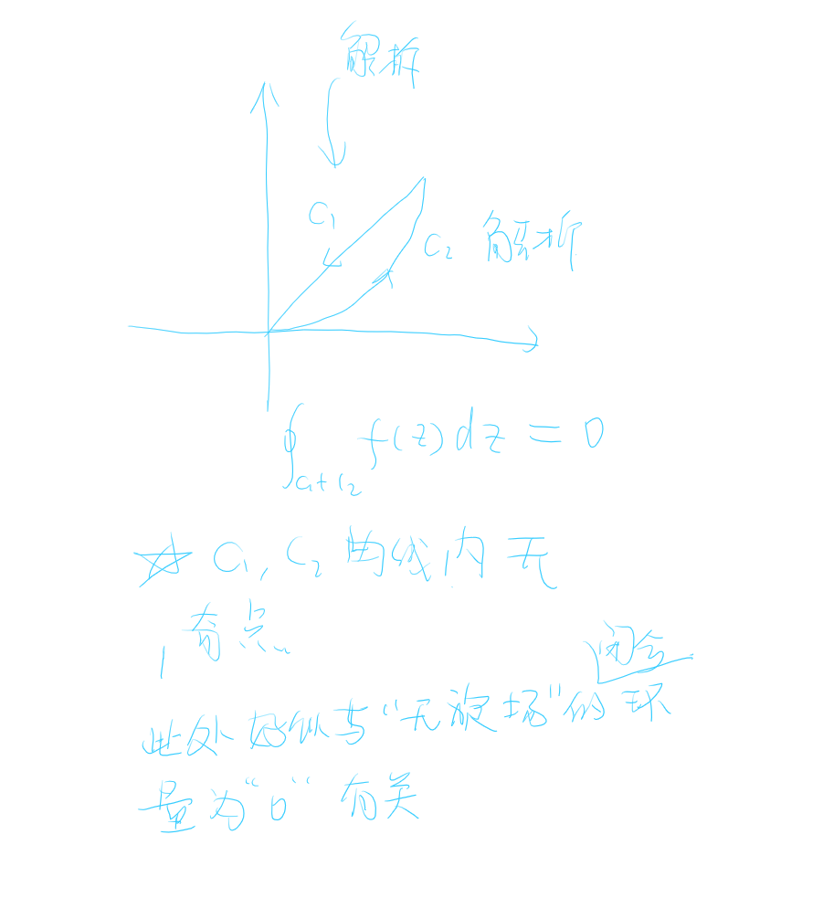

## 1 奇点问题

我感觉奇点和场论之中的“源”和“汇”有关，尤其是“旋度源”有关，

## 2 C-R条件和GreenFormula之间的关系

实数域的格林公式
复数域的C-R条件有关联

## 3 关于实数域的曲线积分和复函数积分的联系，以及奇点的存在问题

感觉物理中例如安培环路定理，高斯定理等等，需要取高斯面以及安培环路的时候，形状似乎不影响最终的计算结果，这点似乎和复变函数论中的Cauchy公式有所关联，而Cauchy公式的关键在于是否存在奇点问题，也就是Green公式的使用条件，

1. 实数域 $\Rightarrow$ Green公式使用条件 $\Rightarrow$ 偏导数是否相等
2. 复数域 $\Rightarrow$ Cauchy公式使用条件$\Rightarrow$ 是否解析$\Rightarrow$ 是否满足Cauchy-Reimann条件(两个偏导数)  
**可以尝试从两个偏导数，Green公式，解析函数条件入手。**

并且复数域的实数和复数确实相当于一个二维问题，即X-Y坐标系问题，但是复数域的实轴和虚轴又有其他联系。

复函数积分问题因此也可以映射到实数域的曲线积分问题，也就是做功问题。

根据以上分析我们理应得到奇点的真正含义，他应该存在一个物理含义。

## 4 对复数域的看法

我是否可以把复数看作一种特殊的场，这中场的x,y方向似乎互相有关联，然后奇点是否可以看成一种“源”或者“旋”之类的定义，因此不奇点的函数解析，所以不含有涡旋源，闭合回路积分为0