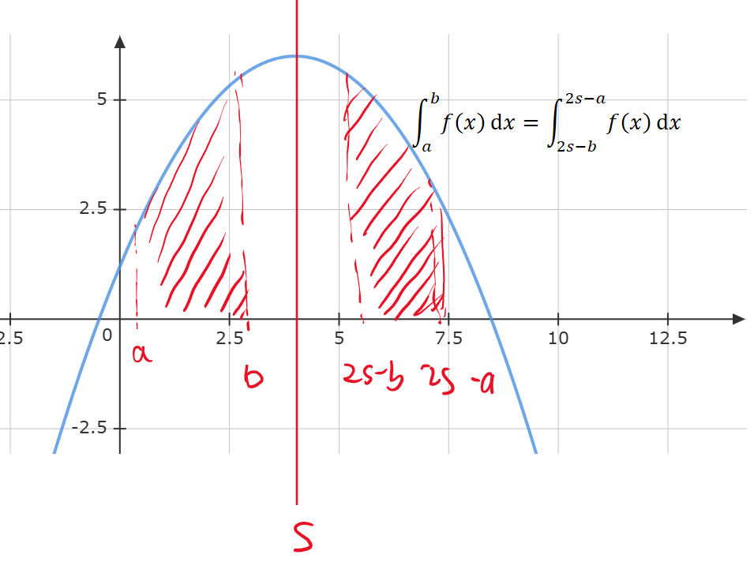
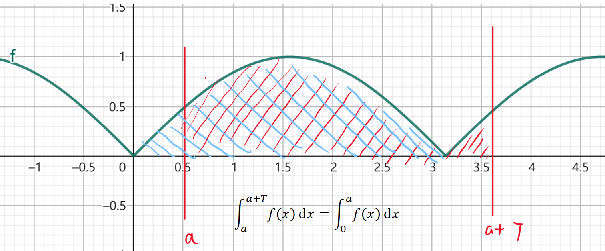

---
header-includes:
  - \usepackage{amsmath}
  - \usepackage{amssymb}
---
# 对称和周期的积分特性

## 0 对称区间的积分特性

**对称区间中积分将消去奇分量**
**任意函数可表示为奇分量和偶分量**

$f(x) = E(x) + O(x)$
$$\begin{cases}
    f(x) = E(x) + O(x) \\
    f(-x) = E(x) - O(x)
\end{cases}$$

得
$$\begin{cases}
    E(x) = \frac{f(x) + f(-x)}{2} \\
    O(x) = \frac{f(x) - f(-x)}{2}
\end{cases}$$

故
$$f(x) = E(x) + O(x) = \frac{f(x) + f(-x)}{2} + \frac{f(x) - f(-x)}{2} = 2E(x)$$

因此，对称区间中积分将消去奇分量。

$$\int_{-a}^{a} f(x)dx = 2\int_0^a E(x)dx = \int_0^a[f(x)+f(-x)]dx$$

**此类问题注意1. 积分区间对称 2. $f(x)+f(-x)$存在化简可能**

## 1 对称函数的积分特性

设$f(x)$关于$s$对称，则有

$$f(x) = f(2s - x)$$

则有积分特性

几何直观
$$\int_a^b f(x)dx = \int_{2s-b}^{2s-a}f(x)dx$$

代数证明:
$$\int_a^b f(x)dx = \int_a^b f(2s - x)dx \xlongequal{Let\ u = 2s - x}\int_{2s-a}^{2s-b}f(u)-du = \int_{2s-a}^{2s-b}f(x)dx$$

## 2 周期函数的积分特性

设$f(x)$关于$T$周期，则有
$$f(x) = f(x+T)$$

有积分特性

周期函数从任意点向后积分一周期等于一周期的积分
$$\int_a^{a+T}f(x)dx = \int_0^Tf(x)dx$$
几何直观:

代数证明:

\[
\begin{aligned}
\int_{a}^{a+T} f(x)dx &= \int_{a}^{T} f(x)dx + \int_{T}^{a+T} f(x)dx \\
&= \int_{a}^{T} f(x)dx + \int_{T}^{a+T} f(x - T)dx \\
&= \int_{a}^{T} f(x)dv + \int_{0}^{a} f(x)dx \\
&= \int_{0}^{T} f(x)dx
\end{aligned}
\]

本质约束

$$\int_a^bf(x)dx = \int_{a+T}^{b+T}f(x)dx$$