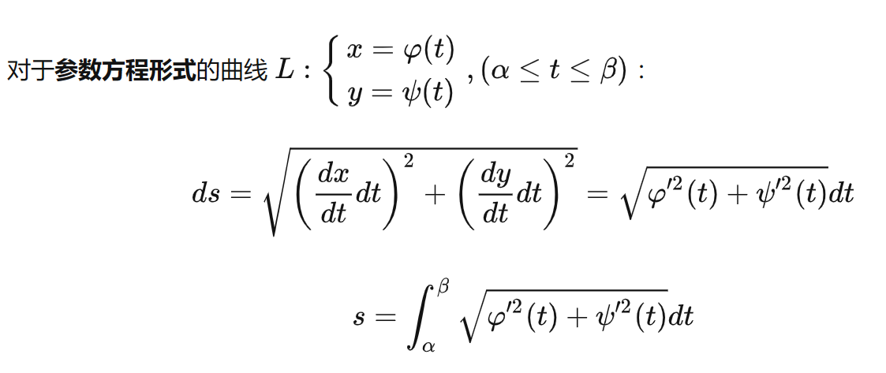

## 1 

我认为当我们求解例如弧长积分问题，以及多个元素相关的积分问题
$$ds=\sqrt{x^2+y^2}$$
此时由于我们知道积分路径，因此我们知道$x,y$的关系，$ds$总可以化为：$ds=\sqrt{x^2+y^2}=\sqrt{1+y'^2}dx$当我们的关系无法使用显式表达的时候，可以寻求一个中间变量例如$t$，

该方法似乎在物理学的微积分中有应用

此类问题归咎于不同坐标系下的微元量（线微元，面微元，体微元）的不同，详细可以看 
>三种坐标系及其变换

然后对于换元问题在物理学上可以解释成对微元量进行更换，例如常见的$dx$和$d\theta$之间的更换。在场论中他们在坐标系中往往满足几何关系，这种几何关系也形成了常见的坐标转换问题，一次坐标转换问题的本质其实是对微元量的几何关系的体现，只不过我们将这种关系描述成了一种映射，称为坐标变换

常见的：
$$d\vec{l} = \vec{e_\phi}dl = \vec{e_\phi} \rho d \phi $$

<!-- $$d\vec{l} = \vec{e_\phi}dl \xlongequal{\vec{e}_\phi = -\sin\phi \vec{e}_x + \cos\phi \vec{e}_y
} \sqrt{dx^2 + dy^2} (-\sin\phi \vec{e}_x + \cos\phi \vec{e}_y
) $$ -->

% 微分弧长在极坐标系中的表达式

$$d\vec{l} = r d\phi \vec{e}_\phi$$

% 将极坐标系下的单位向量用笛卡尔坐标系的单位向量表示

$$d\vec{l} = r d\phi (-\sin\phi \vec{e}_x + \cos\phi \vec{e}_y)$$

% 笛卡尔坐标系中的位置向量微分

$$d\vec{l} = dx\vec{e}_x + dy\vec{e}_y$$

---

$$\begin{align}
\vec{e}_x &= \vec{e}_\rho \cos\phi - \vec{e}_\phi \sin\phi, \\
\vec{e}_y &= \vec{e}_\rho \sin\phi + \vec{e}_\phi \cos\phi
\end{align}$$

$$\begin{equation}\begin{bmatrix}\vec{e}_{\rho} \\\vec{e}_\phi \\\vec{e}_z\end{bmatrix}=\begin{bmatrix}
\cos\phi & \sin\phi & 0 \\
-\sin\phi & \cos\phi & 0 \\
0 & 0 & 1\end{bmatrix}\begin{bmatrix}
\vec{e}_x \\
\vec{e}_y \\
\vec{e}_z
\end{bmatrix}
\end{equation}$$