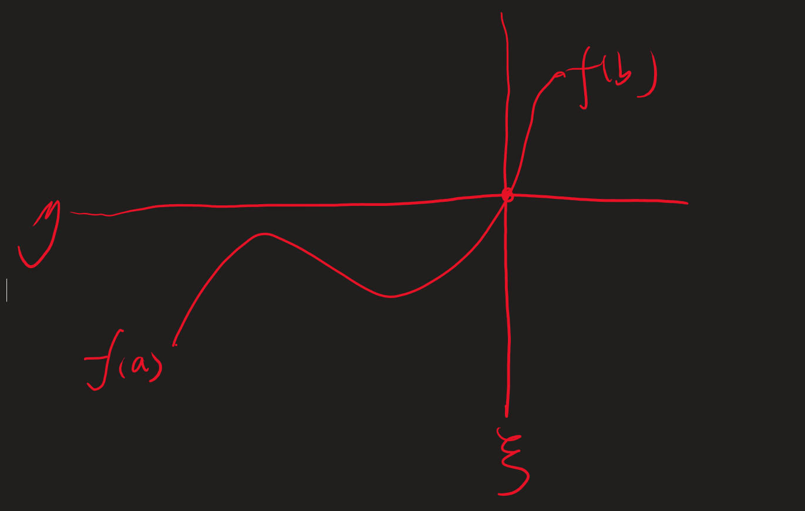

# 关于中值定理
讨论中值定理的本质和推导过程

1. 费马引理
2. 罗尔中值定理
3. 拉格朗日中值定理

这些中值定理的本质是一种连续性

让我们先从介值定理开始

## 1 介值定理

函数连续,意味着总两个值变化的过程是连续的，则必然存在一个中间值

当然他也可以是两端数值的几何平均或者其他的平均数，只要这个平均数是介于f(a)和f(b)之间即可。

$$f(\xi) = \eta$$

$$f(\xi) = \frac{f(a) + f(b)}{2}(调几算方)$$

## 2 中值定理

然后让我们用这样的视角去看待中值定理

1. 导数存在
2. 函数连续

当我们排除无穷震荡函数，这几乎可以等价成导数的连续性(不严谨,sin1\x)

这意味着当一个区间有一个导数的平均值,则必然可以找到一点的导数等于这个平均值。

比如说一个人在区间的平均速度是a，则在区间的某一个瞬间他的瞬间速度也是a，因为他的速度是一个连续变化的过程，他不可能瞬间加速到一个速度，这正好对应了导数的连续性。

---

这意味着中值定理是介值定理在连续性上的一种延申，

---

中值定理与介值定理虽有相似性（均涉及中间值的存在性），但二者的本质和数学基础存在显著差异。以下从数学角度系统分析两者的联系与区别，并重新梳理中值定理的本质：

---

### **一、介值定理与中值定理的本质差异**

| **特性**       | **介值定理**                    | **中值定理**                                       |
| -------------- | ------------------------------- | -------------------------------------------------- |
| **研究对象**   | 函数值 \( f(x) \) 的连续性      | 导数 \( f'(x) \) 的存在性                          |
| **核心条件**   | 函数在闭区间上连续              | 函数在闭区间连续、开区间可导                       |
| **数学本质**   | 拓扑连续性：填补函数值的"跳跃"  | 微分结构：连接局部导数与整体变化率                 |
| **中间值类型** | 任意介于端点值的实数 \( \eta \) | 特定中间值：平均变化率 \( \frac{f(b)-f(a)}{b-a} \) |
| **应用场景**   | 证明方程根的存在性              | 建立微分与积分的关系、证明不等式                   |

---

### **二、中值定理的本质并非单纯连续性**
中值定理的核心在于**导数的存在性**（而非导数的连续性），其本质是通过微分结构揭示函数的整体行为。具体分析如下：

#### **1. 与介值定理的本质区别**
- **介值定理**仅依赖函数值的连续性，是拓扑性质的体现；
- **中值定理**需要更强的微分结构（可导性），是分析学中微分与积分关系的桥梁。

#### **2. 关键反例：导数不连续仍满足中值定理**
考虑函数：
\[
f(x) = 
\begin{cases} 
x^2 \sin\left(\frac{1}{x}\right), & x \neq 0, \\
0, & x = 0 
\end{cases}
\]
- **可导性**：在 \( x=0 \) 处，\( f'(0) = 0 \)；
- **导数不连续**：\( \lim_{x \to 0} f'(x) \) 不存在（震荡发散）；
- **中值定理成立**：在任何包含 \( x=0 \) 的区间上，存在 \( c \) 使得 \( f'(c) = \frac{f(b)-f(a)}{b-a} \)。

此例证明：**中值定理的成立不依赖导数连续性**，仅需可导性。

---

### **三、中值定理的数学本质与推导**

#### **1. 核心思想：局部与整体的联系**
中值定理建立**局部导数**与**整体平均变化率**的等价性：
\[
\exists c \in (a,b), \quad f'(c) = \frac{f(b)-f(a)}{b-a}
\]
这本质上是通过微分刻画函数的整体单调性、凸性等性质。

#### **2. 定理递进关系**
- **费马引理**（极值点导数为零）：  
  极值点处若可导，则瞬时变化率为零。
  
- **罗尔定理**（端点等高则存在平稳点）：  
  通过费马引理，将极值存在性转化为导数为零的条件。

- **拉格朗日定理**（一般化平均变化率）：  
  构造辅助函数 \( g(x) = f(x) - kx \)（\( k \) 为平均变化率），将问题转化为罗尔定理。

#### **3. 严格推导过程**
以**拉格朗日中值定理**为例：
1. **构造辅助函数**：  
   \[
   g(x) = f(x) - \left[ \frac{f(b)-f(a)}{b-a}(x-a) + f(a) \right]
   \]
   - 满足 \( g(a) = g(b) = 0 \)，符合罗尔定理条件。
   
2. **应用罗尔定理**：  
   存在 \( c \in (a,b) \) 使得 \( g'(c) = 0 \)。

3. **还原结论**：  
   由 \( g'(c) = f'(c) - \frac{f(b)-f(a)}{b-a} = 0 \)，得  
   \[
   f'(c) = \frac{f(b)-f(a)}{b-a}.
   \]

---

### **四、物理视角的修正**
用户提到的"速度连续变化对应导数连续性"需修正：
- **物理现实**：经典力学中速度可突变（如理想碰撞），此时加速度（速度的导数）不存在；
- **数学要求**：中值定理仅要求速度函数可导（速度变化有定义），不要求加速度连续；
- **实例修正**：汽车变速时的**瞬时加速度**可能不连续，但只要速度函数可导（加速度存在），中值定理仍成立。

---

### **五、总结：中值定理的数学本质**
1. **结构特性**：在可导性条件下，通过微分结构连接局部与整体行为；
2. **独立性**：不依赖导数连续性，与介值定理的拓扑连续性有本质区别；
3. **核心价值**：为微分学提供从局部导数推断整体性质的工具，是微积分基本定理的重要铺垫。