# 三种坐标系

<!-- @import "[TOC]" {cmd="toc" depthFrom=1 depthTo=6 orderedList=false} -->

<!-- code_chunk_output -->

- [三种坐标系](#三种坐标系)
  - [核心重点](#核心重点)
  - [1 直角坐标系](#1-直角坐标系)
    - [1.1 坐标顺序和坐标定义](#11-坐标顺序和坐标定义)
    - [1.2 矢量运算](#12-矢量运算)
    - [1.3 微分元](#13-微分元)
  - [2 圆柱坐标系](#2-圆柱坐标系)
    - [2.1 坐标顺序和坐标定义](#21-坐标顺序和坐标定义)
    - [2.2 矢量运算](#22-矢量运算)
    - [2.3 微分元](#23-微分元)
  - [3 球坐标系](#3-球坐标系)
    - [3.1 坐标顺序和坐标定义](#31-坐标顺序和坐标定义)
    - [3.2 矢量运算](#32-矢量运算)
    - [3.3 微分元](#33-微分元)
  - [4 坐标系之间的转化](#4-坐标系之间的转化)

<!-- /code_chunk_output -->

---
## 核心重点

**单位矢量的方向就是该点每个坐标的增量**
==**我们找到矢量在每个坐标上的分矢量就可以求得$d\vec{r}$**==
例如
$$(x,y,z) : d\vec{r}=dx\vec{e_x}+dy\vec{e_y}+dz\vec{e_z}=(dz,dy,dz)$$

$$(\rho,\varphi,z): d\vec{r} =d\rho\vec{e_{\rho}}+\rho d\varphi \vec{e_{\varphi}} +dz\vec{e_z} =(d\rho,\rho d\varphi,dz) $$

$$(r,\theta,\varphi): d\vec{r}=dr\vec{e}_r+rd\theta\vec{e}_\theta+r\sin\theta d\varphi\vec{e}_\varphi =(dr,rd\theta,r\sin\theta d\varphi) $$

面积元和体积元可以基于这个基础上求解

---

## 1 直角坐标系

### 1.1 坐标顺序和坐标定义

**顺序其实可以通过用右手法则确定，他们都是右手系**
$$(x,y,z)$$
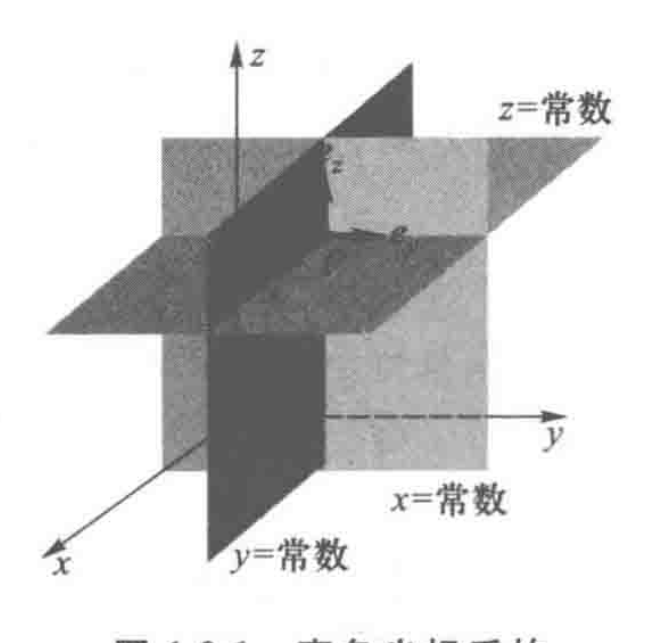

### 1.2 矢量运算

$$e_{x}\times e_{y}=e_{z}， e_{y}\times e_{z}=e_{x}， e_{z}\times e_{x}=e_{y}$$

$$\vec{A}+\vec{B}=\boldsymbol{e}_{x}(A_{x}+B_{x})+\boldsymbol{e}_{y}(A_{y}+B_{y})+\boldsymbol{e}_{z}(A_{z}+B_{z})$$

$$\begin{aligned}
\vec{A}\cdot\vec{B}& \left.=\left(\begin{matrix}{\boldsymbol{e}}_{x}A_{x}+\boldsymbol{e}_{y}A_{y}+\boldsymbol{e}_{z}A_{z}\\\end{matrix}\right.\right)\cdot\left(\begin{matrix}{\boldsymbol{e}}_{x}B_{x}+\boldsymbol{e}_{y}B_{y}+\boldsymbol{e}_{z}B_{z}\\\end{matrix}\right)  \\
&=A_{_x}B_{_x}+A_{_y}B_{_y}+A_{_z}B_{_z}
\end{aligned}$$

$$\begin{aligned}\vec{A}\times\vec{B}&=(\boldsymbol{e}_xA_x+\boldsymbol{e}_yA_y+\boldsymbol{e}_zA_z)\times(\boldsymbol{e}_zB_z+\boldsymbol{e}_yB_y+\boldsymbol{e}_zB_z)\\\\&=\boldsymbol{e}_z(\boldsymbol{e}_yB_z-\boldsymbol{A}_zB_y)+\boldsymbol{e}_z(\boldsymbol{A}_zB_z-\boldsymbol{A}_zB_z)+\boldsymbol{e}_z(\boldsymbol{A}_zB_y-\boldsymbol{A}_s B_z)\\\\&=\begin{vmatrix}\boldsymbol{e}_z&\boldsymbol{e}_y&\boldsymbol{e}_z\\\\A_z&A_y&A_z\\\\B_z&B_y&B_z\end{vmatrix}\end{aligned}$$

### 1.3 微分元

1.线微元
表示沿着$x,y,z$方向每个方向都有增量$dx,dy,dz$注意这里和方向导数的定义不同。
在空间中任意移动一微小距离。在$x,y,z$方向每个方向都产生增量。

$$\mathrm{d}\vec{r}=\boldsymbol{e}_x\mathrm{d}x+\boldsymbol{e}_y\mathrm{d}y+\boldsymbol{e}_z\mathrm{d}z$$

2.面积元

$$\mathrm{d}S_x=\mathrm{d}y\mathrm{d}z,\mathrm{d}S_y=\mathrm{d}x\mathrm{d}z,\mathrm{d}S_z=\mathrm{d}x\mathrm{d}y$$

3.面积元矢量  

$$d\vec{S}=dS_x+dS_y+dS_z$$

4.体积元

$$dV = dxdydz$$

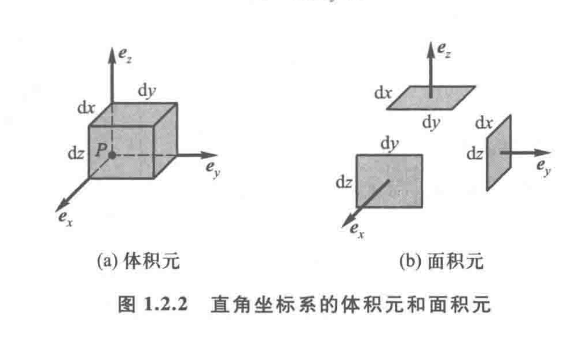

## 2 圆柱坐标系

### 2.1 坐标顺序和坐标定义

$$(\rho,\varphi,z)$$

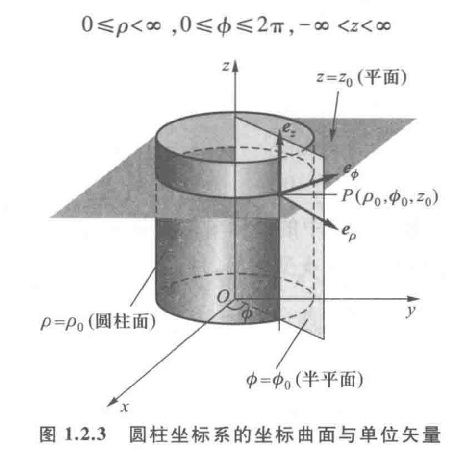

在圆柱坐标系中,过空间任一点$P(\rho,\varphi,z)$的三个相互正交的坐标单位矢量$e_{\rho}$,$e_{\phi}$和$e_{z}$分别是该点的$\rho$、$\varphi$和$z$增加的方向,且遵循右手螺旋法则,即

**必须强调指出,圆柱坐标系中的坐标单位矢量$e_{\rho}$和$e_{\phi}$都不是常矢量,由式可以看出$e_{\rho}$和$e_{\phi}$ 是随$\varphi$变化的**
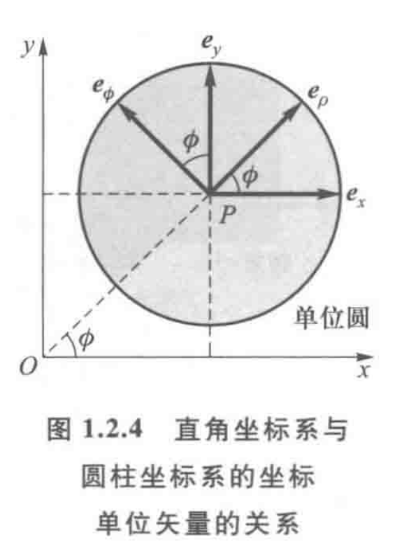

### 2.2 矢量运算  

$$e_{\rho}\times e_{\phi}=e_{z}, e_{\phi}\times e_{z}=e_{\rho}, e_{z}\times e_{\rho}=e_{\phi}$$

**其余矢量性运算法则和直角坐标系相同，这里不做赘述**

### 2.3 微分元

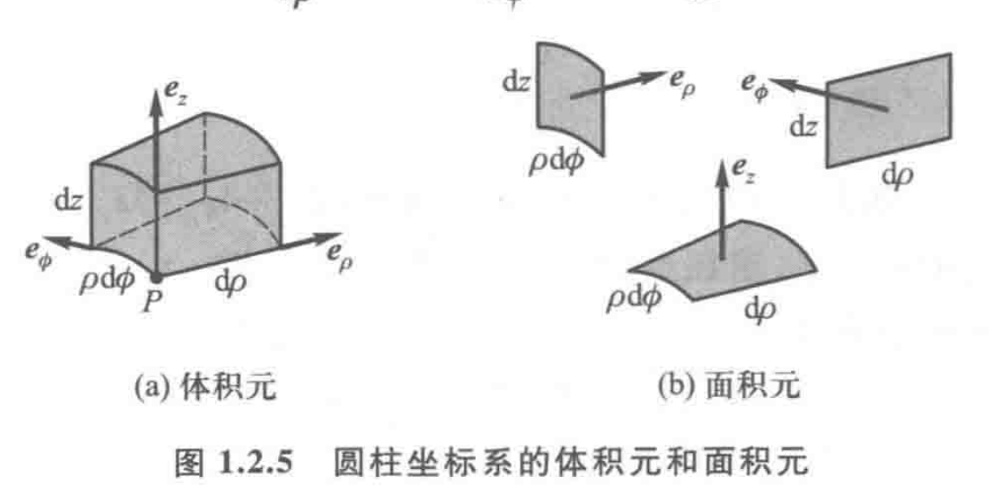

1.位置矢量：
$$\vec{r}=\vec{e_{\rho}}\rho+\vec{e_{z}}z$$
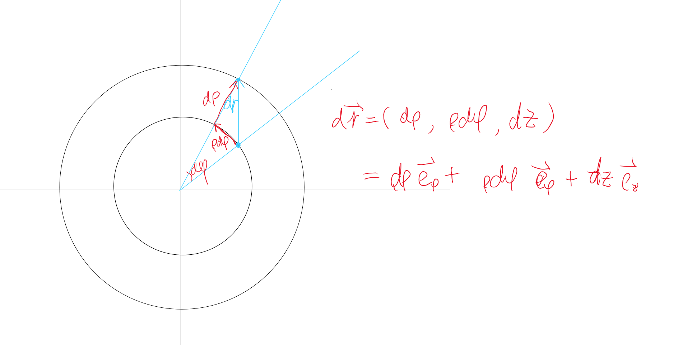
2.线微分：
$$\begin{aligned}\mathrm{d}\boldsymbol{r}&=\mathrm{d}(\boldsymbol{e}_\rho\boldsymbol{\rho})+\mathrm{d}(\boldsymbol{e}_z\boldsymbol{z})=\boldsymbol{e}_\rho\mathrm{d}\boldsymbol{\rho}+\boldsymbol{\rho}\mathrm{d}\boldsymbol{e}_\rho+\boldsymbol{e}_z\mathrm{d}z\\&=\boldsymbol{e}_\rho\mathrm{d}\boldsymbol{\rho}+\boldsymbol{e}_\phi\boldsymbol{\rho}\mathrm{d}\boldsymbol{\phi}+\boldsymbol{e}_z\mathrm{d}z\end{aligned}$$
3.面积元 

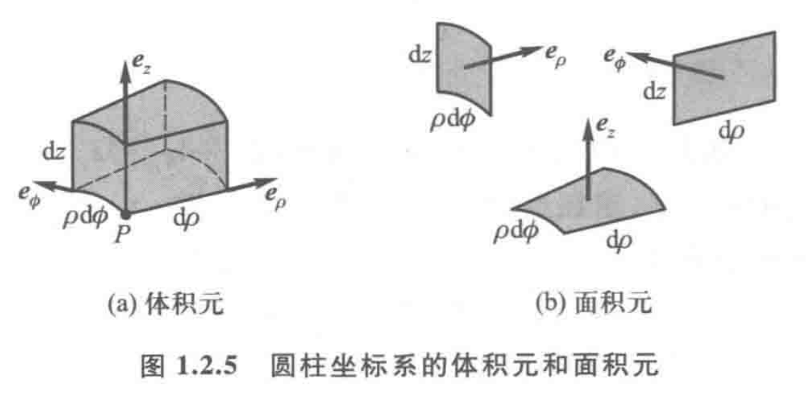
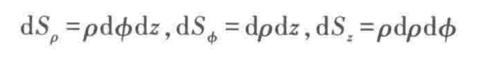
$$\mathrm{d}S_{\rho}=\rho\mathrm{d}\phi\mathrm{d}z,\mathrm{d}S_{\phi}=\mathrm{d}\rho\mathrm{d}z,\mathrm{d}S_{z}=\rho\mathrm{d}\rho\mathrm{d}\phi $$

3.体积元
$$\operatorname{d}V=\rho\mathrm{d}\rho\mathrm{d}\phi\mathrm{d}z$$

## 3 球坐标系  

### 3.1 坐标顺序和坐标定义

$$(r,\theta,\varphi)$$、
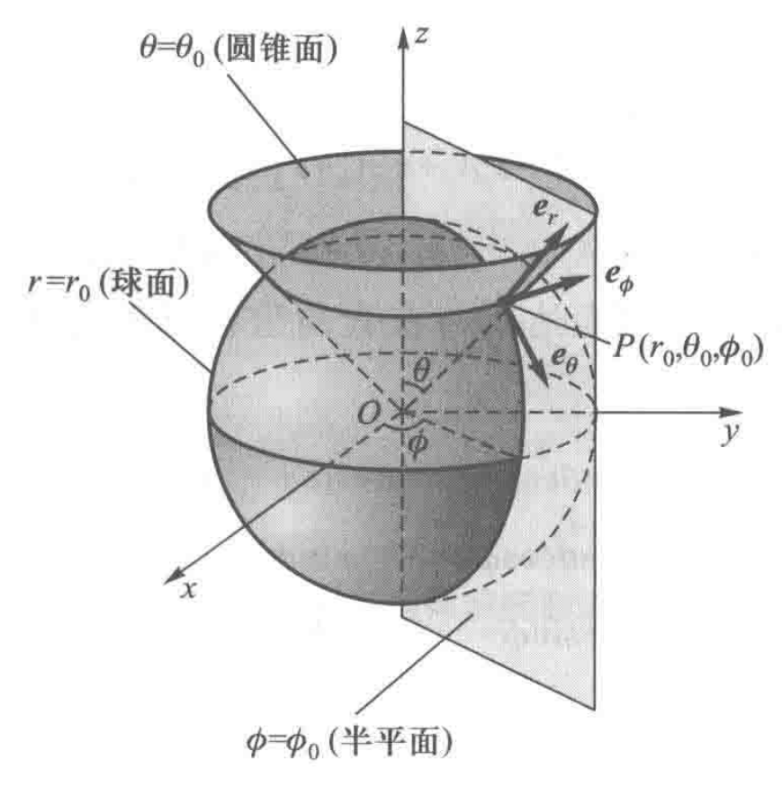
### 3.2 矢量运算

略

### 3.3 微分元

1.位置矢量
$$\vec{r}=\vec{e_r}r$$

2.微分元矢量
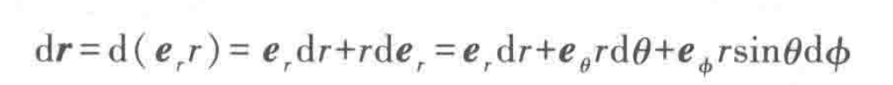

3.面积元，体积元

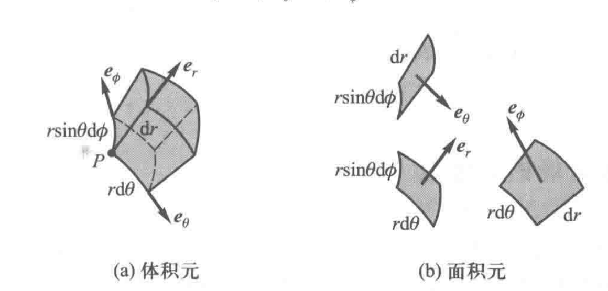
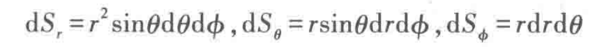
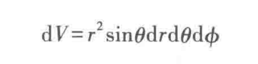
==**我们找到矢量在每个坐标上的分矢量就可以求得$d\vec{r}$**==
## 4 坐标系之间的转化  

以上我们已经完成了三种坐标系的介绍，现在需要介绍三种坐标系之间的关系。

