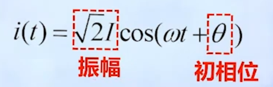
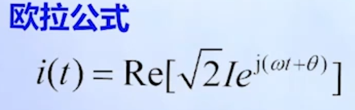
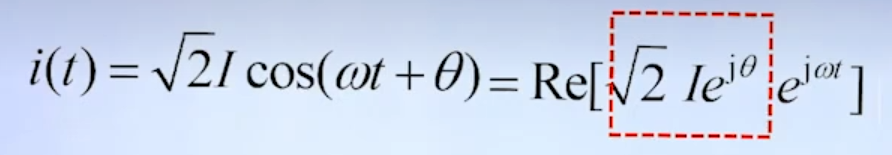
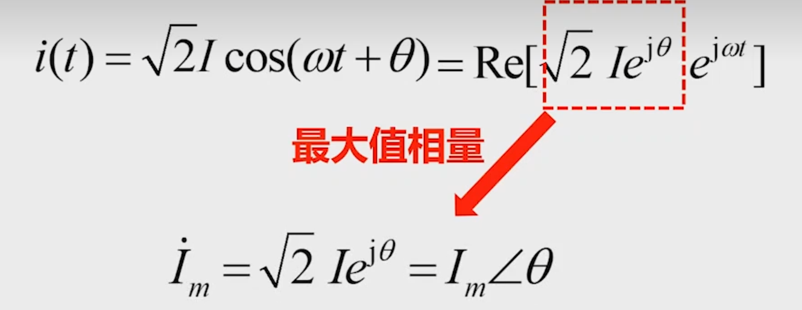
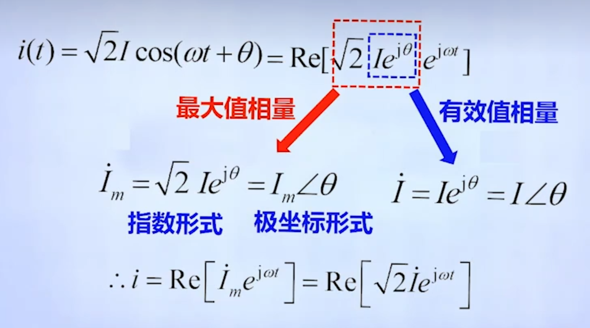
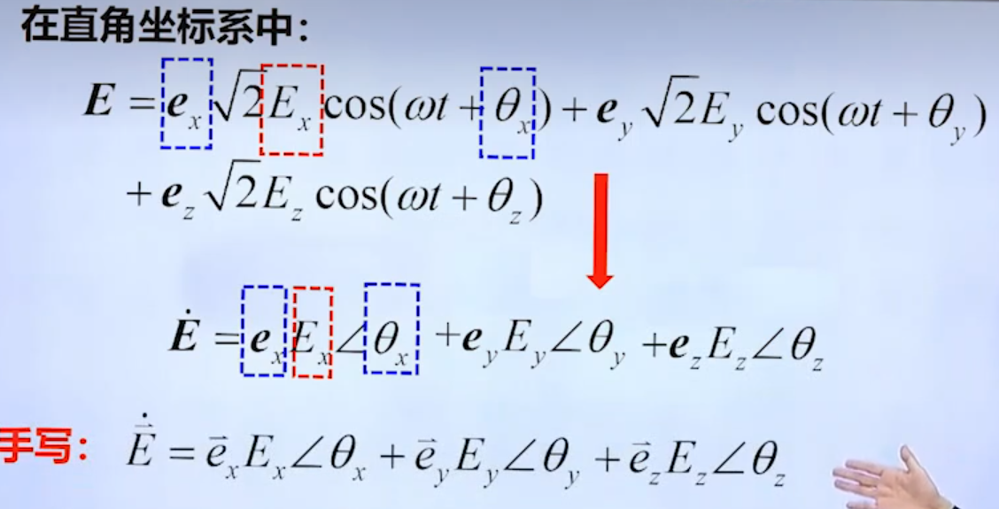
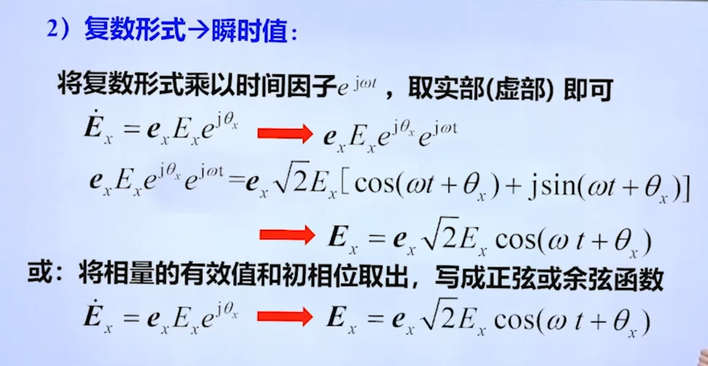

**我们往往专注与问题的核心要素**

>资料：https://www.bilibili.com/video/BV1V4411A7S4/?spm_id_from=333.337.search-card.all.click&vd_source=a3783e84d880b6ffb4a798de09eea520

- 正弦量
  - 幅度&有效值
  - 频率
  - 初相位

借助欧拉公式我们也可等价将正弦量映射到复数空间

由于频率往往固定所以我们甚至可以更加的简化模型，只需要包含赋值和初相位要素即可

并且简单记为

在电磁场中我们可以沿用借鉴这个经验

---

电磁场中我们需要注意与电路分析的区别即引入适量函数

逆变换是不友好忘记乘上时间因子

